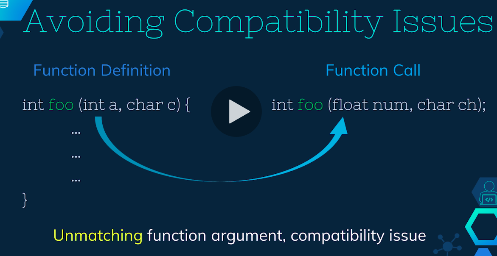
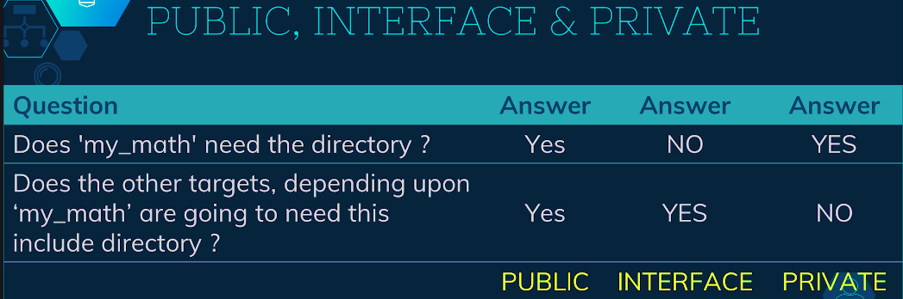
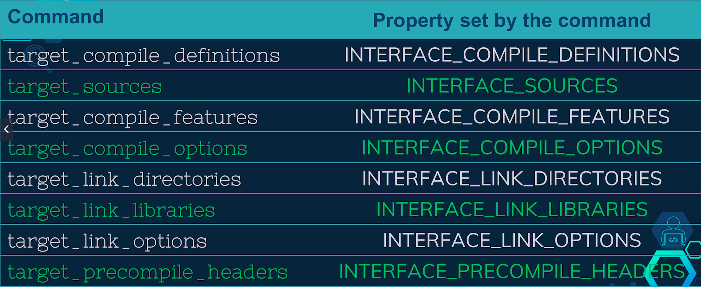
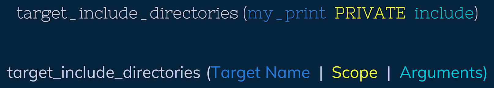
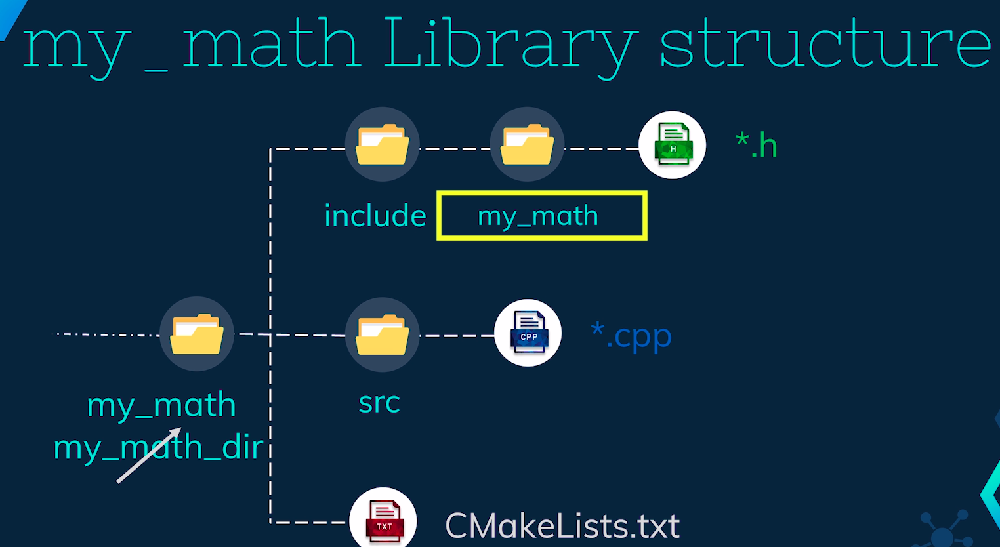

# [Master CMake for Cross-Platform C++ Project Building](https://www.udemy.com/course/master_cmake/learn/lecture/17991435?start=0#overview)

## Requirements

* Ubuntu 18+
* g++: ```sudo apt install g++```
* CMake: ```sudo apt install cmake```

## Module 1 : Introduction

* Write a simple C++ program and execute it using the G++ compiler.
* The program takes two numbers from the user and displays the results of their addition and division.
* Create a folder called "CMake tutorials" on the desktop, and within it a folder called "module1".
* Create an empty C++ file called "main.cpp" in the "module1" folder and write code to take input, do addition and division and print the result.
* Compile the program using G++ to generate an executable called "calculator".
```
g++ main.cpp addition.cpp division.cpp print_result.cpp -o calculator
```
* Edit the main.cpp file to make it more modular by writing two additional functions, one for addition and one for division and a third for printing result.
* Move the function definition from main.cpp to three separate files called addition.cpp, division.cpp, and print_result.cpp
* Declare these functions in main.cpp and specify the location of the function definition using G++ command
* The recommended way is to write the function declaration in separate header files and include those in main.cpp using the #include directive.

### Need of Build Systems
* When compiling a project containing multiple C++ files, initially all
  the files are compiled independently of each other.
* In the example given, four C++ files were compiled to produce four
  different compiled binaries.
* When compiling `main.cpp`, the compiler needs to be told that three
  functions used in `main.cpp` exist somewhere else. This is done by
  including header files that contain the function declaration.
* The compiler does not care about the actual implementation of the
  functions at this point and instead places placeholders where the
  functions are called.
* During the linking process, the linker finds the compiled binaries of
  `addition.cpp`, `division.cpp`, and `print_result.cpp` and links them
  all together to produce one single executable.
* As long as you have the header files containing the function
  declaration and the compiled binaries of the C++ files, you will be
  able to build the project.
* The C++ files containing the function definition are not needed.
* In real-world projects, the number of files can go above 1000, making it
  challenging to keep track of all the files and their dependencies.
* The compilation process in such projects can take a lot of time, sometimes
  more than tens of hours.
* In order to save time, if the dependencies are well managed and if we have
  access to a tree-based representation of all the dependencies and the list
  of files that have been changed since the last successful compilation,
  then we can choose only to compile the files that have been changed
  recently and thereafter we can link all those together.
* Build systems such as 'Make', 'Ninja', 'Ant', 'Gradle' are software for
  automating the source code compilation and linking process. Choosing one
  particular build system over the other can depend on personal choice or
  development environment.

### Need for a Meta Build System

* Usually for building a project, the developer writes a special code in something called build files which is different from the project's source code and then the build system uses that build file to compile and link the source codes.
* In case of 'Make', the developer writes a 'Makefile' and runs that code using Make build system.
* To run the 'make' command, it needs to be installed on the system, which can be done by running sudo apt install make in the command line.
* The make command looks for a makefile and then builds the project based on the rules written inside makefile, resulting in an executable.
* Running the make command will compile all the files and link them together.
* If one of the files is changed, running the make command again will only compile the changed file and link everything else, saving time.
* The idea is not to teach about makefiles or build systems in general, but about the meta build system CMake.
* CMake is a tool that is capable of writing makefiles for us.
* Make: Uses build system files to generate executable.
* CMake: Used to generate build system files.
* The problem with building C++ projects is that it is not standard across platforms.
* This means that source code and makefiles from a Linux machine cannot be directly built on a Windows operating system, and vice versa.
* CMake solves this problem by creating platform-based system files.
* The developer writes a special code called build files, which is different from the project's source code, and the build system uses that build file to compile and link the source codes.
* In the case of "Make", the developer writes a "Makefile" and runs that code using Make build system.
* CMake is a meta build system that is capable of writing makefiles for us.
* The idea is not to teach about makefiles or build systems in general, but about the meta build system, CMake.
* The question arises, why do we even need to learn this new tool CMake for this simple application?
* The problem is that, the building of C++ projects is not a standard across the platforms.
* CMake solves this problem by creating the platform based system files.

## Module 2 : CMake Installation and Building the First Target

### CMake Installation

There are three ways to install CMake.

#### From Repository.

```
sudo apt install cmake
```

* Check if CMake is installed properly with
```
cmake --version
```

#### Using Compile Binaries
* Download the compile binaries from CMAke official website. (Uninstall cmake before proceeding).
* We will download the ".sh" file, which is a shell script.
* Now, we will go to the download folder, open the terminal from the download folder and give execution permission to the script using "chmod +x" command then run this script.
* Here, we can see that a folder is created. If you choose to download the tar file and run the tar xvf command, it will also result in the same folder.
* Now once we have the folder, we can go inside the bin directly. Here we have the CMake executable. To use this executable, we need to add the path of this executable to the system path.
* We can paste this command into ".bashrc" file inside the home directory.
* Here I have added the path and we can see that cmake --version is giving us the expected output.
* Before proceeding to the third technique of installing CMake, we will remove the previously downloaded files and the bashrc entry.

#### Using Source Code
* Download the source codes from the CMake website.
* Extract it using tar command.
* Navigate inside the extracted folder and run these three commands: ```./bootstrap, make, and sudo make install```.
* If you are getting an error after running the bootstrap file, run this command: ```make edit_cache```.
* This process takes some time.
* Check the CMake version to confirm successful installation.
* Note that in this course, CMake version 3.16 was used which was installed from the source. Any version greater than 3 is fine.

### Build file generation

* Basic setup for using CMake tool requires 2 pieces of information: the location of CMakeLists.txt file and the directory location to store the build system files.
* When running CMake command for the first time, CMake tool finds the CMakeLists.txt file and processes the information inside it to generate the build system files in the specified location.
* A common practice is to have the CMakeLists.txt file in the top-level project directory, and the build files are kept inside a separate sub-directory of the project.
* The folder name for storing the build system files can be anything, but the name of the CMakeLists.txt file is fixed. Renaming the CMakeLists.txt file will result in an error from CMake.
* To set up for the example, the folder from the last module is copied and renamed to module2, and any executable or compiled binary or makefile from the previous session is removed.
* A new folder called "my_build_dir" is created for storing the build system files, and an empty CMakeLists.txt file is created in the top-level directory of the project (module2).
* To run the first CMake command, navigate to the "my_build_dir" and then run the CMake command using the ".." argument. This tells CMake that the CMakeLists.txt file is inside the parent folder. By default, CMake generates the build system files inside the directory from where the CMake command was executed, in this case, inside "my_build_dir".
* If G++ or GCC compiler is not installed in the system, the CMake command will fail. In this case, the compilers need to be installed to get rid of the error.
* CMake generates several files after running the command, but the makefile and CMakeCache.txt are the most important ones. The makefile is used by the make tool to build the project, and the CMakeCache.txt is used by CMake in subsequent rounds of the CMake command.
* Running CMake command alone will not generate an executable as there is no source code yet.
* Note that the ```make``` command is always run from the folder that contains the makefile.

### Generating the First Executable using CMake

* The lecture covers the process of generating an executable using cmake and make commands.
* The add_executable command is used to create an executable file at the end of the build process.
* The final executable is named "calculator" and the source files required are "addition.cpp", "division.cpp", "print_result.cpp" and "main.cpp"
* It is also a common practice to specify the minimum CMake version in the CMakeLists.txt file.
* The ```CMakeLists.txt``` file specifies which files are used for making the executable.
* Changing a file and running the make command again, only that file is compiled and everything is linked together.
* The lecture also points out that in large projects, the lack of sense of hierarchy might create problems in managing the project.

### Generating the First Library

* The main.cpp file depends on 3 other C++ files.
   * The project is made a little bit more modular by making two libraries: one for mathematical operations and one for printing purposes.
   * The libraries are linked to the main executable, which brings a sense of hierarchy to the project.
* The libraries can be reused in other projects by using the ```add_library()``` command.
   * The libraries are named based on their functionalities, such as ```my_math``` for mathematical operations and ```my_print``` for printing purposes.
   * The source files for each library are specified, such as ```addition.cpp``` and ```division.cpp``` for ```my_math```, and ```print_result.cpp``` for ```my_print```.
* The libraries are linked to the executable using the ```target_link_libraries()``` command.
* The executable is named calculator and the libraries are named my_math and my_print.
* In this lecture, 2 libraries and 1 executable were worked on, which are jointly called targets in CMake.

### Target's Properties and Dependencies

* Every target in CMake has some properties and dependencies associated with it.
* Here are some of the properties that you might come across very often.
   * ```INTERFACE_LINK_DIRECTORIES```
   * ```INCLUDE_DIRECTORIES```
   * ```VERSION```
   * ```SOURCES```
* The CMake website has all the properties of a target that can be modified or retrieved using commands.
* Targets can have dependencies on one another, meaning that target A can only be built after target B is built successfully.
* In this CMakeLists.txt file, my_math and my_print are the dependencies of the calculator target.
* A target can propagate its properties in the dependency chain.
* The command target_link_libraries can be written with PUBLIC or INTERFACE keywords.
```
target_link_libraries(calculator INTERFACE my_math my_print)
```
* These keywords mean that a property called INTERFACE_LINK_LIBRARIES is set and this property is available to all the targets that depends upon myapp.
* There is a third keyword ```PRIVATE```.
```
target_link_libraries(calculator PRIVATE my_math my_print)
```
* This is used when we do not want to set and propagate a property to other targets.

### FAQ on Targets

Q: Can we add more than one executable in one CMakeLists.txt file?
A: Yes, we can change the name of the executable to avoid confusion.

Q: Can we have two targets of the same name?
A: No, CMake will give an error to prevent confusion in the subsequent stages.

Q: Do we have this target file saved in our computer?
A: Yes, the executables and libraries are saved inside the build directory. The names are only logical and the actual file names could be different depending on the operating system.

## Module 3 : Managing Project Files and Folders using Subdirectories

### Sub-directories

* It is common to use a folder called ```build``` to store system files.
* The ```CMakeLists.txt``` file is the entry point of the CMake command and the root of the build tree.
* The ```CMakeLists.txt``` file can only see files inside its directory.
* To use subdirectories in CMake, create new subdirectories and move the respective files inside them.
* Add the subdirectories to the build tree by using the ```add_subdirectory``` command.
* Create a ```CMakeLists.txt``` file in each subdirectory and move the ```add_library``` command from the root level ```CMakeLists.txt``` file to the subdirectory level ```CMakeLists.txt``` file.
* Run the ```cmake``` and ```make``` commands.
* After running the commands, the project directory structure and the 3 ```CMakeLists.txt``` files should look like this.
* The ```CMakeLists.txt``` file from ```my_math``` dir will be executed and it will add ```my_math``` library, the ```CMakeLists.txt``` file from ```my_print``` dir will be executed and the ```my_print``` library will be added, and the executable will be added and finally the libraries will be linked against the executable.

### Managing Header Files
In the last lecture we modified the project's directory structure by making separate sub-directories

for each target, but the header files are still in the root level directory. A good practice is to keep

all the files belonging to one particular library in one place.

This makes the maintaining and sharing of libraries easier, so we will move these header files inside

their respective sub-directories. Let us do that by moving addition.h and division.h inside my_math_dir

And print_result.h in my_print_dir.

Now, these header files and the source files are also kept in separate directories. Usually the header

files are kept inside the �include� folder and C++ files are kept inside �src� folder. Let us create

these two folders inside my_math_dir and then move these files accordingly.We will follow the similar

directory structure for my_print library.

Another good practice is to include the header files inside the respective C++ files using #included<>

directive.

Let us understand why. When we are calling a function inside our main function we need to make sure that

the functions� arguments type and return type are the same during function call and function definition.

If those are not the same, then the compatibility issues might arise.



A header file stores this interfacing information in a very

compact way. By including these header files in their respective C++ files, we can avoid the inconsistent

declaration of a function and hence there aren't be any compatibility issues in the future.

To avoid any issue in the future,

let us follow the common practice of including the header files inside the function definition file.

Now you might wonder that the addition.cpp and addition.h are in different folders.

How are we going to include addition.h in addition.cpp? In the next lecture,

We are going to see how to include the header files from the other folders.

### Cmake way of Including the Header Files
Whenever we are including a header file inside any other file using #include<> directive, then the

Pre-processor finds that particular file and then replaces the #include<> line with the content of that

particular file.

If the source file and the header file are inside the same folder, the pre-processor will easily find

that particular file. But if the header file is in some another folder, then we need to tell the processor

explicitly where to find that header file.

This can be easily done by providing the relative path when you're using the #include directive.

For example, in addition.cpp,

we can include addition.h by going one level up and then one level down inside the include folder.

The other way of solving this problem is by telling CMake to take care of it. We can use the command

target_include_directories() for this purpose; and this command takes three arguments.

Firstly, the name of the target is provided,

the second argument is the scope of propagation of the properties,

and the third argument is the name of the directories that contains the header files. We will come

back to the scope of the argument in a moment.

Let us use this command in our project. We will edit the CMakeLists.txt file inside my_math_dir.

Note that, I can only use target_include_directories() after we have added the target. The name of the targe

here is my_math, for now, let us keep the scope as PUBLIC.

And finally, the name of the directory is include.

Using this command we can include multiple directories at the same time, but in our case we have just

one single directory that contains the header files at this point.

We can directly include addition.h and division.h in addition.cpp and division.cpp respectively,

without specifying any relative path. Lastly, we will make sure that the CMake is able to find C++ files

inside �src� folder.

In a similar fashion,

now we will also modify the CMakeLists.txt file from my_print_dir directory.

Here, the target is my_print,

the scope is PUBLIC and the directory is include

Again.

Note that, we have not used the command target_include_directories() inside the root level CMakeLists.txt

File, still main.cpp can include the files without providing any relative part.

This is possible because of the PUBLIC keyword that we used earlier.

Now,

let us run the cmake and make commands. And finally, run the executable to get the

desired results.

In the next lecture,

we are going to look at the PUBLIC, PRIVATE and INTERFACE propagation scopes.


### Target Properties and Propagation Scopes

As you know that the targets have properties associated with it. When we specify a PUBLIC or INTERFACE

keyword in a command, a property for their target is automatically set. For example, by using any of the

two lines, a property called INTERFACE_INCLUDE_DIRECTORIES is set for the my_math target. Here,

INTERFACE_INCLUDE_DIRECTORIES is set or the my_print target.

Now, if you remember, we specified the dependencies of calculator by using target_link_libraries command

in the root level CMakeLists.txt file. At this point, CMake will read the properties of both the dependencies.

Once read,

the include directories of both the libraries are visible to the calculator target, so we don't need

to specify the relative part of the header files in the main.cpp file.

Now you might wonder, what is the difference between PUBLIC, INTERFACE and PRIVATE keywords. The PRIVATE

keyword does not set the INTERFACE_INCLUDE_DIRECTORIES or any other property. In such case,

main.cpp will not be able to find the include directory.

Now, we are going to answer 2 questions to find out when to use PUBLIC, PRIVATE or INTERFACE keywords

Referring to our calculator project, the first question is, �Is my_math going
to need this directory?�. And the answer is YES, because addition.cpp is including
addition.h. The next question is, �Are the targets dependent upon the my_math
target, going to need this include Directory?�. In our case, the calculator
depends upon my_math target and calculator also needs addition.h. So, the answer
of the second question is also YES. If both the answers are YES, then we use the
PUBLIC keyword. If the first answer is No, and the second answer is Yes, then we
use the INTERFACE keyword. And lastly, if the first answer is Yes and the second
is No, then we use the PRIVATE keyword.



As you can see, we have rightly used the PUBLIC keyword in our code. In the next lecture,

we will experiment with the PUBLIC, INTERFACE and PRIVATE keywords.

Thank you.

### Propagation of Target Properties
In the last lecture, we concluded that we should use the PUBLIC keyword in our calculator project while

using the target_include_directories() command.

Now let us change the PUBLIC keyword and see the errors that we will get.

If we change PUBLIC keyword to interface,

Then we can see that addition.cpp cannot find addition.h and,

if we change this keyword to PRIATE, then main.cpp cannot include addition.h.

target_include_directories() is not the only command which requires PUBLIC, PRIVATE or INTERFACE scope.

Here are some of the commands that you might come across very frequently, which requires the scopes.


This list

also shows the properties that these commands set, when they are executed. These commands in general,

need a target name, the scope specifier and the target requirements.



 And, using the scope specifier allows

us to propagate the requirements to another higher-level targets.

If our target has both PUBLIC requirements and PRIVATE requirements, then these two can be clubbed together

in one command, or repeated calls can be made with different scopes.

Coming back to our calculator project,

if we open our main.cpp, we can see that addition.h is included, which belongs to my_math target,

but if someone else wants to understand this code, it would be very hard for that person to trace the

source of addition.h, especially when we have too many libraries in the project.

If somehow, we can also manage to write the name on the library in #include<> directive, it would be very

easy for someone to trace that. Let us see how we can do that.

We can go inside my_math_dir directory and then inside include territory here.

We will make a folder name my_math. Note that, this name is same as the name of the library. And now,

we will move the header files inside this folder. As we have modified the directory structure, our code

will not work because addition.cpp and main.cpp will not be able to find the addition.h.

To fix this,

we have two options.

We can either modify the target_include_directories() command

but it beats the purpose why we are doing this.

Instead we will modify the addition.cpp, division.cpp and main.cpp to use the relative

paths.

This way,

anyone reading these codes can find out that addition.h belongs to my_math library.

In a similar fashion,

we will also modify my_print library

Now,

We can run the cmake and make commands and then verify the executable output.

Sometimes,

you will also see that a library's top level folder name is same as the folder inside include directory.

For example, my_math_dir would be my_math and my_print_dir would be my_print. So far,

I have been using two different names for these two folders, because I did not want to confuse you between

these 2 directories of the same name. We will rename these directories accordingly.

Also, we will change the top level CMakeLists.txt file of the project according to the new names. Note that,

add_subdirectory() command reference to the upper level my_math directory while main.cpp or addition.cpp

refers to the lower level my_math directory.


## Module 4: Variables, Lists and Strings

### Normal Variables
* Process script mode.
   * No build files are generated.
```
# Process script mode
cmake -P
```

* [Message](https://cmake.org/cmake/help/latest/command/message.html) command.
```
message (<mode-of-display> "the message")
# Example
message ("Hello World")
```

* Mode of display.
   * STATUS: ```message (STATUS "Hello World")```
   * DEBUG: ```message (DEBUG "Hello World")```
   * WARNING: ```message (WARNING "Hello World")```
   * FATAL ERROR: ```message (FATAL ERROR "Hello World")```

```
cmake -P CMakeLists.txt
```
> ```project``` command is not scriptable.

* Create variable.
```
set(<variable_name> <variable_value>)
```
> All variables are of ```string``` type.

* De-reference a variable with:
```
${variable_name}
```

* Strings vs Lists
   * ```set(Name "Bob Smith")``` --> String 'Name' = Bob Smith
   * ```set(Name Bob Smith)``` --> List 'Name' = Bob;Smith

> A string is also a list with one single item.

### Quoted & Unquoted Arguments

| **Set Commands**        | **Value of VAR** | **message(${VAR})** | **message("${VAR}")** |
|-------------------------|------------------|---------------------|-----------------------|
| set(VAR aa bb cc)       |     aa;bb;cc     |        aabbcc       |        aa;bb;cc       |
| set(VAR aa;bb;cc)       |     aa;bb;cc     |        aabbcc       |        aa;bb;cc       |
| set(VAR "aa" "bb" "cc") |     aa;bb;cc     |        aabbcc       |        aa;bb;cc       |
| set(VAR "aa bb cc")     |     aa bb cc     |       aa bb cc      |        aa bb cc       |
| set(VAR "aa;bb;cc")     |     aa;bb;cc     |        aabbcc       |        aa;bb;cc       |

### Manipulating Variables

```
set(NAME Alice)
set(Alice Bob)
set(NAME2AliceBob Charlie)

message(NAME ${NAME} ${${NAME}})
message(NAME2${NAME2}${${NAME2}})
message("NAME2 ${NAME2} ${${NAME2}}")
message(${NAME2${NAME2}${${NAME2}}})

# Output
NameAliceBob
NameAliceBob
Name Alice Bob
Charlie
```

### Lists and Strings
#### **list()** command.
```
list(<subcommand> <name_of_list> ... ... ... <return_variable>)
```
   * ```APPEND```
   * ```INSERT```
   * ```FILTER```
   * ```GET```
   * ```JOIN```

```
set(VAR a b c;d "e;f" 2.718 "Hello There")
abcdef2.7Hello There
```

* Index starts from 0.
* If index is negative, then it starts from behind.

* Subcommands modifying the input list.
   * ```APPEND```
   * ```REMOVE_ITEM```
   * ```REMOVE_AT```
   * ```INSERT```
   * ```REVERSE```
   * ```REMOVE_DUPLICATES```
   * ```SORT```

|      **List Commands**      |         **Output**        |
|:---------------------------:|:-------------------------:|
|   list(APPEND VAR 1.6 XX)   | abcdef2.7Hello There1.6XX |
|   list(REMOVE_AT VAR 2 -3)  |       abdef2.71.6XX       |
| list(REMOVE_ITEM VAR a 2.7) |         bdef1.6XX         |
|  list(INSERT VAR 2 XX 2.7)  |       bdXX2.7ef1.6XX      |
| list(REMOVE_DUPLICATES VAR) |        bdXX2.7ef1.6       |
|        list(SORT VAR)       |        1.62.7XXbdef       |

* Other commands

|        **List Commands**        |             **Output**             |
|:-------------------------------:|:----------------------------------:|
|     list(LENGTH VAR len_var)    |             len_var: 7             |
|   list(GET VAR 2 5 6 sub_list)  |          sub_list: XX;e;f          |
| list(SUBLIST VAR 2 3 sub_list2) |          sub_list2: XX;b;d         |
|    list(JOIN VAR ++ str_list)   | str_list: 1.6++2.7++XX++b++d++e++f |
|    list(FIND VAR XX find_var)   |             find_var: 2            |

> Find sub-command will return negative 1, if the specified element was not found.

#### **string()** command.
* List of subcommands:
   * ```FIND```
   * ```REPLACE```
   * ```PREPEND```
   * ```APPEND```
   * ```TOLOWER```
   * ```TOUPPER```
   * ```COMPARE```

* To find and replace.

```
set(VAR "CMake for Cross-Platform C++ Projects")

string(FIND ${VAR} "for" find_var)
message(${find_var})
# Output: 5

string(REPLACE "Projects" "Project" replaced_var ${VAR})
message(${replaced_var})
# Output: CMake for Cross-Platform C++ Project.
```

* To append and prepend.

```
#replaced_var=CMake for Cross-Platform C++ Project

string(PREPEND replaced_var "Master")
message(${replaced_var})
#Output: Master CMake for Cross-Platform C++ Project.

string(APPEND replaced_var "Building")
message(${replaced_var})
#Output: Master CMake for Cross-Platform C++ Project Building.
```

* To convert string to lower or upper-case.

```
#replaced_var=CMake for Cross-Platform C++ Project.

string(TOLOWER ${replaced_var} lower_case_var)
message(${lower_case_var})
#Output:master cmake for cross-platform c++ project building.

string(TOUPPER ${lower_case_var} upper_case_var)
message(${upper_case_var})
#Output: MASTER CMAKE FOR CROSS-PLATFORM C++ PROJECT BUILDING.
```

* To compare strings.

```
#upper_case_var = MASTER CMAKE FOR CROSS-PLATFORM C++ PROJECT BUILDING

string(COMPAREE EQUAL ${upper_case_var} "MASTER CMAKE FOR CROSS-PLATFORM C++ PROJECT BUILDING" equality_check_var)
message(${equality_check_var})
#Output:1
```

#### **file()** command.
* List of subcommands:
   * ```READ```
   * ```WRITE```
   * ```RENAME```
   * ```REMOVE```
   * ```COPY```
   * ```DOWNLOAD```
   * ```LOCK```

## Module 5: Control Flow Commands, Functions, Macros, Scopes and Listfiles

* Flow Control commands
   * If-else
   * Loop
      * while
      * foreach
* Function command
* Scopes
* Macro command
* Modules

### If-Else Command

```
# If
if(<condition>)
   <command1>
   <command2>
endif()

# Elseif
if(<condition>)
   <command>
elseif(<condition>)
   <command>
else
   <commands>
endif()
```

* Constants
   * 1, ON, YES, TRUE, Y, a non-zero number: ```TRUE```
   * 0, OFF, NO, FALSE, N, IGNORE, NOTFOUND, the empty string, string ending with -NOTFOUND: ```FALSE```

* Using constants with if()
```
if(YES)
   <commands>
endif()

if(N)
   <commands>
endif()

if(ON)
   <commands>
endif()

if(OFF)
   <commands>
endif()
```

* Using variables with if()
```
# Constant
if(YES)
   <commands>
endif()

# Variable
if(YE)
   <commands>
endif()
```

* if() conditions

   * Unary tests.
      * Used to check if something does exist or not.
   * Binary tests: Used to check if two strings or variables are greater, lesser or equal to one another.
   * Boolean operators.

   * if() Conditions | Unary Tests
      * DEFINED: If a variable is set or not set.
      * COMMAND: If a command exists or not.
      * EXISTS: If a file or directory exists or not.

   * Binary tests.
      * STRLESS
      * STRGREATER
      * STREQUAL

   * Boolean operators.
      * NOT: ```if(NOT DEFINED VAR)```
      * OR: ```if(NOT(VAR STREQUAL "test" OR VAR2 STREQUAL "test2"))```
      * AND: ```if(NOT(VAR STREQUAL "test" AND VAR2 STREQUAL "test2"))```

### Loops
* while
```
while(<condition>)
   <commands>
endwhile()
```

* foreach
```
foreach(<loop_variable> <items>)
   <commands>
endforeach()
```

   * Variant 1

      ```
      foreach(Name Alice Bob Charlie)
      foreach(Name Alice;Bob;Charlie)
      ```
   * Variant 2

      ```
      foreach(x RANGE 10)  # x: 0~10
      foreach(x RANGE 10 20)  # x: 10~20
      foreach(x RANGE 10 20 3)  # x: 10~20 with step-size 3
      ```
      * Start and Stop values are inclusive.
      * Start, Stop and Step values should be non-negative integers.

   * Variant 3: Iterating over multiple lists.

      ```
      foreach(x IN LISTS <list1> <list2> <list3>)
      ```

### Functions

```
function(<function_name> <function_args>)
   <commands>
endfunction()
```

* De-referencing arguments.

```
# Method 1
function(print_detail name_var)
   message(${name_var})
endfunction()

set(Name Charlie)
print_detail(Name)

# Method 2
function(print_detail name_var)
   message(${${name_var}})
endfunction()

set(Name Charlie)
print_detail(Name)
```

* Functions with same names.
   * Cmake renames the first function by appending ```_```, so, if there are two functions with the same name, the first one defined can be accessed with ```_function_name```.
   * If there are three functions with the same name, then the first one can longer be accessed.

### Optional Arguments of Functions
Types of arguments:
* Named arguments: If these arguments are not passed into the function call, then an error will occur. Also called mandatory arguments.

* Optional arguments: Makes use of a special variable ```ARGV1```.

| Special Variables |                  Description                 |
|:-----------------:|:--------------------------------------------:|
|        ARGC       | Total counts of arguments (named + optional) |
|        ARGV       |   List of all arguments (named + optional)   |
|        ARGN       |          List of optional arguments          |
|       ARGV0       |                First argument                |
|       ARGV1       |                Second argument               |
|       ARGV2       |                Third argument                |


### Scopes
Whenever a function is called in CMake, a new scope is created in the current scope. The variables created or modified inside the function scope are not accessible outside the function scope.

```
set(Name Charlie)
set(Age 45)

function(print_detail var)
   message("My ${var} is ${${var}}")
endfunction()

print_detail(Name)  # New scope
print_detail(Age)  # Another new scope
```

* ```PARENT_SCOPE```: We can use this optional argument to modify the variable in parent scope inside the function scope, without modifying the variable in the function scope itself.
```set(Name Bob PARENT_SCOPE)```

* Modifying List & Strings, inside a function scope also limits the changes to the variables inside the function scope.

```
function(modify _list list_var)
   list(APPEND ${list_var} aa xx)
endfunction()

function(modify _string string_var)
   list(APPEND ${string_var} aa xx)
endfunction()
```

* ```add_subdirectory(<dir1> <dir2> <dir3> ...)```
Also introduces a new scope which is called a **directory scope**.

### Macros
Macros in CMake look very similar to the functions.
They also accept named and optional arguments.

```
macro(<function_name> <function_args>)
   <commands>
endmacro()
```

* Difference between macros and functions.
   * Macros do NOT introduce a new scope.
   * The commands executed in the macro body are executed in the parent scope.

> The CMake **Commands, Function Names, and Macro Names**, are Case Insensitive.

```
function(FOO)
   <commands>
endfunction()
```

It is valid to call the above function with any of the following names:
* foo() &#x2611;
* fOo() &#x2611;
* FoO() &#x2611;

```target_link_library()``` can also be called as:
* tarGet_link_library() &#x2611;
* TARGET_LINK_LIBRARY() &#x2611;
* target_LInk_library() &#x2611;
* target_link_LIBrary() &#x2611;

### Listfiles and Modules
So far, we have been writing our CMake codes in CMakelists.txt files. These files are collectively called the **ListFiles**.

Apart from the listfiles, we also have the concept of modules, where the CMake codes are written. These modules have ```.cmake``` extension.

CMake provides some standard modules containing the CMake codes so that we can directly use those in any project. You can find those in the /usr/local/share/CMake-3.16/Modules directory.

These modules can be used with the include() command. If you want to use this module, you need to write these 2 lines of code and then the variable VAR will contain the number of processors.

```
include(ProcessorCount)
ProcessorCount(VAR)
message("Number of processors are: ${VAR}.)
```

You can use this VAR variable in your project if you want to run parallel jobs of any process.

Apart from the standard modules, you can also make your own module.

We can create this directory structure with 2 files CMakeLists.txt and my_module.cmake.

```
+module7
   -CMakeLists.txt
   -my_module.cmake
   +build
```

The CMakeLists.txt file will contain the following lines:

```
cmake_minimum_required(VERSION 3.0.0)
project(Calculator_Project VERSION 1.0.0)
include(my_module)
```

and the my_module.cmake file will contain just the following line:

```
message("Hello from the my_module.cmake file!")
```

We also need to specify the path which contains the my_module.cmake file. To specify that path, we have a variable called ```CMAKE_MODULE_PATH``` which contains the lists of paths to search the module. This variable is a **cache variable**.

The final CMakeLists.txt file will contain the following lines:

```
cmake_minimum_required(VERSION 3.0.0)
project(Calculator_Project VERSION 1.0.0)
list(APPEND CMAKE_MODULE_PATH <path-to-module5-directory>)
include(my_module)
```

Now you can run the ```cmake ..``` command from the build directory and the output will be:

```
Hello from the my_module.cmake file!
```

This command is NOT similar to ```add_subdirectory()``` command. When we use the ```include()``` command, we do NOT introduce a new scope.

If we set or modify a variable inside the my_module.cmake file, that modification is going to reflect inside the CMakeLists.txt file.

The modules are often used if we want to have reusable code in our project. Also if your CMakeLists.txt file is too long, some part of it can be written inside another .cmake file; to improve the readability of the code.

## Module 6: Cache Variables

### Setting a Cache Variable

* Two types of global variables in CMake
   * Persistent Cache Variables.
   * Environment Variables.

* We'll make use of the files from module3.
All the variables in build/CMakeCache.txt are **cache** variables.

#### Cache Variables
   * Set by CMake, depending on the Development environment.
   * Set by commands inside CMakeLists.txt.

```
set(A "123" CACHE STRING "This command sets variable A in persistent cache.)
```
   * The ```CACHE``` specifies that:
      * the specified variable belongs to the **global** scope, and
      * it has to be stored in the CMakeCache.txt file.
   * ```STRING``` keyword is the variable type.
   * And the rest is the summary of the variable.

* Cache Variable Dereferencing

```
$CACHE{variable_name}
```

#### Environment Variables
   * Global scope.
   * Not stored in CMakeCache.txt.

* Setting environment variables.

```
set(ENV <variable_name> <variable_value>)
```

* Dereferencing Environment Variables.

```
$ENV{variable_name}
```

### Modification of Cache Variables
When installing a custom library, it is often required to change the cache variables so that the installation is done as per your requirements.

* Steps followed when creating cache variables.
   * Run CMake command for the first time.
   * CMakeCache.txt created.
   * If any new steps to modify or remove the cache variables are added in the CMakeLists.txt, they are rejected.

* To modify the cache variables, there are three ways:
   * Edit CMakeCache.txt file.
   * Use ```FORCE``` keyword in the ```set``` command. (**NOT RECOMMENDED**)
   * Use ```-D``` flag. (**RECOMMENDED**)

      ```
      cmake -DName=Charlie ..
      ```

   > If both ```FORCE``` and ```-D``` are used, the ```FORCE``` option has priority.

### Cache Variables: CMAKE_VERSION, CMAKE_PROJECT_NAME, CMAKE_GENERATOR

* [CMake Variables](https://cmake.org/cmake/help/latest/manual/cmake-variables.7.html).

* List of available CMake cache variables.
   * CMAKE_VERSION.
   * CMAKE_MAJOR_VERSION.
   * CMAKE_MINOR_VERSION.
   * CMAKE_PATCH_VERSION.
   * CMAKE_PROJECT_NAME: Always has the value of the top-level project name.
   * PROJECT_NAME: Its value depends on the most recent project command call.
   * CMAKE_GENERATOR:
      * Tells CMake about the build system.
      * We generally use the **make** build system. It can be verified from the ```CMakeCache.txt``` file.
      * ```cmake --help``` can show the available build systems.

      * To use ninja build system.

      ```
      # Install ninja-build system.
      sudo apt install ninja-build

      # Delete all the files in the build directory.
      rm build/*

      # Generate CMAKE_GENERATOR variable to ninja.
      cmake -DCMAKE_GENERATOR=Ninja ..

      # Generate executable.
      ninja
      ```

      * Generator can also be changed using the ```-G``` flag.

      ```
      cmake -GNinja ..
      ```

## Module 7: Installing and Exporting Package

### Requirements for Installing/Exporting Package

* Library: A part of a package.

* Package: A package is a distribution unit, which contains a bunch of source files, header files and other supporting files.

* Using a package: When we want to use a package, that is developed by the community, we:
   * Download,
   * Compile, and
   * Install.
      * Compiled Libraries / Executables.
      * Header Files.
      * Supporting Files.

   * After installation, the above files are usually stored in ```/usr/local/``` in Linux.

   * Finding the installed package.

#### install command

```
install(FILES <file_name> DESTINATION <dir>)

install(TARGETS <tgt_name> DESTINATION <dir>)
```

**Arguments**:
* Items to copy.
* Destination for pasting the items.

**Default location**
```/usr/local```

Can be checked by printing the ```CMAKE_INSTALL_PREFIX``` variable.

### Exporting a Package

#### find_package command

To use a package developed by the community.

```
find_package(<package_name>)
```

```find_package(ABC)``` -> ABC-config.cmake

When a project uses the above command, it searches for ```ABC-config.cmake``` file inside it's ```/user/loca/lib/ABC``` directory.

* Steps involved:
   * Add targets to export group.
   * Install the export group.
   * Modify the target_include_directories() commands.

The following error indicates there is some error with ```target_include_directories()``` command.
```
CMake Error in my_math/CMakeLists.txt:
  Target "my_math" INTERFACE_INCLUDE_DIRECTORIES property contains path:

    "/home/sp/dev_root/my_learnings/CPP/CMake/module7/my_math/include"

  which is prefixed in the source directory.
```

* When we use ```target_include_directories(my_math PUBLIC include)``` command, a property called ```INTERFACE_INCLUDE_DIRECTORIES``` is automatically set.
* If we use the ```install(EXPORT )```, this property is also going to be exported.
* Any user who will be consuming this library, **must** use the same include directory structure.
* To avoid such problems ```CMake``` has a concept of **Generator Expressions**.

#### Generator Expressions

* Evaluated during **Build system generation**.
* Form: ```$<..>```
* Enables **conditional linking, conditional include directories**, etc..
* Conditions based on:
   * build configuration.
   * target properties.
   * platform.

To use the generator expressions, modify the ```target_include_directories()``` command.
```
target_include_directories(my_math PUBLIC
$<INSTALL_INTERFACE:include>
$<BUILD_INTERFACE:${CMAKE_CURRENT_SOURCE_DIR}/include>)
```

After this, we can run the following commands to install the ```my_math``` library.
```
cd module7/build/
cmake ..
make
sudo make install
```

All the header ```files```, ```config.cmake``` files are installed in ```/usr/local/include/<library_name>```, ```/usr/local/lib/<library_name>``` respectively.

### Using a 3rd party Package in our Project

* Run the example with:
```
cd test_module7/build/
cmake ..
make
./calc
```

#### ```find_package()``` command | Modes of Operation

* Module Mode.
   * In the module mode, the ```find_package(my_math)``` command will look for ```Findmy_math.cmake``` file.
   * To use the module mode, you need to specify the **MODULE** option: ```find_package(my_math MODULE)```.
   * The CMake file is firstly searched within the directories specified inside ```CMAKE_MODULE_DIR``` variable.
      * Since the cache variable ```CMAKE_MODULE_DIR``` is set by us, it is recommended to use the module mode to find the packages that is inside our project.
* Config Mode.
   * In the config mode, the ```find_package(my_math)``` command will look for ```my_math-config.cmake``` file.
   * To use the config mode, you need to specify the **CONFIG** option: ```find_package(my_math CONFIG)```.
   * The config mode is used, when using an installed package.
* If no option is provided, the file is first searched in module mode and then in config mode.

In our example, we used the **config mode**, to find ```my_math-config.cmake``` file.

>> **Important feature of make tool:** If we have edited the ```CMakeLists``` file and then forgot to run the ```CMake``` command before running the make command, the make tool automatically runs ```CMake``` for us.

## Module 8: Tips/FAQs

### Commenting in CMake

* How can we comment the codes in CMake?
   * You can have a **single line comment** by prepending a line with ```#```, for example:
   ```
   # This is a comment.
   ```

   * You can also have **multi-line comment** by wrapping the lines between ```#[[``` and ```#]]``` with ```#```, for example:
   ```
   ##[[ This is comment line 1
        This is comment line 2
        This is comment line 3
        This is comment line 4
        This is comment line 5
   ##]]
   ```

   * You can also have nested comments, with the help of =, like this:
   ```
   #[==[ This is comment line 1
         This is comment line 2
         #[=[This is comment line 3
             This is comment line 4
             #[[This is comment line 5
             #]]This is comment line 6
             This is comment line 7
         #[=]This is comment line 8
         This is comment line 9
   #]==]
   ```

### Using CMake variables in CPP files

* Can we use CMake's normal variables or cache variables inside ```main.cpp``` files?
   * Yes!

Say you want the value of the variable ```CMAKE_SOURCE_DIR``` inside your ```main.cpp```. You just need to add 1 command in ```CMakeLists.txt```.
```
add_definitions(-Dsomevariablename="${CMAKE_SOURCE_DIR}")
```
now, you can go inside ```main.cpp``` and add directly use the ```somevariablename``` variable like this:

```
std::cout << somevariablename << "\n";
```

or like this

```
#ifdef somevariablename
   do_something()
#endif
```

Note that I've NOT used ```-D``` inside ```main.cpp``` because it's a part of CMake's syntax.

### Running CMakeLists.txt in Script mode

#### Linux Specific Instructions

* Method 1, using the ```-P``` option.
```
cmake -P CMakeLists.txt
```

* Method 2:
   1. Run the command ```which cmake``` in your terminal. It will give you the location of the cmake executable. For example:
   ```
   /usr/bin/cmake
   ```
   2. Open the CMakeLists.txt file and paste the following code in its first line.
   ```
   #!/usr/bin/cmake -P
   ```
   3. Give the execution permission to the CMakeLists.txt file by running the command:
   ```
   chmod +x CMakeLists.txt
   ```
   4. Now, you can either use the command ```./CMakeLists.txt``` or ```cmake -P CMakeLists.txt``` to run the ```CMakeLists.txt``` file in the script mode.

### Debug/Release Mode

* How can we handle different build configurations like debug, release, etc. using CMakeLists.txt file?
   * There are two case scenarios.

   1. **You are making a project, which does not depend on any external library.** In this case, you can directly set a normal variable ```CMAKE_BUILD_TYPE``` to ```Debug``` or ```Release```, while generating build system files. To do that, simply execute
   ```
   cmake -DCMAKE_BUILD_TYPE=Debug ..
   ```
   or
   ```
   cmake -DCMAKE_BUILD_TYPE=Release ..
   ```
   commands.
   You will see that the release build is faster and also has less file size compared to the debug build. When you set the CMAKE_BUILD_TYPE variable, the compile flags are automatically modified to offer you the desired optimization levels.

   2. **You want to use an external library in the Debug/Release mode.**
      * Firstly, you will download the external library's source codes and compile it in both debug and release modes. You **MUST** have **separate folders** containing the debug binaries and release binaries. Say the external debug library is in ```/some/path/foo/debug/libfoo.so``` and the release library is in ```/some/path/foo/release/libfoo.so```.

      * Say, the executable in your project is called ```my_app``` then you can use the following command in ```my_app``` project's ```CMakeLists.txt```, to link the external ```foo``` library.
      ```
      target_link_libraries( my_app
         debug /some/path/foo/debug/libfoo.so
         optimized /some/path/foo/release/libfoo.so)
      ```
      Now, when you will run
      ```
      cmake -DCMAKE_BUILD_TYPE=Debug ..
      ```
      while generating the build files for ```my_app``` project, ```/some/path/foo/debug/libfoo.so``` will be linked against ```my_app```.

   > Note that, running the ```cmake ..``` command i.e. without any build type will throw an error.

## Module 9: Linking External Libraries

### Problems with Linking External Libraries

* Process of linking an external library ```xyz```.
   * Library name: XYZ
   * Library file name: libXYZ.a or libXYZ.so
      * Download the source code(github/official website).
      * ```cmake, make, sudo make install```
      * XYZ-config.cmake in the installed location.
      * Use ```find_package(XYZ)```.

* What if the installed library does not contain the ```XYZ-config.cmake``` file.
   * Ask the library developers to provide it.
   * Write your own ```Find*cmake``` file.
   * Write ```*config``` module.

> XYZ-config.cmake file is usually kept inside one of the standard installation locations, but ```FindXYZ.cmake``` file is kept inside your project folder.

* Using External Library.
   * Uses CMake based build generation process.
      * *config.cmake present.
      * NO *config.cmake present.
   * Uses NON-CMake based build generation process.
      * CMake or Library provides Find* or *config modules.
      * Uses pkg-config file.

### Installation of OpenCV (External Package)

* Go to the [official instructions](https://docs.opencv.org/4.x/d7/d9f/tutorial_linux_install.html).

* Install dependencies.
```
# Compiler
sudo apt-get install build-essential

# Required
sudo apt-get install cmake git libgtk2.0-dev pkg-config libavcodec-dev libavformat-dev libswscale-dev

# Optional
sudo apt-get install python-dev python-numpy libtbb2 libtbb-dev libjpeg-dev libpng-dev libtiff-dev libdc1394-22-dev python3-dev python3-numpy
```

* Download the stable source code of OpenCV from this [link](https://opencv.org/releases/).

* Extract the zip file.

* Create a build directory and execute ```cmake``` command.
```
mkdir build
cmake ..
make -j8
sudo make install
```

### Using OpenCV in a Project

* Create a new directory module9, with the following files.
```
mkdir module9
cd module9
mkdir App_OpenCV
cd App_OpenCV
touch main.cpp CMakeLists.txt
mkdir build
```

* In the CMakeLists.txt, make sure to use ```OpenCV``` (case-sensitive) in the find_package command, as it will look for the wrong file otherwise.
   * find_package(OpenCV REQUIRED) --> OpenCVConfig.cmake
   * find_package(opencv REQUIRED) --> opencvConfig.cmake

#### Variable Naming

* Package Name: XYZ
  * Libraries: XYZ_LIBRARIES, XYZ_LIBS, ...
  * Include Directories: XYZ_INCLUDES, XYZ_INCLUDE_DIRS, ...

* To check what variable name OpenCV uses.
  ```
  find /usr -name OpenCV*cmake

  vim /usr/local/lib/cmake/opencv4/OpenCVConfig.cmake
  ```

OpenCV uses: ```OpenCV_LIBS``` and ```OpenCV_INCLUDE_DIRS``` variable names.

### Using Pkg-Config to link GTK3 Library

When we install a package say libxyz from the repository, the following files are also installed.
* Compiled Library.
* Header Files.
* Symbolic Links.
* Pkg-Config (.pc) files.

If you can't find these files after installing the package, then you can install,
* libxyz-dev, or
* libxyz-devel
package from the repository if available.

#### Using the GTK3 Library

* Install the GTK3 library.
```
sudo apt install libgtk-3-dev
```

* Look for the ```.pc``` file of the GTK3 library.
```
find /usr -name *gtk*pc
vim /usr/lib/x86_64-linux-gnu/pkgconfig/gtk+-3.0.pc
```
In this file, it shows the location of the library, the include directory location, the public and private dependencies, etc..

#### pkg_check_modules()

```pkg_check_modules()``` is available after we use ```PkgConfig``` package.
```
find_package(PkgConfig REQUIRED)
```

* It will look for .pc files and if they are found it will set the following variables: ```GTK3_LIBRARIES``` and ```GTK3_INCLUDE_DIRS```.

In the above case, the pkg-config was easily able to find the .pc file as it was stored in one of the standard locations.
But, if the .pc file was inside the Downloads or Deskop folder, we need to tell pkg-config where to look for.
This can be done by storing its path in a normal variable ```CMAKE_PREFIX_PATH``` or an environment variable.

Whenever you are modifying a ```_PATH``` variable, always append new paths to it, rather than overwriting the previous one.

#### Instructions on Setting the ```_PATH``` Variables

* OK
  * set(CMAKE_PREFIX_PATH ${CMAKE_PREFIX_PATH} "/home/mky/Desktop")
  * list(APPEND CMAKE_PREFIX_PATH "/home/mky/Desktop")
  * set(ENV{CMAKE_PREFIX_PATH} "$ENV{PKG_CONFIG_PATH}:/home/mky/Desktop")
* NOT GOOD
  * set(CMAKE_PREFIX_PATH "/home/mky/Desktop")

### pkg_check_modules() vs pkg_search_modules()
   * When the REQUIRED argument is given, pkg_check_modules() will fail with an error if the module could not be found.

### find_library() and find_path() commands

#### Example

* Project: MyProject
  * Executable: MyApp
    * Dependency: External Library abc

* The abc.h and libabc.so files are in these locations
  * abc.h: /home/mky/Downloads/abc/include/abc.h
  * libabc.so: /home/mky/Downloads/abc/lib/libabc.so

Simplest solution would be to provide the full path during linking.
```
add_executable(MyApp main.cpp)
target_include_directories(MyApp PRIVATE /home/mky/Downloads/abc/include)
target_include_libraries(MyApp PRIVATE /home/mky/Downloads/abc/lib/libabc.so)
```

Suppose, you have three such libraries, and they are all in the same directory. You can use the target_link_directories().
```
add_executable(MyApp main.cpp)
target_include_directories(MyApp PRIVATE /home/mky/Downloads/abc/include)
target_link_directories(MyApp PRIVATE /home/mky/Downloads/abc/lib)
target_include_libraries(MyApp PRIVATE libabc.so libabc1.so libabc2.so)
```

In case the libraries are in a hard to find location, we can use the find_library() and find_path() commands.

#### find_library()

* Input
  * Library name.
  * Probable paths.
* Output
  * Library path.

```
find_library(<VAR> <lib-name> <path1> <path2> ...)
```
where,
   * <VAR> is the variable name to store the output path of the library.

Example:
* Library file: libabc.so
* Location: /home/mky/Downloads/abc
            /home/mky/Downloads/abc/include
            /home/mky/Downloads/abc/include/abc-1.14

* find_library(abc_LIBRARY abc HINTS /home/mky/Downloads/abc)
* abc_LIBRARY: /home/mky/Downloads/abc/libabc.so

* The find_library() by **DEFAULT** will not look for the library in any of the sub-directories.
* If we want it to look for in all the probable paths, we can add it as:
```
find_library(abc_LIBRARY abc
   HINTS /home/mky/Downloads/abc
         /home/mky/Downloads/abc/lib
         /home/mky/Downloads/abc/lib/abc-1.14)
```
* Better way to do it would be to use ```PATH_SUFFIXES``` option.
```
find_library(abc_LIBRARY abc
   HINTS /home/mky/Downloads/abc
   PATH_SUFFIXES lib lib/abc-1.14)
```

* If you are unsure about the name or version, you can use the ```NAMES``` option.
```
find_library(abc_LIBRARY abc
   NAMES abc abc-1.14 abc-1.15
   HINTS /home/mky/Downloads/abc /opt/abc
   PATH_SUFFIXES lib lib/abc-1.14)
```

#### find_path()

```
find_path(<VAR> <file-name> <path1> <path2> ... <suffix1> ...)
```

* Header file: abc.h
* Location: /home/mky/Downloads/abc
            /home/mky/Downloads/abc/include
            /home/mky/Downloads/abc/include/abc-1.14

```
find_path(abc_INCLUDE abc.h
   HINTS /home/mky/Downloads/abc
   PATH_SUFFIXES include include/abc-1.14)
```

* The find_library() and find_path() commands will look for the libraries in the paths provided.
* But, they will also first look in the default locations.
* Default locations.
  * find_library(...)
    * /usr/lib
    * /usr/lib/x86_64-linux-gnu
  * find_path(...)
    * /usr/include
    * /usr/include/x86_64-linux-gnu

* find_library() output contains the location of the file.
* find_path() output contains the location of the directory where the file is stored.

### Writing a Find* Module

* Find the location of the .so files with:
```
find /usr -name '*gtk*so'
```

* Find the location of the .h file with:
```
find /usr -name 'gtk.h'
```

If you find an error like the following, it means the linker cannot find a particular library.
```
/usr/bin/ld: CMakeFiles/GTK_FindModule_app.dir/main.cpp.o: undefined reference to symbol 'g_application_run'
/usr/bin/ld: /lib/x86_64-linux-gnu/libgio-2.0.so.0: error adding symbols: DSO missing from command line
```

We can fix the error, by using the find_library() command.

* In the terminal.
```
find /usr -name '*gio*so'

/usr/lib/x86_64-linux-gnu/libgio-2.0.so
```

* In FindGTK3.cmake.
```
find_library(GIO_LIBRARY
                NAMES gio-2.0)
```

We want to set the GTK3_FOUND variable to true, if all the libraries and paths are found. This job is automatically handled by a function find_package_handle_standard_args().


## APPENDIX
* [How to set up a CMakeLists.txt with add_subdirectories](https://github.com/sun1211/cmake_with_add_subdirectory).
