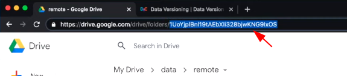

# Data Version Control (DVC)

**DVC** allows you to version control your large files such as data, binaries, images, videos, etc. in storage space. It is connected with **git** which helps in the version control part, but the data is not stored in your git repository and instead stored in your dvc repository.

## Requirements

- git
- dvc

# Installation

> Install in a virtual environment.
>

```bash
# Install with pip
pip install dvc==2.10.2
# Install with conda
conda install -c conda-forge mamba
```

> Install from repository
>

```bash
sudo wget \
       https://dvc.org/deb/dvc.list \
       -O /etc/apt/sources.list.d/dvc.list
wget -qO - https://dvc.org/deb/iterative.asc | gpg --dearmor > packages.iterative.gpg
sudo install -o root -g root -m 644 packages.iterative.gpg /etc/apt/trusted.gpg.d/
rm -f packages.iterative.gpg
sudo apt update
sudo apt install dvc
```

# Getting Started

- Create a repository for your data.

```bash
mkdir ml_data
```

- Initialize **git** and **dvc**

```bash
cd ml_data/
git init
dvc init
```

- If you’re already hosting data on cloud, use the following command to download it into your local machine.

```bash
dvc get <source> \
```

- If you’re adding new data, move it into your repository.

```bash
mkdir example_data/
cp <example_files> example_data/
# Add the data to dvc
dvc add example_data/
```

- You should get instructions on screen to add files to **git**.

```bash
git add example_data.dvc .gitignore
```

- Add remote storage.

### For **Google Drive:**

- Install the Google Drive dependencies for dvc.

```bash
pip install 'dvc[gdrive]'
```

- Create a directory on your google drive.
- Copy the id.



- Add the remote storage to your repository.

```bash
dvc remote add -d storage gdrive://<id>
# -d: Default
```

- Commit the change to your git repo.

```bash
git add .dvc/config
git commit -m "Configure remote storage."
```

- Push the data to remote storage.

```bash
dvc push
```

- A link is shown on the screen. Copy-paste it in your browser and copy the authorization code after the following screen.


- Once the authorization is successful, the files will be pushed to your remote storage.

<aside>
💡 If you have trouble with authentication, make sure you have installed the correct version of `dvc` with `pip`.
On Linux, you can delete the previous authentication token at `~/.cache/pydrive2fs/<dirname>/default.json,` for a fresh authentication.

</aside>

### Pulling data

Now, let’s try to delete our local data and pull it again.

```bash
rm -f example_data/
# Also remove the cached data
rm -rf .dvc/cache
```

Pull the data with.

```bash
dvc pull
```

And the data should be automatically downloaded.

### Modifying data

- Modify your data, for e.g. cropping your images, adding new images, etc..
- Add the modified data to `dvc` and `git`.

```bash
dvc add example_data/
git add example_data.dvc
git commit -m "Dataset updates."
```

- If you want to access the previous version of your data.

```bash
git checkout HEAD^1 example_data.dvc
dvc checkout
```

- You can commit this to git if you want to keep the old version.

```bash
git commit example_data.dvc -m "Revert dataset updates."
```

> You don’t need to do `dvc add`, since the storage already contains the old version of your data.
>
- If you want to go back to the updated data.

```bash
git checkout HEAD example_data.dvc
dvc checkout
```

### Cloning the repo

On Windows:

```bash
git clone <repo_url>
cd <repo_name>
# Make sure dvc is installed.
pip install dvc=2.10.2
# DVC Pull
python -m dvc pull
# Authenticate your GDrive account.
```
