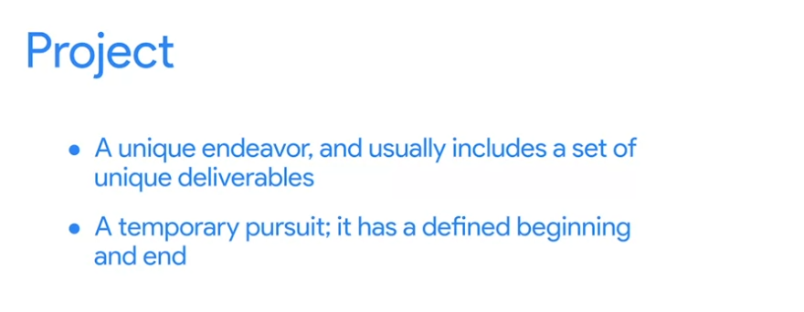

# Week 1

# Understanding the basics of project management

## What is Project Management?

### Project

### Project Management

### Skills Needed

- Organize
- Budget
- Maintain strong communication

### Outcomes of Bad Project Management

## What does a Project Manager do?

# Learning about careers in project management

## Finding the perfect role

### Networking

