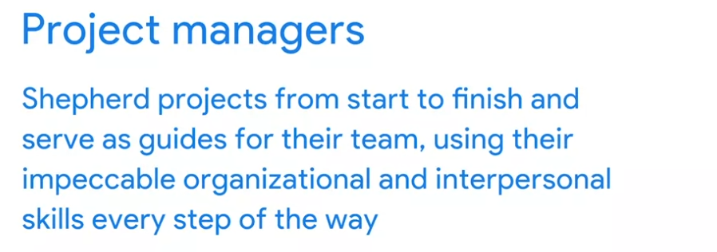

# Week 2

# Exploring how a project manager adds value

## The value of a project manager

### Project managers

### Stakeholders

### Prioritization

### Delegation

### Communication

## How project managers impact organizations

*You can save this reading for future reference. Feel free to download a PDF version of this reading below:*

**How project managers impact organizations.pdf**PDF File

[Open file](https://d3c33hcgiwev3.cloudfront.net/8vA9FspURf-wPRbKVKX_Bw_97db6aeaa13d4fbfa21e5439de82cef1_How-project-managers-impact-organizations.pdf?Expires=1648080000&Signature=ZFtrB6DoI3GksQ1BkRQdI9zL9g-0llIYCdviy47LoafGcmSP1LFSNg5bo9Ccc~s03mckX1bOv6Jsw6GteAuMJGJ6ARUEWXU6vOP4cRKdPw~6-6zwN1qKg7AFPW0bBUJKkTgrfcazM7FyHH6VzVbFAsazOTZgcUGs4xNhTEKomEM_&Key-Pair-Id=APKAJLTNE6QMUY6HBC5A)

You have learned that project managers can prioritize, delegate, and effectively communicate to deliver value to their projects. This reading will focus on the main ways that project managers can add value to projects and impact organizations, which include:

- Focusing on the customer
- Building a great team
- Fostering relationships and communication
- Managing the project
- Breaking down barriers

Customers are always a key element to success in any business. There is no exception to that in the field of project management. In project management, the word “customer” refers to a person or an organization that defines the requirements of the project and sets important guidelines, such as budget and deadlines. In projects, customers can be internal or external. Internal customers are stakeholders within your organization, such as management, project team members, resource managers, and other organizational departments. External customers are customers outside of your organization, such as clients, contractors, suppliers, and consumers.

To successfully deliver a project, it has to meet the customer’s standards. To meet the customer’s standards, you have to make sure you clearly understand their expectations. The customer is at the center of a successful project. Project managers can add a lot of value to the project by building relationships with customers and taking the time to make sure the customer is heard and satisfied with the result.

### **Asking the customer questions**

Let’s discuss how you can focus on the customer in a project. First, sit with the customer and ask what problem they are trying to solve. You might ask if they have a specific vision of the final outcome they would like delivered. Sometimes, customers will lean on project managers to find the solution to their problem. It’s your job to ask questions like:

- What is the problem you would like us to help solve? Example response: The customer wants help developing a new process that would allow their company to be more efficient.
- How is the problem impacting your organization? Example response: The customer states that they are losing clients because of their current inefficient processes since clients are sometimes receiving their orders late.
- What prompted you to ask for help now? Example response: The customer says that they may lose department funding if they do not improve efficiency.
- What is your hope for the outcome of this project? Example response: The customer states that their ultimate goal is to increase the speed at which they fill orders without sacrificing quality.

Taking the time to dig a little deeper into the “why” behind the project can help a project manager better support and understand the customer. The more you understand the customer’s goals, the more likely you will be able to produce what the customer is seeking.

The team is a project’s biggest asset. A successful project manager knows that and takes the time to understand each person’s motivations, strengths, and weaknesses. Project managers add value to the project by identifying the right team for the project and enabling the team to be successful and make decisions.

When you work to build a great team, you have to consider the skills needed for the project, as well as the resources available. Understanding the customer’s requirements helps shape the skills needed for your team. If you are working on a project that requires people with medical expertise and you hire people who do not have a medical background, no matter how hard that team works, they will not have the right skill set to complete the project. As project manager, you should bring on people with the right skills and ensure the team knows that each individual is valued, trusted, and appreciated. You can demonstrate how you feel about the team’s value by allowing them to have input and ask questions, and by addressing their needs as soon as possible.

Maintaining customer satisfaction and building a great team are two ways that you, as a project manager, can add value to a project. Both of these skills are built on the foundation of relationships and communication. The project managers who add the most value are the ones who take the time to build relationships, communicate, and treat others with consideration and respect.

Project managers can set the tone for a project and build relationships within their teams and with stakeholders. Taking the time to check in daily with your team, see how they’re doing, and ask if there is anything they need help with can go a long way towards making them feel valued and heard.

When you build teams, each person is generally assigned specific project tasks. Once each task is done, the person responsible for that task hands that part of the project over to the next person. Your team members don’t always see the whole picture and how they impact others in a project. A successful project manager sees the impacts of each process within the project and communicates those impacts to the team. This ensures that everyone working on the project understands their task goal as well as the big picture goal for the finished product. For example, if a graphic designer working on marketing materials for your project doesn't understand the customer’s overall goal to appeal to educators, they may not be able to fully capture the vision for the campaign. Helping this team member understand the big picture allows them to tailor their tasks to meet the needs of the project end goal.

Managing a project can be busy, but if you take the time to build relationships and maintain open lines of communication, you will increase the chances of the project’s success as well as the customer’s and your team members’ satisfaction.

Sometimes, when you ask why something is being done a certain way, the response you get is, “Because we’ve always done it this way.” A project manager adds value to a project when they break down barriers, allow their team to innovate new ways to do things, and empower them to share ideas. As a project manager, you have to model ingenuity and collaboration, and encourage your team to do the same.

How can you break down barriers on a project? You can provide support for your team as they try new approaches to find solutions, and you can advocate for additional resources for your team. If your team is having a hard time getting an answer from another organization, you can reach out to the organization yourself in order to keep the team on track and on schedule.

## **Key takeaway**

You have now learned some of the ways that project managers can add value to projects and impact organizations. By focusing on the customer, building a great project team, fostering relationships and communication, managing the project, and breaking down barriers, you can overcome obstacles and find solutions to succeed.

# Project manager roles and responsibilities

## Project manager responsibilities

### Planning and organizing

### Managing tasks

### Budgeting and controlling costs and other factors

is how a project manager oversees the financial components of a project and mitigates project issues and risks as they come up.

### Project Task

## Project manager’s role

As a project manager, you will likely work with **cross-functional teams**. A cross-functional team includes ****team members who have different backgrounds, types of expertise, and job functions. Even though these team members have different skill sets, occupy different roles, and may even work in different departments, they are all working towards a common goal: the successful completion of your project.

Sometimes the members of a cross-functional team are referred to as “T-shaped professionals.” They are skilled in how to collaborate and innovate with those in different job functions and across different departments, but they also contribute their own specific areas of expertise. Each member of a cross-functional team has their own unique perspective and experience, bringing different ideas and strategies to the project.

Let’s explore each of these ideas in more detail.

## **Clarify goals**

When working with cross-functional teams, it is important to ensure that each member of the team understands their role, how they support each other, and the common goals of the project. It is vital to set clear goals for the team and make sure that the team understands those goals. Be direct and concise, avoiding extraneous details and explanations. When communicating task or project goals, make sure you define key items, such as budget, deadlines, quality requirements, or important resources. Ensure your team members understand task and project goals by encouraging them to ask questions and clarify information. It will be up to you to continuously check in with your team to make sure they’re all moving towards their goals, staying on track, and completing quality work. Cross-functional teams may work in different departments, be in different physical locations, and have different leadership, but all team members work together with the project manager to support the current project. Your project may be competing against other priorities, so communicating clearly and often with your team—and vice versa—helps you identify any potential issues or concerns before they arise.

## **Get team members with the right skills**

Making sure you have team members with the correct skill sets for each of the project functions is critical. If you are building an airplane and you’ve got five engineers but no mechanics, you are missing a key element of your cross-functional team. As the project manager, you must help ensure that your team has the right people with the right skill sets needed for the project to succeed. Later in this program, we will discuss some tools you can use to help you identify the skill sets needed to accomplish your project tasks.

## **Measure progress**

Showing your team how much they have accomplished helps keep them motivated. Take the time to measure and communicate the project’s progress across the cross-functional team. This helps everyone see the full picture and recognize their impact on the project. You can measure progress in many ways, including meeting key milestones, completing project tasks, and meeting project goals on time and within budget. Regularly communicate with your team members to check on their progress. Ask them if they anticipate being finished on time. If not, ask how you can help them succeed. Keep track of the team’s progress throughout the project by documenting when tasks and goals are completed, and let your team members know if the project is on track or not. Make sure you communicate successes, delays, or issues, to the team so they know how the project is progressing. Keeping everyone informed is essential to the project’s success.

## **Recognize efforts**

Sometimes, when you work with cross-functional teams, there are certain skills that get recognized more than others. A mechanic could get accolades for coming up with the solution to a problem within the project, while the finance member who sourced the funding might be forgotten. As a project manager, it is your job to make sure that each member of your cross-functional team recognizes the value of their efforts each step of the way. You have learned the importance of building relationships with stakeholders, and building relationships with your cross-functional team members is just as important. Learning what makes your team members feel supported, giving and taking feedback, and being mindful of each individual's background, personal identifiers, and work style can help mediate some of the differences among team members.

## **Key takeaway**

Being able to communicate clearly with team members, clarify the goals of the project, get team members with the right skills, measure team progress, and recognize team members’ efforts is an important part of your role as the project manager, and is key to your project’s success.

# Acquiring the core skills of a successful project manager

## The core skills of a project manager

## Key competencies

# Key competencies: Flexibility and handling ambiguity

In the previous video, we discussed the four key competencies of a project manager: **enabling decision-making**, **communicating and escalating**, **strong organizational skills**, and **flexibility**. With time and practice, you will master these skills to help you become successful in a project management role. In this reading, we’ll dig deeper into why **flexibility** is essential for effective project management and how you can help your team deal with **ambiguity**.

First, let’s review the other project management competencies you’ve learned about so far.

## **Enabling decision-making**

You can help team members feel empowered from the start of your project by making the decision-making process collaborative. For example, state the goals of specific deliverables and elicit input from your team on how to achieve those goals. You may have an idea of how you would like certain tasks to be accomplished, but your team members may have more creative or efficient approaches. Empowering your team to express their opinions and make their own decisions allows you to focus on the overarching management tasks and prioritize them in order of importance. Additionally, when you allow team members to have a voice in decisions, it helps foster an environment of responsibility, accountability, and team closeness.

## **Communicating and escalating**

Project management requires clearly communicating project goals and expectations, team member roles and responsibilities, and constructive feedback. Knowing how to effectively communicate and when to escalate issues to management is key to keeping you, your team, and your organization on the path to success. When escalation is required, try to approach management with both the problem and the potential solution or suggestions. This will show that you’re taking initiative as a project manager.

## **Strong organizational skills**

If you demonstrate that it is important for you, as a leader, to stay organized through efficient tracking and communications, your team will follow suit. One way to do this is by utilizing the abundance of organizational tools available, such as:

- Planning and scheduling software (templates, workflows, calendars)
- Collaboration tools (email, collaboration software, dashboards)
- Documentation (files, plans, spreadsheets)
- Quality assurance tools (evaluations, productivity trackers, reports)

You may need to experiment with different organizational approaches to determine what works best for you and your team.

## **Flexibility**

All project managers need the ability to adapt and overcome changes and challenges. Let’s further explore why flexibility is such a critical project management skill and discuss how it can help prepare your team for change, mitigate risks, and handle ambiguity.

### **Flexible planning**

Change is inevitable, and the more flexible you are as a project manager, the more successful you will be throughout your career. These flexible planning strategies can help you manage your project during times of unpredictability:

- **Assess external constraints**. When planning your project, take external events into account, such as national holidays and team member vacations and sick leave. Leaving extra time in the schedule for these inevitable events up front can help minimize the impact to your project.
- **Plan for risks and challenges**. If you consider the risks that may occur, you may be able to find solutions for them in advance. For example, what if someone on your team gets sick or decides to quit? Are you able to replace them within the company? If not, can you hire an independent contractor? Come up with a list of people who may be able to join your team if one of your team members becomes unavailable. You can also assess risks by looking at historical data. Review your past projects and examine the challenges you faced. Then evaluate if similar challenges could occur in this project and prepare accordingly. We will discuss risk management at length later in this program.
- **Calculate “float” in your schedule**. **Float**, ****or slack, refers to the amount of time you can wait to begin a task before it impacts the project schedule and threatens the project outcome. Identifying float in your schedule can help with resource management, scheduling, and keeping your project on track. You will learn more about calculating float in a later course, when we discuss creating a critical path for your project tasks.

### **Handling ambiguity**

Ambiguity can be a big challenge in managing projects. Project managers often face ambiguity in goals, requirements, schedules, vision, or other areas related to the project. Your team will look to you to lead during times of ambiguity and change, and flexibility is especially important during these instances. Here are some different ways to help your team deal with ambiguity:

- **Keep calm.** In uncertain times, handling ambiguity with grace and poise will help inspire the members of your team to do the same.
- **Express empathy**. As a project manager, it is important to try to understand what your team is thinking and feeling, especially during times of ambiguity. Let your team members know that you care about the challenges they are facing and are there to support them.
- **Communicate what you know clearly**. Define the aspects of the project that are confirmed and will not change. This helps your team get a better sense of what to expect, regardless of any aspects of the project that are still unknown or changing.
- **Make decisions and stick to them**. Try not to second-guess your decisions in front of your team since this can lead to greater uncertainty. If you need to change course, clearly explain why you have chosen to do so to your team.
- **Trust the expertise of your team**. Increase clarity by having everyone on your team discuss what they already know or believe to be true about components of your project, such as what is involved in specific tasks or resources needed, based on their areas of expertise. Then, discuss what you still don’t know and brainstorm ways to gather more information.

## **Key takeaway**

As a project manager, having the flexibility and ability to handle ambiguity in a rapidly-changing business setting gives you an advantage. Mastering these competencies, along with enabling decision-making, effective communication skills, and strong organizational skills, will allow you to innovate and grow as a project manager and leader.

##

# Common myths about project managers

We have talked about the skills that project managers need to be successful in their role. Now, let’s debunk some of the common myths about what is needed to be an effective project manager.

## **Myth: You have to be an expert in the field and have a lot of technical knowledge about the project.**

**Reality:** There are benefits to the project manager *not* having a lot of technical knowledge about a project. Rather than getting caught up in the technical details when communicating with management and stakeholders, the project manager can look at all of the different pieces that the cross-functional team is working on and assess how they each contribute to the success of the project. As a project manager, you bring on the right team members—with their differing areas of expertise—and trust them to be able to focus on the technical aspects of the project. Your job is to handle the communication, documentation, and organization necessary to get the project successfully to the finish line.

**Scenario:** Jamar just landed his first project management job with a construction company.  He’s been tasked with managing the construction of a new elementary school in his city. He isn’t expected to know how to do all of the technical skills, like engineering, construction, plumbing, and electrical; he hires the right people for the job. He communicates the needs, timelines, and expectations of the project to his team members and stakeholders and helps break down any barriers to completing the project on time. Jamar helps the engineers and construction workers communicate with one another to ensure that they are all on the same page regarding the requirements. He makes sure that the materials are in place as needed for the plumbers and electricians.

**The bottom line:** Project managers hire the experts and help put all the pieces of the project together. Project managers don’t need to be experts in every field.

## **Myth: Only people with a lot of experience within an organization can manage projects successfully.**

**Reality:** It is a common misconception that anyone who has significant experience and success in an organization can manage projects there. In order to successfully manage projects in any organization, you must acquire the necessary skills, knowledge, tools, and techniques and be able to apply them. You don’t necessarily need to have worked in previous roles at that organization. In taking this certification, you are learning and practicing how to be an effective project manager before taking on a position.

**Scenario:** Sofia is a supervisor at a large customer service call center. She has been recognized by leadership as a top performer. To reward her, management has offered her the role of project manager for the implementation of a new call center software program. It will be her job to oversee the installation, training, and implementation of the new process. Sofia tries to manage the project, but she has no idea how to create a project plan, manage the various members of her team, identify risks, or handle any of the other major project management tasks. She lets her manager know that she does not have the appropriate training to manage the project but that she would like to build those skills. Sofia’s manager enrolls her in a project management training course so that she will have the necessary skills to manage projects in the future.

**The bottom line:** To be a successful project manager at any organization—regardless of whether you have worked there previously—it is essential to master the skills, tools, and techniques of project management.

## **Myth: You have to know every single detail about the project at all times.**

**Reality:** Details matter in project execution, but as a project manager, you must also focus on the big picture and strategy for the project. What is the end goal? Do you and your team have a clear direction? If the whole team understands their objectives and has what they need to be successful in their tasks, they can work on the individual details and provide you space to supervise the overall project goals. Open lines of communication will help ensure that your team members share any possible risks to the budget or schedule with you.

**Scenario:** Yui is a project manager working for a clothing company. The company is developing a new line of winter sleepwear that is set to launch in late October. Yui meets with the key stakeholders to determine their goals and timeline for the project. She recruits employees from the merchandising, exports, marketing, materials, production, and quality control departments to be a part of the project team. Yui meets with her team at the start of the project to clarify the objectives for the product line and checks in with them regularly to remove any barriers and find out where they need additional support. When a team member from the materials department informs Yui that the fabric they were planning on using for a particular style of pajamas has increased in price, Yui works with the team member to find a new supplier so that the overall project budget is not impacted.

**The bottom line:** Your role as a project manager is to communicate with your stakeholders, clarify objectives, and set expectations. Trust your team to handle the details of each project task and communicate with you when there’s an issue. Through your direct communication and strategic approach to problem-solving, you can provide solutions and help remove barriers for your team. This is where you add value!

We have just busted three project management myths! Recognizing these truths will help you be more confident and successful as you pursue your project manager career.

## Leadership and team dynamics

## Traits of a successful project manager

