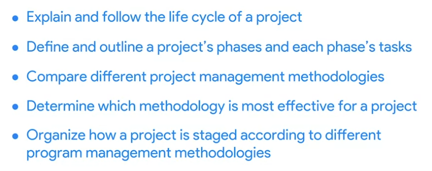

# Week 3

# Understanding the project life cycle

## The project management life cycle and methodologies

## Exploring the phases of the project life cycle

### Initiate the project

- Launchpad for the entire process of your project.
- You’ll define project goals and deliverables.
- Identify the budget and resources you’ll need.
- The people involved in your project.
- Any other details that can impact the successful completion of your project.

### Make a plan

- There are different ways to plan your project.
- Creating a plan of how you’re going to meet your goals is very important.
- Example, budget, a breakdown of all the tasks that you need to completed, ways to communicate team roles and responsibilities, schedule, resources, and what to do in case your project encounters problems or needs to change.

### Execute & complete tasks

- Most of the main tasks are done by the team.
- Your task is to monitor the team’s tasks along with your tasks.
- And keep your team motivated.

### Close the project

- You can reflect on the project.
- A moment to celebrate.
- Some projects may have a firm end date and others might continue to have tasks.

# Case study: The significance of each project phase

## **The consequences of rushing through a project phase**

It’s Friday night when Jason, a project manager at a company that specializes in virtual reality software, receives an urgent call from his manager, Mateo. Mateo tells Jason that he needs a cost and timeline for a virtual reality training program for Flight Simulators, Inc., a company that does aircraft maintenance, by the end of the weekend.

Jason spends the weekend working through a proposal for Flight Simulators, Inc. He quickly throws together a proposal estimating that it will cost $200,000 and take six weeks to develop the course. This is the standard cost and time frame for developing training on his company’s platform. He sends the proposal over to Flight Simulators, Inc. so that he can meet their deadline.

When Jason walks into the office on Monday morning, Mateo tells him that he got reprimanded for not following the company’s process for building out a proposal and including the engineers in the process. The engineers take a look at the information presented by Flight Simulators, Inc. and realize that the company’s software won’t work with their platform. It will take six months to develop their platform to meet the needs of the organization’s software and another six months to test the software and platform integration. The cost to develop and test this software will be over a million dollars.

This project has failed before it even started. There’s no way to complete the request from Flight Simulators, Inc. without impacting the budget, quality, and timeline.

## **What should have happened**

When his manager calls, Jason tells him that while he understands that Mateo wants to make the customer happy by getting them a proposal promptly, he would like to take a little more time to get the proposal right. Jason tells Mateo that he will draft up an email to Flight Simulators, Inc. and request additional time to develop an accurate and reasonable proposal. Mateo is hesitant but agrees.

On Monday morning, Jason sees that Flight Simulators, Inc. has responded to his request. They appreciate the fact that he communicated his concerns about the quick turnaround on the proposal request. They say they will give him a week to work with his team to provide an estimate for the project.

Now Jason has the time to get all of the key players involved in estimating the effort it will take to complete the project, including the cost, schedule, and resources.

Let’s apply the project life cycle to this project.

## **Initiating the project**

This is the phase Jason rushed through in the first scenario. Ideally, in this phase, Jason discusses project goals with Flight Simulators, Inc. to gain a clear understanding of what they are asking for. Once Jason has defined the project goals, he can gather the stakeholders and project team members to define what needs to be done to successfully create this training for Flight Simulators, Inc. Jason identifies the skill sets required, the timeline, and the cost to develop the training. He identifies and documents the value that this project creates for the company. He presents all of the information he has put together to his company’s leadership team, who approves Jason’s proposal. Jason then submits the proposal to Flight Simulators, Inc., and they accept it.

## **Making a plan**

Now that Jason has the green light to work on the project, he makes a project plan to get from start to finish. Having a plan in place ensures that all team members and stakeholders are prepared to complete their tasks. Jason outlines the important deadlines and tasks for the project to be successful. He creates a schedule to account for all resources, materials, and tasks needed to complete the project.

## **Executing and completing tasks**

During this project phase, Jason’s project team puts his plan in motion by executing the work. Jason monitors his team as they complete project tasks. His role as the project manager is not to complete the individual tasks but to help break down any barriers that would slow or stop the team from completing their tasks. It is also Jason’s responsibility to communicate schedule and quality expectations. Jason uses his communication skills to keep Flight Simulators, Inc. up to date on the project status and gather feedback from them. This keeps the project on schedule and within budget.

## **Closing the project**

Jason’s team has successfully completed the training, and he delivers it to Flight Simulators, Inc. They are very pleased with how it turned out! Jason is now ready to close this project and move on to the next one. Before he closes this chapter, Jason and his team discuss and document the lessons learned from the project. What worked well, and what could work better next time? Jason also puts together a small lunch gathering for his team to celebrate and recognize their hard work.

## **Key takeaway**

It may seem like a lot of work to go through an entire project life cycle, but the long-term impact it will have on your project is huge! It is your job as the project manager to make sure that your leadership truly understands the risk of not properly preparing for a project. Making assumptions that are incorrect can put your company at risk. Instead, taking the time to carefully initiate, plan, execute, and close your project leads to project success and good working relationships with customers.

# Analyzing the different project phases

## Initiating and planning

### Initiate the project

### Make a plan

## Executing and closing

### Execute and complete tasks

### Retrospective

### Close the project

## Summary of the project phases

The **project life cycle** is the path for your project from start to finish. Each project phase builds toward the subsequent phase and helps to create a structure for the project. To recap, the main phases of the project life cycle are: initiating the project, making a plan, executing and completing tasks, and closing the project.

In this reading, we will summarize each phase of the project life cycle.

## **The project life cycle**

### **Initiate the project**

In this phase, ask questions to help set the foundation for the project, such as:

- Who are the stakeholders?
- What are the client’s or customer’s goals?
- What is the purpose and mission of the project?
- What are the measurable objectives for the team?
- What is the project trying to improve?
- When does this project need to be completed?
- What skills and resources will the project require?
- What will the project cost? What are the benefits?

### **Make a plan**

In this phase, make a plan to get your project from start to finish.

- Create a detailed project plan. What are the major milestones? What tasks or deliverables make up each milestone?
- Build out the schedule so you can properly manage the resources, budget, materials, and timeline. Here, you will create an itemized budget.

### **Execute the project**

In this phase, put all of your hard work from the first two phases into action.

- Monitor your project team as they complete project tasks.
- Break down any barriers that would slow or stop the team from completing tasks.
- Help keep the team aware of schedule and deliverable expectations.
- Address weaknesses in your process or examine places where your team may need additional training to meet the project’s goals.
- Adapt to changes in the project as they arise.

### **Close the project**

In this phase, close out the project.

- Identify that your team has completed all of the requested outcomes.
- Release your team so they can support other projects within the company.
- Take time with your team to celebrate your successes!
- Pass off all remaining deliverables and get stakeholder approval.
- Document the lessons you and your team learned during the project.
- Reflect on ways to improve in the future.

## **Key takeaway**

Each phase of the project life cycle has its own significance and reason for existing. By following the project life cycle, you’re ensuring that you are:

- Capturing the expectations of your customer
- Setting your project up for success with a plan
- Executing project tasks and addressing any issues that arise
- Closing out your project to capture any lessons learned.

As you continue through this course, we will walk through each project phase in more detail.

# Comparing project management methodologies and approaches

## Introduction to project management methodologies

### Project management methodology

### Linear

- Example: Building a house.
- Completing each step in order and sticking to the agreed upon specific results and being able to deliver just what the client ordered.

### Iterative

- Example: Making a TV show: have different pilots, changing actors, changing time-limit of the show, flexible project.
- Allow for more flexibility and changes.

## Overview of Waterfall and Agile

### Waterfall

Eg:

### Agile

- Scrum is a form of Agile.

## Comparing Waterfall and Agile approaches

Now that you know more about some of the different approaches and frameworks associated with project management, let's compare specific aspects of **Waterfall** (also commonly called **traditional**) and **Agile** approaches.

Understanding the fundamentals of—and differences between—these common project management approaches can help you demonstrate your project management knowledge during an interview. It can also help you evaluate a project to determine the right approach when working on the job.

Waterfall and Agile are implemented in many different ways on many different projects, and some projects may use aspects of each. The chart below briefly describes and compares Waterfall and Agile approaches. You can use it as a quick reference tool, but be aware that in practice, the differences between these two approaches may not always be clearly defined.

**Waterfall and Agile Comparison**

[Untitled](images/week_3/Untitled%20Database%206182cc0bf1884ef1b0e368e7f550543e.md)

Now that you better understand the differences between Waterfall and Agile project management approaches, you can use this understanding to determine which is most effective for your projects.

## Introduction to Lean and Six Sigma

- Used in process improvement.

### Define

### Measure

### Analyze

### Improve

### Control

## Lean and Six Sigma methodologies

Previously you learned about Agile and Waterfall project management approaches. Now, we will define some key concepts from Lean and Six Sigma methodologies. We will learn how these methodologies can be used to organize and manage your projects, and we will discuss which is the most effective for different kinds of projects.

### **Lean**

**Lean** methodology is often referred to as Lean Manufacturing because it originated in the manufacturing world. The main principle in Lean methodology is the removal of waste within an operation. By optimizing process steps and eliminating waste, only value is added at each phase of production.

Today, the Lean Manufacturing methodology recognizes eight types of waste within an operation: defects, excess processing, overproduction, waiting, inventory, transportation, motion, and non-utilized talent. In the manufacturing industry, these types of waste are often attributed to issues such as:

- Lack of proper documentation
- Lack of process standards
- Not understanding the customers’ needs
- Lack of effective communication
- Lack of process control
- Inefficient process design
- Failures of management

These same issues create waste in project management.

Implement Lean project management when you want to use limited resources, reduce waste, and streamline processes to gain maximum benefits.

You can achieve this by using the pillars of the Lean 5S quality tool. The term 5S refers to the five pillars that are required for good housekeeping: sort, set in order, shine, standardize, and sustain. Implementing the 5S method means cleaning up and organizing the workplace to achieve the smallest amount of wasted time and material. The 5S method includes these five steps:

1. **Sort:** Remove all items not needed for current production operations and leave only the bare essentials.
2. **Set in order:** Arrange needed items so that they are easy to use. Label items so that anyone can find them or put them away.
3. **Shine:** Keep everything in the correct place. Clean your workspace every day.
4. **Standardize:** Perform the process in the same way every time.
5. **Sustain:** Make a habit of maintaining correct procedures and instill this discipline in your team.

Within the Lean methodology, 5S helps you boost performance.

The final concept of Lean uses a **Kanban** scheduling system to manage production. The Kanban scheduling system, or Kanban board, is a visualization tool that enables you to optimize the flow of your team’s work. It gives the team a visual display to identify what needs to be done and when. The Kanban board uses cards that are moved from left to right to show progress and help your team coordinate the work.

Kanban boards and 5S are core principles of the Lean methodology. They can help you successfully manage your project. Now let’s analyze the Six Sigma method and learn when is the best time to use it.

### **Six Sigma**

**Six Sigma** is a methodology used to reduce variations by ensuring that quality processes are followed every time. The term “Six Sigma” originates from statistics and generally means that items or processes should have 99.9996% quality.

The seven key principles of Six Sigma are:

1. Always focus on the customer.
2. Identify and understand how the work gets done. Understand how work really happens.
3. Make your processes flow smoothly.
4. Reduce waste and concentrate on value.
5. Stop defects by removing variation.
6. Involve and collaborate with your team.
7. Approach improvement activity in a systematic way.

Use this methodology to find aspects of the product or process that are *measurable* like time, cost, or quantity. Then inspect that measurable item and reject any products that do not meet the Six Sigma standard. Any process that created unacceptable products has to be improved upon.

Now that you understand both Lean and Six Sigma, let's see how they come together to improve the performance of your project!

### **Lean Six Sigma**

After both Lean and Six Sigma were put into practice, it was discovered that the two methodologies could be combined to increase benefits. The tools used in Lean, such as Kanban boards and 5S, build quality in processes from the beginning. Products developed using Lean methods are then inspected or tested using Six Sigma standards. The products that do not meet these standards are rejected.

The largest difference between these methodologies is that Lean streamlines processes while Six Sigma reduces variation in products by building in quality from the beginning and inspecting products to ensure quality standards are met. You may find that one of these two methods—or using them both together—can improve the efficiency of your projects.

## Common project management approaches and how to select one

You have been learning a lot about different project management approaches and when to use them. In this reading, we will briefly recap some of the most common ones and recommend a  couple of articles with supporting information. You’ll continue to learn more about these approaches throughout this certificate program.

## **Popular project management approaches**

Below is a brief recap of some of the project management approaches you’ve been introduced to so far:

**Waterfall** is a traditional methodology in which tasks and phases are completed in a linear, sequential manner, and each stage of the project must be completed before the next begins. The project manager is responsible for prioritizing and assigning tasks to team members. In Waterfall, the criteria used to measure quality is clearly defined at the beginning of the project.

**Agile** involves short phases of collaborative, iterative work with frequent testing and regularly-implemented improvements. Some phases and tasks happen at the same time as others. In Agile projects, teams share responsibility for managing their own work. Scrum and Kanban are examples of Agile frameworks, which are specific development approaches based on the Agile philosophy.

**Scrum** is an Agile framework that focuses on developing, delivering, and sustaining complex projects and products through collaboration, accountability, and an iterative process. Work is completed by small, cross-functional teams led by a Scrum Master and is divided into short Sprints with a set list of deliverables.

**Kanban** is both an Agile approach and a tool that provides visual feedback about the status of the work in progress through the use of Kanban boards or charts. With Kanban, project managers use sticky notes or note cards on a physical or digital Kanban board to represent the team’s tasks with categories like “To do,” “In progress,” and “Done.”

**Lean** uses the 5S quality tool to eliminate eight areas of waste, save money, improve quality, and streamline processes. Lean’s principles state that you can do more with less by addressing dysfunctions that create waste. Lean implements a Kanban scheduling system to manage production.

**Six Sigma** involves reducing variations by ensuring that quality processes are followed every time. The Six Sigma method follows a process-improvement approach called DMAIC, which stands for define, measure, analyze, improve, and control.

**Lean Six Sigma** is a combination of Lean and Six Sigma approaches. It is often used in projects that aim to save money, improve quality, and move through processes quickly. Lean Six Sigma is also ideal for solving complex or high-risk problems. The 5S quality tool, the DMAIC process, and the use of Kanban boards are all components of this approach.

Despite their differences, all of these project management methodologies require communication and collaboration among various teams and aim to deliver projects on time and within budget.

## **Selecting a project management approach**

With so many methodologies available, there are many options that would work well for your project. Since projects and the organizations in which you will execute them vary greatly, the approach you choose to implement for each project will vary. At Google, we often use a hybrid of approaches and frameworks to efficiently meet the project goal! All approaches can be combined with others, depending on the needs of your project.

Choosing an approach that works best for the project, the organization, and the team takes time and practice. You’ll learn more about how to choose a project management approach throughout this certificate program. In the meantime, take a look at how this article breaks down common methodologies and when (or when not) to use them: [Which project management methodologies should you use?](https://www.teamwork.com/project-management-guide/project-management-methodologies/)
