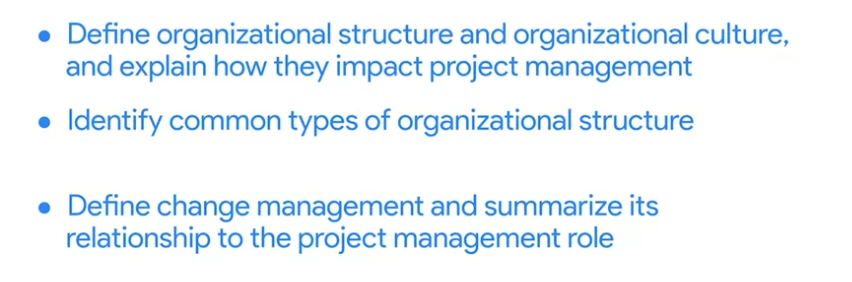

# Week 4

# Understanding organizational structure

## Introduction

## Organizational Structure

### Classic

### Matrix

## A project manager's role within different organizational structures

In the last video, you learned about the way a company is arranged, which is called **organizational structure**. You also learned that two of the most common organizational structures are **Classic** and **Matrix**.

Understanding the differences in Classic and Matrix organizational structures can help you ask questions during a job interview to fully understand the role and responsibilities you are considering. This will also help you understand which skills will be most important for you to have if you get the position.

Once you are hired into a role, knowing a company’s organizational structure can help you identify key points of communication and key stakeholders. It can also help you navigate within the organization when you need support or need to determine who has authority in a certain situation. Let’s examine the characteristics of each of these organizational structures in greater depth so you can identify the type of structure an organization has and how to navigate it as a project manager.

### **Classic organizational structures**

The **Classic organizational structure** is a top-down hierarchy system, where a Chief Executive Officer (CEO) has direct authority over several department managers. The department manager has direct authority over several other sections of employees. This system requires communication both up and down the ladder. In a Classic structure, authority comes from the top and filters to the bottom. Frequent reporting of project status updates may be required to pass up through management levels to keep higher leaders informed.

Classic organizations are also referred to as **functional** **organizations** because the organization is divided into departments based on function. Each department is led by a **functional manager**, and employees are grouped according to the functions of their role. For example, the main function of Friendly Skies Airlines, an airline company, is to fly airplanes. There are typically departments logically arranged to fulfill other important company functions, such as Marketing, Human Resources, and Strategy. Employees usually have a specialty within the organization and may not work within other areas during normal everyday operations.

### **Managing a project in a Classic organization**

Friendly Skies Airlines has a Classic organizational structure, as indicated by its reporting or “org” chart.

Imagine that the Friendly Skies Airlines Board of Directors approves an initiative to retrofit existing airplanes to carry more passengers. The CEO sponsors a project team to redesign the airplanes. The project will be led by a project manager from the Engineering and Innovation department and will require representatives from Finance, Marketing, Strategy, and Operations, along with several other team members from the Design department, to successfully complete the project.

The project team will typically remain in their reporting lines but act as their own assembled team. They do not fall under any of the existing functional departments. In the Classic organizational structure, the project builds from already existing departments to form teams.

If you are a project manager in this type of structure, you may need to consult with functional managers to understand your resources and the capacity of each teammate, as well as to familiarize yourself with each function’s internal processes and approval structure. Your authority may be slightly limited due to competing priorities, approval chains, and other complexities, but setting expectations up front will enable you to navigate the organization and execute your project successfully.

### **Matrix organizational structures**

The **Matrix** structure differs from the Classic structure in that the employees have two or more managers. In Matrix structures, you still have people above you, but you also have people in adjacent departments with whom you will need to communicate on your work progress. Functional areas tend to cross paths more frequently, and depending on the nature of the work, the responsible manager for each area has the most authority.

As a project manager in a Matrix organization, your team will essentially have at least two chains of command, or managers. You can think of the project manager as being a temporary manager while the employee is assigned to the team, whereas the functional manager is consistent regardless of which project the employee is supporting. The visual below illustrates what the Friendly Skies Airlines would look like if it had a Matrix organizational structure.

### **Managing a project in a Matrix organization**

Imagine that Friendly Skies Airlines is organized in a Matrix structure. Their Product Excellence team develops a new amenity kit for long-haul flights. They ask the Project Manager to help gather marketing materials that present research data about how this product fulfills passenger desires. The Project Manager is working on behalf of the Product Excellence team, but they are able to work in partnership with the Marketing team to create these materials.

You can read more about an overview of Matrix organizations in this [PMI article](https://www.pmi.org/learning/library/matrix-organization-structure-reason-evolution-1837).

### **Key takeaway**

In both Classic and Matrix organizations, project managers must clearly define roles and responsibilities in order to work effectively. However, within most Matrix organizations, some project managers or department leads may have the same level of authority as the functional managers and operate more directly.

Now you know how to identify Classic and Matrix organizational structures, how project managers fit into them, and how an organization’s structure may affect projects. You are well on your way to becoming a great project manager in any organizational structure!

## How organizational structure impacts project management

### Authority

### Resource availability

## Project Management Office

# Understanding the impact of organizational culture

## Introduction to organizational culture

### Organizational culture

### How to infer the company’s culture

### Navigating culture

### Change agent

## Learning about an organization’s culture

It is important to learn about the culture of the organization where you work or want to work. Understanding the company’s culture can help you navigate your team through a project. Consider this quote from Peter Drucker, an expert on management: ”Culture eats strategy for breakfast.” Drucker is implying that the culture of a company always influences its success, regardless of how effective the company’s business model may be. Organizational culture is critical to the health of a company, the people who work there, and the customers it serves.

### **The importance of organizational culture**

- **Identity:** An organization’s culture defines its identity. Its identity essentially describes the way the company conducts business, both internally and externally. A company’s values and organizational culture go hand-in-hand; its values are part of its identity. You can almost think of an organization’s culture as its personality. That is why it is important to learn your company’s (or target company’s) mission and value statements. The mission and value statements will help you understand why the company exists and will give you insight into what the company believes in and how it will behave.
- **People:** Strong, positive organizational culture helps retain a company’s best employees. People who feel valued, engaged, and challenged are more likely to give their best and want to drive for success. An organization’s culture can help keep talented employees at a company, and it can attract great people too! On the other hand, a toxic culture can have the opposite effect. It is important to find an organization with a culture that fits your personality. One way to find out more about an organization's culture is to talk to the people who work there. You can also take note of the current employees’ attire, expressions, and overall behavior.
- **Processes:** Organizational culture can have direct impacts on a company's processes, and ultimately, its productivity. The organization’s culture is instilled throughout the company—from its employees to how its employees do their job. For example, a company that values feedback and employee involvement might have that reflected in their processes by including many opportunities for employees to comment. By allowing employees to feel their voices are heard, this company is adhering to its culture.

### **Understanding an organization’s culture**

As a project manager, it is important to understand your company’s culture, especially because it could affect the projects you work on. Some aspects of an organization’s culture that are directly related to how you will manage projects are communication, decision-making, rituals, previous management styles, and values. To learn more about a company’s culture and how it applies to you as a project manager, you can:

### **Ask questions**

You can learn about an organization's culture by asking questions of management and peers. It can be helpful to ask these questions in the interview phase to better understand the company’s culture before accepting a position. You might want to ask questions about:

### **Atmosphere**

- What is the company’s dress code?
- How do people typically share credit at this company?
- Is risk-taking encouraged, and what happens when people fail?
- How do managers support and motivate their team?
- How do people in this role interact with customers and users?
- When and how do team members give feedback to one another?
- What are some workplace traditions?
- What are some of the ways the company celebrates success?

### **Policies**

- What are the policies around sick days and vacation?
- Does the company allow for employee flexibility (e.g., working from home, flexible working hours)?
- What policies are in place that support employees sharing their identity in the workplace?

### **Processes**

- What is the company’s onboarding process?
- How do employees measure the impact of their work?

### **Values**

- What are the company’s mission and value statements?
- How might the person in this role contribute to the organization’s mission?
- How does the organization support professional development and career growth?

### **Listen to people’s stories**

Listening to what current employees have to say and how they portray the company will give you great insight.

- What were employees' experiences with similar projects in the past?
- What can they tell you about key stakeholders and customers?

### **Take note of company rituals**

Rituals can be powerful drivers of culture. They engage people and help instill a sense of shared purpose and experience.

- How are birthdays and holidays celebrated?
- Do employees generally eat lunch at the same time and in the same place?
- Watch employee interactions**:** Observing how employees interact can help you tailor your interaction style to the company norm.
- Are employee interactions more formal or informal in nature?
- Are ideas solicited from employees in different roles?

## **Understand your impact**

As a project manager, you become a **change agent**. Remember: a change agent is a person from inside an organization who helps the organization transform by focusing on improving organizational effectiveness and development. When you begin a new role, sit down with management to better understand what is expected of you and how you can make the most of the opportunity.

### **Sharpen your communication skills**

Interpersonal communication skills are a major part of project management. How a company communicates is directly tied to its organizational culture. You will most likely have interactions with various departments and management levels while executing projects. To communicate effectively, you will need to understand how to navigate the different channels in your company. Ask questions about communication practices when you start a new role such as: Is it customary to sign emails from the team rather than from you individually? Should presentations include team members or be solely presented by the project manager? This can help you make sure you are adhering to expectations.

Approaching projects differently from how similar projects were managed in the past may be met with some resistance. Although some projects may call for you to break the status quo, when you show an appreciation of your organization’s culture, you may help your team members accept any improvements you are implementing.

### **Key takeaway**

Organizational culture is important because it has a direct impact on you as a project manager, and learning how to navigate organizational culture gives you a great advantage when you are executing projects. Being able to navigate departmental interactions, communicate effectively, and plan your project in line with the organization’s culture will help set you up for success in your project management career path.

## Case study: Balancing company culture and strategic goals

As you’ve learned, **organizational culture** refers to the values employees share and an organization’s values, mission, history, and more. In other words, organizational culture can be thought of as a company's personality. A company’s organizational culture can help drive its internal and external success. When a company’s culture is aligned with its corporate strategy and goals, the level at which it can perform is impressive. When researching a company for a possible new job, understanding the company’s culture can help you decide if it is a good fit for you and your priorities. Also, understanding a company's culture as a project manager can help you make informed choices about when you want your actions and decisions to fit within the culture or when you might choose to intentionally push back against the culture to effect change or create improvements. Let’s explore an example of a positive organizational culture and how a project manager fits into that culture.

### **The Family Java culture**

The Family Java coffeehouse has over 2,000 stores worldwide. The Family Java’s culture is closely linked to their strategy and capabilities—this is what they feel sets them apart from other coffee shops. The company has invested in a relationship-driven, employees-first approach. Their culture establishes that the employees are what makes the company unique. This helps foster a warm, comfortable, and calm environment for both employees and customers alike. Because The Family Java’s organizational culture has cultivated employees who genuinely care about the company and their jobs, those employees create the same environment for their customers to enjoy.

The Family Java’s mission and values speak to this approach directly:

**Mission**

- To provide a welcoming environment where our employees become our family and our guests become our friends

**Values**

- To create a place where everyone is welcome
- To always give our best and hold ourselves accountable for the results
- To treat others with respect and kindness

The Family Java has worked hard to be able to create the structure to put their mission and values into practice daily. They practice these values, all while achieving new levels in sales and growth. For example, The Family Java believes in expressing their employees-first value by spending more on employee healthcare than on coffee beans! Each employee is crucial to the success of the company and their ability to fulfill their mission and adhere to their values. In turn, the company makes their employees feel valued by offering substantial training, education scholarships, assistance with daycare, and growth within the company.

The Family Java is able to capitalize on the critical link between culture and strategic goals to achieve optimal performance. When evaluating their organizational culture, the company focuses on their positive attributes and adapts to what works and has proven to be beneficial. By taking the time to perfect what the company does well, The Family Java has created a culture that drives out negativity, empowers employees to be their best selves, and aligns with their strategic goals.

### **A project manager’s relationship to organizational culture**

### **Learning the company’s values**

Avi was excited to begin his role as a project manager at The Family Java. He had asked questions about the organization’s culture during his job interview and was told about the company’s people-first approach. Avi’s previous company prioritized profitability over teamwork and mentorship. While his previous company was very successful, it was difficult for Avi to engage meaningfully in his work because the culture was so focused on financial results rather than on their employees’ job satisfaction. Avi felt like The Family Java’s approach better aligned with his own values.

### **Clarifying the company’s expectations**

Avi’s manager at The Family Java said that his role would involve a substantial emphasis on team building and keeping morale high. When he began, Avi asked his manager to clarify the time investment expected by the company in order to accomplish team- and morale-building goals. He also asked for suggestions and guidance based on what had been done at the company in the past. If Avi had made incorrect assumptions about the company’s culture and tried to manage projects with his previous company’s culture in mind, he might have emphasized speed over collaboration and communication. Avi now knew that he would need to carefully balance expectations related to The Family Java’s culture with the project workload in order to meet project timelines and achieve the desired outcome.

### **Applying organizational culture to a project**

Before beginning his first project, Avi planned a team lunch to get to know everyone at The Family Java. Then, he scheduled one-on-one meetings with each of his team members to learn more about their working style and professional goals. He also asked how he could help support and remove any barriers for them. One of Avi’s team members, Miguel, said that he needed to start his workday early because he picked his children up from school at 3:00. After hearing this, Avi avoided scheduling team meetings in the late afternoon. Another team member, Elisa, told Avi that she preferred face-to-face or phone conversations to email since she felt like she communicated better verbally. When Avi needed to discuss something with Elisa, he made sure that he talked with her in person as much as possible. Avi continued to check in with all of his team members regularly as the project progressed. He also scheduled weekly “Coffee Chats” with his team, since he had learned that this was company tradition. Avi’s efforts to align his project management style to The Family Java’s organizational culture were noticed by executives and stakeholders, and he was given a lot of support in getting the resources he needed.

### **Key takeaway**

The culture of each organization you encounter will be different and can change over time. Like Avi, it is worth your time as a project manager to learn about your company's culture because it directly relates to your projects’ success.

## Understanding change management

### Change Management

The process of delivering your completed project and getting people to adopt it.

### Core concepts

## A project manager’s role in change management

In this lesson, you’re learning about how to support the **change management** process for your project. To review, change management is the process of delivering your completed project and getting other people in the organization to adopt it. In this reading, we will discuss strategies for approaching change management as a project manager.

Your project’s success depends on the adoption and acceptance of your project—whether that entails the launch of a new external tool or a process that will change operations at a production facility. In both cases, the greatest impact of the change will be on the people who use and interact with the product or process that is changing.

For example, if your website’s user interface changes, the major impact of that change affects the user. The user must learn how the website has been reorganized and adapt to the new way to navigate it. If part of the website’s interface update includes a new brand logo, the major impact of that change impacts your organization’s employees. They must be made aware of the new logo and measures must be taken to ensure that all company communications include the new logo, not the old one.

You can help ensure your project’s success by embracing changes as they come and by convincing the wider audience, whether that is the end user or members of the organization, to embrace changes, too. When you implement a careful approach to change management, you can address issues that might occur in the later stages of your project.

### **Integrating project management and change management**

Change management is a major undertaking and a project in and of itself. When it comes to change management, you may not always be responsible for leading and planning the entire end-to-end process. There will be times when your manager, a team member, or another senior leader might be responsible for taking on that transition and successfully implementing the changes. However, just because you're not the one directly leading the change, there are still ways in which you can support and participate in the successful adoption of your project.

As a project manager, you can think of change management as necessary for the successful outcome of your project. Both change management and project management aim to increase the likelihood of project success. They also incorporate tools and processes to accomplish that goal. The most effective way to achieve a project goal is to integrate project management and change management, and it is your responsibility as a project manager to do so.

When you are thinking about change management as it relates to your project, begin by asking yourself the following questions:

- How will the organization react to change?
- Which influencers can affect change?
- What are the best means of communication?
- What change management practices will lead to the successful implementation of my project?

The answers to these questions will help you prepare for a variety of possible scenarios and allow you to craft solutions to effectively support the adoption of your project.

Let’s look at some best practices for approaching change management on your projects:

**Be proactive.** Proactive and inclusive change management planning can help keep any potentially impacted stakeholders aware of the upcoming changes.

- Incorporate change management into your project management steps. For example, you can schedule time during team meetings or create a feedback document to ensure that your team members know there is a place to voice their suggestions and concerns.
- You can also plan steps towards the end of your project to introduce the deliverable to stakeholders in the form of demonstrations, question and answer forums, or marketing videos. You can factor all of these decisions into your plan so that any potential changes are less likely to impact your timeline. If these steps have not been built into your plan, you can escalate and stress the importance of a change management plan to your stakeholders.

**Communicate about upcoming changes.** Communication should occur regularly among impacted stakeholders, the change management team, and the project team. Check in and communicate throughout the project about how the changes will provide a better experience for end users of the project deliverables. In this way, you support the process by providing everyone with the information they need to feel prepared to adjust to changes once the project is ready to launch.

**Follow a consistent process.** Following a clear change management process helps maintain consistency each time there is a change. The change management process should be established and documented early on in your project to guide how the project will handle change. Your organization may also have an overarching change management plan that can be adopted for your project. This may include when the promotion of the change should happen, when training should occur, when the launch or release will occur, and corresponding steps for each phase of the process.

**Practice empathy.** Changes are inevitable, but we are often resistant to them. By being empathetic to the challenges and anxiety change can bring, you can support the process in subtle ways.

**Use tools.** Incorporating tools to assist in the adoption of a change can be very helpful. Here are a few examples you can use on your next project:

- **Feedback mechanisms**, such as surveys, can capture input from stakeholders.
- **[Flowcharts](https://www.lucidchart.com/pages/what-is-a-flowchart-tutorial)** can visualize the project's development process.
- **[Culture mapping](https://www.strategyzer.com/blog/posts/2015/10/13/the-culture-map-a-systematic-intentional-tool-for-designing-great-company-culture)** can illustrate the company's culture and how the company's values, norms, and employees behavior may be affected by the change.

As the project manager, you are responsible for successfully delivering projects. As you hone the skill set you acquire throughout this program, you will find that change management is essential to your projects’ success.

For more on how to participate in the change management process, check out the following resources:

- [Change Management at the Project Level](https://www.prosci.com/resources/articles/change-management-at-the-project-level)
- [5 Steps to Successful End-User Adoption](https://www.citrix.com/content/dam/citrix/en_us/documents/reference-material/5-steps-to-successful-end-user-adoption.pdf)
- [Change Management Framework](https://docs.google.com/presentation/d/1YMVERX1vBsknCjbCtsKFmHgWWZxFcO5A3urvWbWXKbs/template/preview?resourcekey=0-_V7hj-KwQu75EI2Y9qpsTw)

If you don't have a Google account, you can download this file directly from the attachment below:

## Participating in change management

## Corporate and project governance

**Governance** in business is the management framework within which decisions are made and accountability and responsibility are determined. In simple terms, governance is understanding who is in charge. In this reading, we will discuss corporate governance and project governance. It is important to learn how corporate and project governance are related since you may have to speak about governance in an interview. Additionally, you will need to understand how your project relates to the governance structure of the organization.

### **Corporate governance**

Each organization is governed by its own set of standards and practices that direct and control its actions. Those standards and practices are called **corporate governance**, and they will influence your projects. Corporate governance is the framework by which an organization achieves its goals and objectives. Corporate governance is also a way to balance the requirements of the various corporate entities, such as stakeholders, management, and customers. Corporate governance affects every part of an organization, including action plans, internal and external controls, and performance measurements.

Governance and change management go hand-in-hand. Think back to the previous videos on change management. To successfully implement change management, it is essential that you understand the structure and culture of the organization. Effective governance in change management provides clearly defined roles and responsibilities during change. This enables the people within the organization to have a precise understanding of who makes decisions and of the relationship between those managing and participating in the change management process.

Another example of governance within an organization is the creation and use of **steering committees**. Steering committees decide on the priorities of an organization and manage the general course of its operations. The steering committee essentially acts as an advisory board or council to help the project manager and the company make and approve strategic decisions that affect both the company and the project.

### **Project governance**

As a project manager, you will be responsible for **project governance**. Project governance is the framework for how project decisions are made. Project governance helps keep projects running smoothly, on time, and within budget. Project governance involves all the key elements that make a project successful. It tells you what activities an organization does and who is responsible for those activities. Project governance covers policies, regulations, functions, processes, procedures, and responsibilities.

### **How project and corporate governance intersect**

Project governance needs to be tailored to your organization's specific needs. These needs will influence how you implement and monitor the governance framework on your project. Project governance concerns those areas of corporate governance that are specifically related to project activities. Effective project governance ensures that an organization’s projects are aligned to the organization’s larger objectives, are delivered efficiently, and are sustainable. This includes:

- Considering the long- and short-term interests of your organization
- Making thoughtful decisions about which projects to take on and avoiding projects if you do not have sufficient resources
- Providing timely, relevant, and reliable information to the board of directors and other major stakeholders
- Eliciting the input and buy-in of senior managers since they are the decision-makers
- During the initiation phase, prioritizing clear, reachable, and sustainable goals in order to reduce confusion and conflict
- During the planning phase, assigning ownership and accountability to an experienced team to deliver, monitor, and control the process
- During the execution phase, learning from mistakes and adapting to new or improved knowledge

Corporate governance can involve clearing many hurdles before making decisions. These decisions can influence not only a single project, but the entire corporation.

At the same time, corporate governance can help support project governance, as it provides oversight on compliance and mitigating risk and offers guidance and direction for project managers. Good corporate governance can also help project managers secure resources, get issues addressed, avoid delays in decision-making, get buy-in from stakeholders, and achieve visibility for projects on the executive level.

### **Key takeaway**

You should think about an organization’s culture and structure when you are interviewing for a new role and as you begin a new role or project. You should consider an organization’s governance processes and practices in the same way. This will help you understand how decisions are made, who is responsible for what, and what are the potential issues and areas of concern.

## How to uncover job opportunities

Starting a new career means not only developing a new skill set but also learning how to relate your previous experience and skills to the new role you’re pursuing. If you’re ready to start your journey on a new career path, this reading will help you position yourself for success in your job search. You’ll learn how to understand what your potential employer is looking for and how to connect your background to their needs. The strategies outlined below are designed to help you become a strong job candidate, even if you don’t have directly relevant experience.

The first step is to fully understand the role you’re targeting.

### **Understand your target role**

One of the primary challenges for anyone looking to launch a new career is how to stand out against candidates who already have experience in the field. Overcoming this challenge begins with developing a comprehensive understanding of the role you’re targeting. You'll need to understand the role in the context of any company you’re applying to, and more broadly as well. Having a holistic understanding of what it takes to succeed in your target role will help you determine your suitability for the role, and identify any steps you can take to improve your chances of getting hired.

To understand everything from minimum must-have requirements to skills that might help you stand out from the crowd, you can begin by researching and analyzing job descriptions across different organizations.

Below you’ll find our recommended strategy for how to approach this process effectively.

### **Analyze job listings**

The first part of the process is to gather information from multiple job listings:

- **Pull up ten job descriptions for your target role**. To do this, you can use job boards like Indeed, Glassdoor, and LinkedIn. Make sure the roles you select come from different companies, share similar titles, and are roles you would actually apply for. In each job description, you should be able to identify a section listing requirements for the role.
- **Combine all the job requirements**. To do this, create a new Google document and copy over all the required responsibilities from all ten job descriptions.
- **Order requirements based on appearance frequency.** Certain requirements will likely appear in multiple descriptions. The more commonly they appear, the more likely it is that they’re essential for the role. Put the most frequently appearing requirements at the top of your list. For example, a requirement that appears in all ten descriptions would go at the very top.

After completing these steps, you should have a clearer picture of which requirements are most common and important for the role. You may also have questions:

- **Why do requirements differ across job descriptions?**
One of the most common reasons for this has to do with overly general job titles, or job titles that don’t necessarily communicate the specific scope of a given role at a particular company. For example, a program manager at one company might be focused on customer management, while at another company, the emphasis might be on project management. A Data Analyst might primarily use SQL at one company and Python at another. Because of these differences, it’s important to look beyond job titles. This is why we recommend the process outlined above—to help ensure you’re targeting the exact roles that are right for you—and that you understand the requirements for those exact roles.
- **Why are some requirements higher on my list than I thought they would be, while others I expected to see barely show up at all?**
If you’re surprised by your results, you may need to spend more time learning what the role really entails, as you may have some preconceptions about the role that require adjusting. You might also need to do additional research to ensure you’re targeting the right roles in your job search.
- **How do I know if I’m really right for my target role?**
It’s perfectly normal to experience self-doubt at this stage of the process. Remember, this is a new career for you. You’re not expected to know everything about the role, and it’s likely that your existing skills and experience won’t line up perfectly. The more you learn about the role, the better you’ll understand what’s required for success, and the more you’ll know about how to prepare yourself for that success.

### **Create your professional inventory**

For this next step, you can temporarily set aside the master list of role requirements you previously created. The focus here will be on your existing professional qualifications, and any other skills or experience you possess that might be relevant to your target role and of value to a potential employer.

To begin, assemble a comprehensive list of the following:

- **Technical (hard) skills**. These are skills relating to a specific task or situation such as programming, technical writing, project management, and more.
- **Non-technical (interpersonal) skills.** These are the skills that enable people to navigate their environment, work well with others, perform well, and achieve their goals. They include skills like communication, leadership, team management, and more.
- **Personal qualities.** These are positive attributes and personality traits such as being honest, having a good sense of humor, and being dependable. You can also include your professional interests on this list.
- **Education.** This includes any post-secondary education, certifications, or independent classes completed online or offline.

**Tip**: You do not need to limit your professional inventory to skills and qualities developed through professional experience. Consider any volunteer, extracurricular, or personal experiences that might help a hiring manager understand your capabilities.

Once you’ve created your inventory of skills and experience, you’re ready to line these up against your requirements list.

### **Match your profile to the job requirements**

The concluding step in this process is to match your profile to the job requirements. The goal here is to make it easy for any hiring manager to see why you’re a great fit for their role. You’ll accomplish this by learning what to emphasize and focus on in your search, on your resume, and during interviews.

To begin, go through your professional inventory of skills and experience, highlighting each item in green, orange, or red, depending on its relevance to your target role. Relevance is determined by whether a given skill appears on your role requirements list, how high it appears on your list, and how directly it aligns with your list.

For example, let’s say you’re interested in a program manager role. If you’re skilled at using project management software, and project management software skills are high on your job requirements list, then highlight that item in green. If you have some experience with tools that do not consistently show up on job descriptions but could still be relevant, highlight these skills in orange.

- **Green** **should be used for skills that are directly relevant to your target role. You should look for roles that emphasize these skills. You should also highlight these skills on your resume, and be prepared to discuss them in an interview.
- **Orange** **should be used to identify those skills and experiences that are relevant for the role but not necessarily in a direct way. These are generally your transferable skills—skills that you bring with you from past experiences that can help you succeed in your new role. Plan to have to explain these to recruiters and hiring managers, as their relevance may not be immediately evident.
- **Red** should be used for items that are not relevant for your job search. De-prioritize these skills, and steer clear of highlighting them on your resume and focusing on them during interviews.

Of these three categories, the orange items are where you’ll need to focus extra attention. When it comes to transferable skills, you have to do the convincing, as you can’t count on a recruiter or hiring manager making the connection. For example, no job description for a project manager role calls for waitstaff experience. However, that project manager job description will likely mention excellent communication skills—which you would have developed during your hospitality career. When applying for the project manager role, make sure your resume specifically mentions excellent communication in addition to listing “waiter” or “waitress” as your previous occupation. Once you’ve categorized your skills and experience based on how well they align with the requirements for your target role, you’re ready to move your job search forward.
