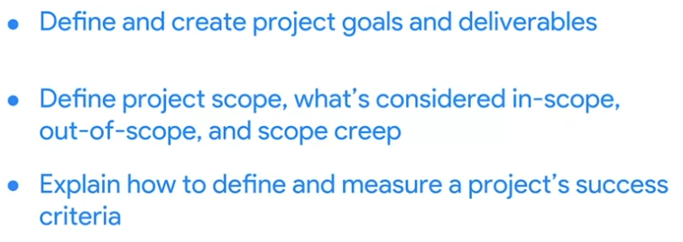

# Week 2

# Identifying project goals

## Introduction: Defining project goals, scope, and success criteria

## Determining project goals and deliverables

### Project Goal

- A desired outcome of a project that is clear and specific.

Eg:

### Project deliverables

## How to set SMART goals

### SMART goals

### Specific

### Measurable

### Metrics

What you use to measure something.

### Benchmarks

Points of reference.

### Attainable

### Relevant

### Time-bound

## SMART goals: Making goals meaningful

In this lesson you are learning to define and create measurable project goals and deliverables. Now, let's focus on SMART goals.

**Specific, Measurable, Attainable, Relevant,** and **Time-bound (SMART)** goals are very helpful for ensuring project success. As you start your career in project management, you may not directly set the project goals, but you should be able to clarify and understand them. SMART goals help you see the full scope of a goal, determine its feasibility, and clearly define project success in concrete terms.

Let’s recap what we discussed in the previous video by taking a look at a breakdown of the criteria for SMART goals below:

- **Specific:** The objective has no ambiguity for the project team to misinterpret.
- **Measurable:** Metrics help the project team determine when the objective is met.
- **Attainable:** The project team agrees the objective is realistic.
- **Relevant:** The goal fits the organization’s strategic plan and supports the project charter.
- **Time-bound:** The project team documents a date to achieve the goal.

You may see variations on what each letter in the “SMART” acronym stands for. (For example, you may see “actionable” or “achievable” instead of “attainable” or “realistic” instead of “relevant.”) However, the general intent of each of these terms—to make sure the goal is within reach—is always similar.

### **Focusing on the "M" in SMART**

Let’s take a moment to zoom in on the **M** in SMART, which stands for **measurable**. Having measurable goals allows you to assess the success of your project based on quantifiable or tangible ****metrics, such as dollar amounts, number of outputs, quantities, etc. Measurable goals are important because they leave little room for confusion around expectations from stakeholders.

Not every metric will have value, so you will have to determine which metrics make sense for the project. For example, measuring how many meetings the software engineers on your project attend on a weekly basis may not be the most valuable metric for a productivity goal. Alternatively, you might measure other aspects of the engineers’ productivity, such as a particular number of features created per engineer or a specific number of issues flagged per day.

### **Defining a SMART goal**

Let’s explore an example related to making a personal goal measurable. Imagine you are looking to make a career change, and you set a goal to complete a Google Career Certificate. You can **measure** the success of this goal because after completing the entire program, you will receive a certificate—a tangible outcome.

Now, let’s determine how to make the remaining elements of this goal SMART. In this example, your **specific** goal is to attain a ****Google Career Certificate. You can make this goal **attainable** by deciding that you will complete one course per month. This goal is **relevant** because it supports your desire to make a career change. Finally, you can make this goal **time-bound** by deciding that you will complete the program within six months.

After defining each of these components, your SMART goal then becomes: Obtain a Google Career Certificate by taking one course per month within the next six months.

### **Key takeaway**

Determining metrics can be extremely helpful in capturing statuses, successes, delays, and more in a project. As a project manager, identifying meaningful metrics can help move the project toward its goal. Additionally, by defining each element of a project goal to make it SMART, you can determine what success means for that goal and how to achieve it.

## Navigating Peer/Self Reviews

## Introduction to OKRs

- Objectives + Key Results
- OKR’s combine a goal and a metric to determine a measurable outcome.

### Objective

- Defines what needs to be achieved.
- Describes a desired outcome.
- Examples:
    - Increase in customer retention.
    - Improve the employee onboarding process.

### Key Results

- The measurable outcomes that define when the objective has been met.
- Example:
    - Objective: Improve customer retention.
    - Key Result: Achieve a 90% customer satisfaction rating by the end of the first quarter.

### OKR Levels

### Company level OKRs

### Project level OKRs

- Need to support and be aligned with company level OKRs.

### Example

- Company level OKR

- Department / Project level OKR

- Project level OKR

### Key points

## Reading: Creating OKRs for your project.

- OKRs stands for Objectives and Key Results, which combine a goal and a metric to determine a measurable outcome.
- They are used to set an ultimate goal for an entire organization, while team, department, and project-level OKRs describe the focused results each group will need to achieve in order to support the organization.
- As a project manager, OKRs can help you expand upon project goals and further clarify the deliverables you’ll need from the project to accomplish those goals.
- Project objectives should be aspirational, aligned with organizational goals, action-oriented, concrete, and significant.
- For each objective, add 2-3 key results which should be time-bound, results-oriented, measurable and verifiable, specific and time-bound, aggressive yet realistic.
- Keep in mind that OKRs are motivational and inspiring, while key results are tactical and specific.
- Develop around 2-3 key results for each objective and document them, linking to them in the project plan.
- OKRs are different from SMART goals, where SMART goals are specific, measurable, attainable, relevant, and time-bound.

    ### Other reading resources:

    - [Google’s OKR playbook](https://www.whatmatters.com/resources/google-okr-playbook/)
    - [Planning company goals](https://asana.com/guide/examples/project-management/goals-okrs-planning)
    - [OKRs and SMART goals: What's the difference?](https://www.whatmatters.com/resources/okrs-smart-goals-difference-between/)
    - [OKRs and KPIs: What They Are and How They Work Together](https://www.reflektive.com/blog/okrs-and-kpis-what-they-are-and-how-they-work-together/)
    - [How OKR and project management work together](https://www.perdoo.com/resources/okr-and-project-management/)
    - [OKR Examples](https://www.workfront.com/strategic-planning/goals/okr/okr-examples)
    - [OKR TED Talk](https://www.whatmatters.com/articles/ted-talk/) video (John Doerr, the founder of OKRs, explains why the secret to success is setting the right goals.)

# Defining Project Scope

## Determining a project’s scope

- Project scope is the boundaries of a project and an agreed upon understanding of what is included or excluded from a project.
- Scope helps ensure that a project is clearly defined and mapped out, including who the project will be delivered to and who will be using the end result.
- Understanding the project's complexity is also important when determining scope.
- Scope includes the project timeline, budget and resources, which should be clearly defined to make sure the project is possible within those boundaries.
- Poorly-defined scope or major changes to scope can cause changes to the budget, timeline, or final outcome of the project.
- To determine scope, talk to sponsors and stakeholders, understand their goals and find out what is and is not included in the project.
- Defining project scope should happen during the initial planning stage, and all details should be documented so they can be referred to throughout the life cycle of the project.
- The project manager is responsible for monitoring the project and making sure all work and resources fall within its scope, but team members and stakeholders can also help by focusing on tasks that are important to reaching the project's goal.

## Gathering information to define scope

- Learn to define project scope status, differentiate in-scope, out-of-scope, and scope creep factors that affect reaching the project goal
- Identify vital elements of a project’s scope
- Examine the right questions to ask in order to define project scope
- The scope provides the boundaries for the project
- Helps to identify necessary resources, resource costs and schedule for the project
- In the given situation, manager asks to update dining space without providing instruction
- Some questions to ask in order to get information to define scope:
    - Who is the project for?
    - What is the project expected to achieve?
    - When is the project expected to be completed?
    - Where is the project taking place?
    - Why is the project needed?
    - How will the project be completed?
- Taking the time to ask questions and ensure that you understand the scope of the project will help reduce expenses, rework, frustration and confusion.
- Make sure you understand the who, what, when, where, why and how as it applies to the scope
- If you are missing any of that information, focus your questions on those elements
- The initiation phase of the project sets the foundation for the project, so ensuring that you understand the scope and expectations during this stage is essential.

##
