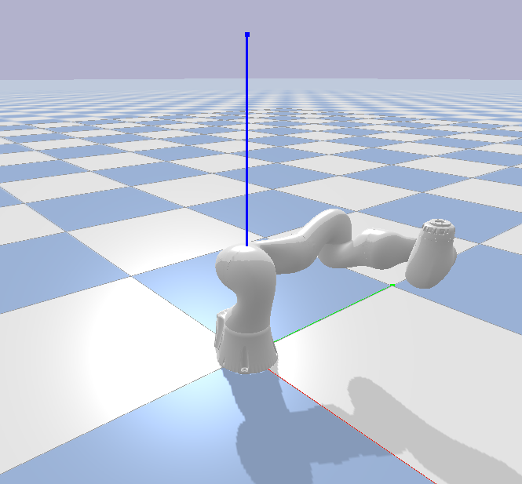

# PyBullet Basics Tutorial for Robotics
This repo contains some tutorial scripts to get started with robotics simulation
with PyBullet. Inspired by [video tutorial](https://www.youtube.com/watch?v=9p0O941opGc)
by Skyentific.



## Requirements
* pybullet

    ```python
    pip install pybullet
    ```

* pybullet_data

* kuka_experimental repo from ros-industrial


## Setup

* Create a directory and clone kuka_experimental repository

```
$ cd Documents
$ mkdir PyBulletProject
$ cd PyBulletProject/
$ git clone https://github.com/ros-industrial/kuka_experimental.git
```

## Simulation controls
- g : To toggle on and off all menus; make them disappear and appear again
- ctrl + left mouse + mouse : To rotate

## How to Use

### Tutorial-1: Launch Simulation; Load Robot and Start Simulation

* Launch python.

```
    $ python3
```

* Import pybullet
```
    import pybullet
    import time
    import pybullet_data
```


* Launch PyBullet GUI

```
    physicsClient = pybullet.connect(pybullet.GUI) # To launch simulation

    # Add Search Path
    pybullet.setAdditionalSearchPath(pybullet_data.getDataPath())

    # Serves as ground in our simulation
    plainID = pybullet.loadURDF("plane.urdf") # Present in pybullet_data

    # Load robot
    robot = pybullet.loadURDF("Documents/PyBulletProject/kuka_experimental/kuka_lbr_iiwa_support/urdf/
    lbr_iiwa_14_r820.urdf")

    # Get info about robot
    pybullet.getNumJoints(robot)

    # Orientation is a quaternion
    position, orientation = pybullet.getBasePositionAndOrientation(robot)

    pybullet.getJointInfo(robot, 7)

    joint_positions = [j[0] for j in pybullet.getJointStates(robot, range(7))]

    joint_positions

    world_position, world_orientation = pybullet.getLinkState(robot, 2)[:2]

    world_position

    # Simulate gravity
    pybullet.setGravity(0, 0, -9.81)

    pybullet.setRealTimeSimulation(0) # no realtime simulation

    pybullet.setJointMotorControlArray(robot, range(7), pybullet.POSITION_CONTROL,
    targetPositions=[0.2]*7)

    for _ in range(10000):
        pybullet.stepSimulation()
        time.sleep(1./240.)
```

_Robot falls since the base is not set. Reset simulation and fix the base of the robot._

### Tutorial-2: Fix Robot Base

```
    # Reset simulation
    pybullet.resetSimulation()
    planeID = pybullet.loadURDF("plane.urdf")

    # Load robot again with fixed base and base position at 0
    robot = pybullet.loadURDF("/home/sp/repos/PyBulletProject/kuka_experimental/kuka_lbr_iiwa_support/
    urdf/lbr_iiwa_14_r820.urdf", [0, 0, 0], useFixedBase = 1)

    # Simulate gravity
    pybullet.setGravity(0, 0, -9.81)

    pybullet.setRealTimeSimulation(0) # no realtime simulation
    # Don't really need the above line since it's by default

    # Move joints
    pybullet.setJointMotorControlArray(robot, range(7), pybullet.POSITION_CONTROL,
    targetPositions=[1.5]*7)

    for _ in range(10000):
        pybullet.stepSimulation()
        time.sleep(1./240.)
```

### Tutorial-3: Test Inverse Kinematics

```
    pybullet.resetSimulation()
    planeID = pybullet.loadURDF("plane.urdf")

    # Load robot again with fixed base and base position at 0
    robot = pybullet.loadURDF("/home/sp/repos/PyBulletProject/kuka_experimental/kuka_lbr_iiwa_support/
    urdf/lbr_iiwa_14_r820.urdf", [0, 0, 0], useFixedBase = 1)

    # Simulate gravity
    pybullet.setGravity(0, 0, -9.81)

    pybullet.setRealTimeSimulation(0) # no realtime simulation

    # Get Orientation
    # We want to move the robot such as the head of the end-effector is pointed downwards
    Orientation = pybullet.getQuaternionFromEuler([3.14, 0., 0.])

    # Calculate IK
    targetPositionJoints = pybullet.calculateInverseKinematics(robot, 7, [0.1, 0.1, 0.4],
    targetOrientation = Orientation)

    # Move joints
    pybullet.setJointMotorControlArray(robot, range(7), pybullet.POSITION_CONTROL,
    targetPositions = targetPositionJoints)

    for _ in range(10000):
        pybullet.stepSimulation()
        time.sleep(1./240.)

    pybullet.disconnect()
```
