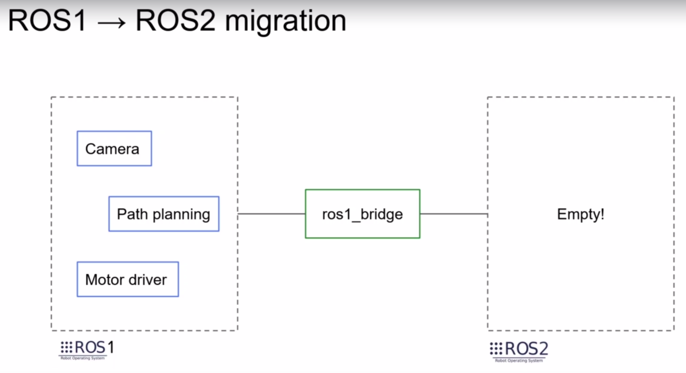

# Learn ROS2 as a ROS1 Developer

## When to switch from ROS1 to ROS2
* In ROS2 the way to write the code has changed, but most of the core concepts
  are still the same.

* ROS1 Noetic is the latest version of ROS and it'll reach its end of life by
  2025. There will be no more ROS1 releases after Noetic.


* If you still rely on ROS1, then you still have some time.
* For now, ROS1 is much more mature than ROS2. It's more stable, there are more
  packages, etc..

* When to switch?
    * New Project?: If you're starting a new project, then it's better to pick
      ROS2, as it'll be a chance to learn something new for the team and it'll
have more long-term perspective. If you still like some ROS1 packages then you
can still use those with the help of ROS1 package.

    * Existing ROS1 Project?: This is more complicated. You can check all the
      packages and functionalities that you're using and see if they exist also
in ROS2. If too many are missing, then it's maybe better for few months and
continue to use ROS1 as there's still time.

First good step would be to port your ROS1 code to ROS1 Noetic. Then
transition to ROS2 Foxy will be easier because of two things:
* Noetic and Foxy are supported on the same operating system.
* Both version support Python3.

If some ROS1 packages are not supported in ROS and you would still like to port
your code to ROS2, you can still do that with ros1_bridge:


## Requirements
* Ubuntu 20.04
* Ubuntu 18 for ROS1 Melodic

## ROS1 vs ROS2 Differences in Architecture (Quick Overview)

* Multi-platform support in ROS2 is available due to the change in Transport
  Layer. Instead of custom ROS layer, ROS2 makes use of DDS.
* Some of the implementations of DDS are already supporting multiple operating
  systems.

* rcl (ROS Client Library): Pure C library which deals directly with DDS. It
  contains all the core functionalities of ROS2.

On top of rcl you have other client libraries that you'll use in your programs
like rclpy, rclcpp, etc..

In ROS1 when a new functionality was added, it was added in C++ in the roscpp
library and then if you wanted to use this feature in Python, then you needed to
rewrite it in Python or wait for support. Thus, many features were available for
C++ only.

In ROS2 however, whenever a new functionality is added to the rcl library, then
it is quite easy to make the binding to any of th upper libraries.


There is no more RosMaster in ROS2. You don't need to launch Roscore before you
launch a node. Nodes are totally independent and have the capability to find
other nodes in the network. This makes multi-machine communication much simpler.


For language support ROS1 Noetic is an exception as it supports Python3.

In ROS1 you can write your program however you want. There is no given structure
to follow for your nodes.

In ROS2 you need to use OOP. You will have to make your node class inherit from
the node objects in rclpy or rclcpp, etc..


## Re-write a ROS1 Application in ROS2

### Install ROS1 Noetic
```
# Setup your sources
sudo sh -c 'echo "deb http://packages.ros.org/ros/ubuntu $(lsb_release -sc) main" > /etc/apt/sources.list.d/ros-latest.list'

# Setup your keys
sudo apt-key adv --keyserver 'hkp://keyserver.ubuntu.com:80' --recv-key C1CF6E31E6BADE8868B172B4F42ED6FBAB17C654

# Apt update
sudo apt update

# For this course we need only ROS Noetic Desktop
sudo apt install ros-noetic-desktop
```

To avoid problems with environment when you have both ROS2 Foxy and ROS1 Noetic,
you can create aliases for sourcing both environments in ```~/.bash_aliases```
file:
```
# Source ros2 foxy
alias foxy='source /opt/ros/foxy/setup.bash; source ~/ros2_ws/install/setup.bash; source /usr/share/colcon_argcomplete/hook/colcon-argcomplete.bash'

# Source ros1 noetic
alias noetic='source /opt/ros/noetic/setup.bash'
```
And in a new terminal you can simply type "noetic" or "foxy" to source either of
the environments.

### ROS1 App

* Create a ROS1 Workspace
```
mkdir ros1_ws
```
And unzip the ```number_app_ros1_noetic.zip``` file in the above folder.

* Catkin Make in the ros1_ws directory
```
cd ~/ros1_ws/
catkin_make
```

* Source workspace
```
source ~/ros1_ws/devel/setup.bash
```

* Launch application
```
roslaunch my_robot_bringup
```

* Launch rqt_graph to observe the nodes and topics
```
rqt_graph
```


* List the topics and services
```
rostopic list
rosservice list
```

* Call reset counter service
```
rosservice call /reset_counter "reset_value: 0"
```

### Install Colcon
Follow steps in ...


## Creating a Package

* In ROS1, when you create a package, you can change it internally for Python or
  CPP, but in ROS2 you can also do that or you can specifically create a package
for Python or specifically create a package for CPP.

### Creating a Python Package in ROS2
* To migrate the ros1_app_py pkg, we first check its dependencies in the
  package.xml and use them to create a ROS2 package.

```
cd ~/ros2_ws/src/
ros2 pkg create ros2_app_py --build-type ament_python --dependencies rclpy std_msgs
cd ~/ros2_ws
colcon build
OR
colcon build --packages-select ro2_app_py
```

### Creating a CPP Package in ROS2

```
cd ~/ros2_ws/src/
ros2 pkg create ros2_app_cpp --build-type  ament_cmake --dependencies rclcpp std_msgs
cd ~/ros2_ws/
colcon build
OR
colcon build --packages-select ros2_app_cpp
```

### Create a Basic Node (Python)
In ROS1, the node is linked to the executable
We do init_node to initialize the communication and also the node with
a name.
In ROS2, you'll first initialize ROS2 communication and then you'll create
an object of the node.
So the executable itself is not the node
Thus you'll be able to create multiple nodes inside one executable, which
you couldn't do with ROS1 in Python.

In ROS1, you call the log functionality from rospy
In ROS2, you call the log functionality from the node object

You can execute the python file similar to ROS1.
```
./number_publisher.py
```

To create an executable, we make the following entries in setup.py. This is
different from ROS1.
```
    entry_points={
        'console_scripts': [
            #"name_of_the_executable = name_of_package.name_of_file:name_of_function_to_be_launched"
            "number_publisher = ros2_app_py.number_publisher:main",

        ],
    },
```

Build the package with:
```
colcon build
OR
colcon build --packages-select ros2_app_py --symlink-install
```

We use --symlink-install, so that we don't need to compile everytime we make a
change in the python file.

Run the node with:
```
ros2 run ros2_app_py number_publisher
```

### Create a Node with OOP (Python):
Spin will allow your node to continue to be alive until you kill it.
In ROS2 you need to provide the node which you want to spin
In ROS1, as the node is linked to the executable, you spin just run
'rospy.spin()'

In ROS1 we were using "Rate" to define at what frequency the node must
operate. In ROS2, we use timers instead.
We create the timer from the Node object.

### Create a Basic Node (C++)
ROS2 and ROS1 cpp package structure is quite similar.

In ROS1 you need to have a NodeHandle and every ROS functionality will come from the node handle.
You create a rclcpp Node object with a name. This node object will be stored in a shared pointer.

To create shared pointer, we make use of std::make_shared

Similar to python, we create the node independently from rclcpp init and
shutdown. So the node is directly linked to the executable.

So you'll be able to create multiple nodes.
So auto here is std::shared_ptr<rclcpp::Node>

In ROS2 we have an extra step. In ROS1, when we create an executable, it is
automatically installed.

The executable can be found at this location:
```
install/ros2_app_cpp/lib/ros2_app_cpp/
```
Adding SharedPtr at the end makes the object a shared pointer.
As we're in a class, we need to give the callback using std::bind
"this" is this class

* In ROS1 you create a publisher from NodeHandle (nh), but in ROS2 you create
  the publisher directly from the node.

* In ROS1 you would intialize the message like this: ```std_msgs::Int64 msg;```
In ROS2 you would initialize it like: ```auto msg = std_msgs::msg::Int64();```

* In ROS1 you don't need to create a shared pointer, but in ROS2 you'll have to.

### Create Custom Interfaces (Msg/Srv)

* In ROS1 you would talk about messages, services, etc., but in ROS2 there is a
  common term called interfaces.

In ROS1 you would have to add two additional tags in your package.xml, one for
message generation and for message runtime.
```
<build_depend>message_generation</build_depend>
<exec_depend>message_runtime</exec_depend>
```
Those two don't exist anymore for ROS2. Instead you have:
```
  <build_depend>rosidl_default_generators</build_depend>
  <exec_depend>rosidl_default_runtim</exec_depend>
  <member_of_group>rosidl_interface_packages</member_of_group>
```
**rosidl** is a tool in ROS2 to handle and generate your messages.

### Write a Service (Python)

In ROS1 you would simply create a service
```
reset_service = rospy.Service("reset_counter", ResetCounter, callback_reset_counter)
```

In ROS2 you would need to create it in the node:
```
self.reset_counter_service_ = self.create_service(ResetCounter, "reset_counter", self.callback_reset_counter)
```

In ROS1, in a service you have only the request. But in ROS2 you have both the
request and the response.
```
def callback_reset_counter(self,request, response)
```

### ROS2 Parameters - What has Changed?
The purpose of parameters is the same for ROS1 and ROS2. What has changed is how
we use them.

In ROS1 you would first create a ROS master, and soon the Parameter Server is
created and will stay alive as long as the ROS master is alive.
The parameters can be set in the Parameter Server and they're global to the
application. Any node you start can retrieve any parameter and if you kill a
node the parameters are still here in the parameter server.


In ROS2 you don't have a ROS master anymore. This is a distributed system. Each
node is completely independent. As there is no ROS master, you don't have a Parameter
Server either. The parameters are hosted directly inside the node. They only
exist while the node exists.
In ROS2 the parameters are nested inside the nodes instead of being global for
all the nodes.
So you don't set the parameters before you start the node. You'll set the
parameters at the same time you start the node.


#### ROS2 Parameters
To use ROS2 Parameters:
1. Declare them from within your noce (in the code)
2. Get the values inside the node

-> Then, run your node and set the values.

## Use ros1_bridge + Migration Guide

ros1 bridge allows you to make work a ROS1 and ROS2 application together.

### Steps to Migrate a Codebase Using ros1_bridge.

1. You'll start with your ROS1 application.
2. You'll then create an empty ROS2 project.
3. You can then link those two projects with ROS2 bridge. So you can start
   communicating with ROS1 from ROS2 side.



4. Now you can start implementing only some of the functionalities in ROS2.


5. Once it is ready, you can start using the ROS2 package instead of the ROS1
   functionality.


Due to ros1_bridge, we can use either ROS1 app or ROS2 app as all the
functionalities are still available.

6. You can continue to translate the functionalities in addtion to adding new
   functionalities. You don't need to wait until everything is ready.


7. You can keep using ROS1 until its EOL in 2025 and eventually only ROS2 app
   will remain.


#### Compatible ROS packages and Ubuntu Versions for Migration


Steps:
1. Port your ROS1 code to ROS1 Noetic.
2. Port your ROS1(Noetic) code to ROS2 Foxy.

### Install and Test ros1_bridge

* First install ros1_bridge, which is a ROS2 package
```
sudo apt install ros-foxy-ros1-bridge
```

* Next in one terminal source only ROS1.
```
source /opt/ros/noetic/setup.bash
```

* And in another terminal, first source ROS1 and then ROS2. This is usually not
  recommended but we do it to run ros1_bridge.
```
source /opt/ros/noetic/setup.bash
source /opt/ros/foxy/setup.bash
```

* Run ros1_bridge from this terminal with --bridge-all-topics command

```
# See help message
ros2 run ros1_bridge dynamic_bridge --help
# Run ros1_bridge
ros2 run ros1_bridge dynamic_bridge --bridge-all-topics
```

* Test the bridge with running ROS1 talker in one terminal and ROS2 listener in
  another

```
# Launch ROS1 talker
rosrun rospy_tutorials talker

# Launch ROS2 listener
ros2 run demo_nodes_cpp listener
```

Or with ROS2 talker and ROS1 listener

```
# Launch ROS2 talker
ros2 run demo_nodes_py talker

# Launch ROS1 listener
rosrun roscpp_tutorials listener
```

Or test a server

```
# Launch a ROS1 server
rosrun rospy_tutorials add_two_ints_server

# And send a message from ROS2 client
ros2 run demo_nodes_cpp add_two_ints_client
```


### Bridge Custom Messages
Custom messages might not work straight out of the box when using ros1_bridge.
The reason is that the ros1_bridge package has a pre-defined set of message
pairs that is defined at compilation time.

So when you install the ros1_bridge package, you install the binaries which are
already compiled with a pre-defined set of message-pairs.

You can see these message-pairs with:

_NOTE: Remember to source ROS1 and run ros master in one terminal beforehand.
And source ROS1 and ROS2 (in that order) in another terminal before running this
command._

```
ros2 run ros1_bridge dynamic_bridge --print-pairs
```

In the above examples, the talker and listener were able to bridge as the
following message-pairs were pre-defined:

```
'std_msgs/msg/String' (ROS 2) <=> 'std_msgs/String' (ROS 1)
```

So in order to have use our custom messages with the ros1_bridge, we need to
compile ros1_bridge ourselves from source.

Let's create workspaces to do this.

```
# Create a new workspace
mkdir bridge_ws
mkdir src

# NOTE: Follow the instructions carefully
# Clone the ros1_bridge repo from: https://github.com/ros2/ros1_bridge
git clone git@github.com:ros2/ros1_bridge.git
```

* Checkout foxy branch in ros1_bridge

* Open another terminal; source ROS1 Noetic and catkin make the extracted test workspace.

* Similarly in another terminal source ROS2 Foxy and colcon build the extracted
  test workspace.

* In a third terminal:

```
source /opt/ros/noetic/setup.bash
source /opt/ros/foxy/setup.bash

# Source ROS1 workspace that contains the custom message
source /path/to/test_ros1_ws/devel/setup.bash

# Source test ROS2 workspace
source /path/to/test_ros2_ws/install/setup.bash

# Go to Bridge Workspace and colcon build
cd bridge_ws/
colcon build --packages-select ros1_bridge --cmake-force-configure

#NOTE: The compilation time will be very long.

# After compilation is done, source the local setup as ROS2 is already sourced
# in that terminal.
source install/local_setup.bash

# And check if your new custom messages are available with
ros2 run ros1_bridge dynamic_bridge --print-pairs | grep my_msgs
```

### Bridge Custom Messages - Mapping Rules
1. The above process will only work, if the package name for ROS1 and ROS2 are
   the SAME.
2. The message name are the SAME.
3. The field inside the message are the SAME.

In case there is a difference, we will have to do some configurations.

NOTE: Any configuration we will do in such case will be in ROS2 workspace and
not in ROS1 workspace.

* Change the name of the file "CustomString.msg" to "MyCustomString.msg" in test
  ros2 workspace. Remember to change the name in CMakeLists.txt as well.

* Create a new file named "my_mapping_rules.yaml" in the same workspace.

```
cd /path/to/test_ros2_ws/src/my_msgs/
touch my_mapping_rules.yaml

## Add the following in the file
-
  ros1_package_name: 'my_msgs'
  ros1_message_name: 'CustomString'
  ros2_package_name: 'my_msgs'
  ros2_message_name: 'MyCustomString'

# And add the path to mapping rules file in the package.xml
---
...
  <export>
    <build_type>ament_cmake</build_type>
    <ros1_bridge mapping_rules="my_mapping_rules.yaml"
  </export>
</package>
---

# And in the CMakeLists.txt
install(FILES
  my_mapping_rules.yaml
  DESTINATION share/${PROJECT_NAME}/
)
```

* Then you need to build the ROS1 package.

* In the ROS2 workspace, remove the build and install folders before building
  the ROS2 package again.

* Then in a terminal
1. Source ROS1 Noetic.
2. Source ROS2 Foxy.
3. Source the ros1 and ros2 workspaces.
4. Go to bridge workspace, remove the build and install folder, and colcon build
   ros1_bridge again.
```
source /opt/ros/noetic/setup.bash
source /opt/ros/foxy/setup.bash

# Source ROS1 workspace that contains the custom message
source /path/to/test_ros1_ws/devel/setup.bash

# Source test ROS2 workspace
source /path/to/test_ros2_ws/install/setup.bash

# Go to Bridge Workspace and colcon build
cd bridge_ws/
colcon build --packages-select ros1_bridge --cmake-force-configure
```

## Links
1. [Migration guide for Noetic](https://wiki.ros.org/noetic/Migration)
