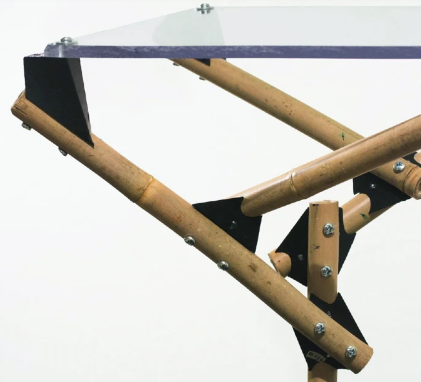
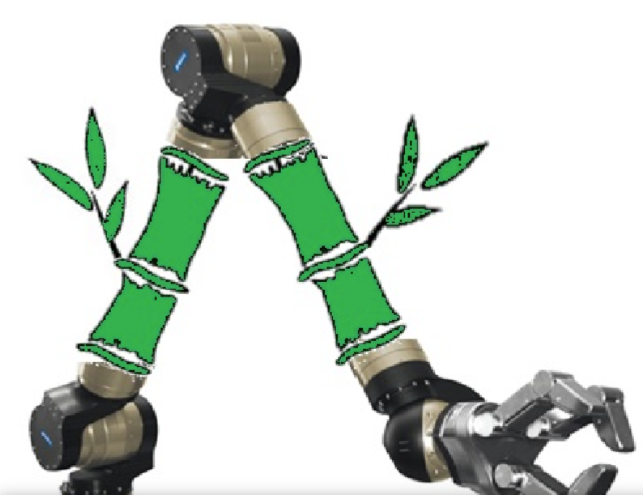
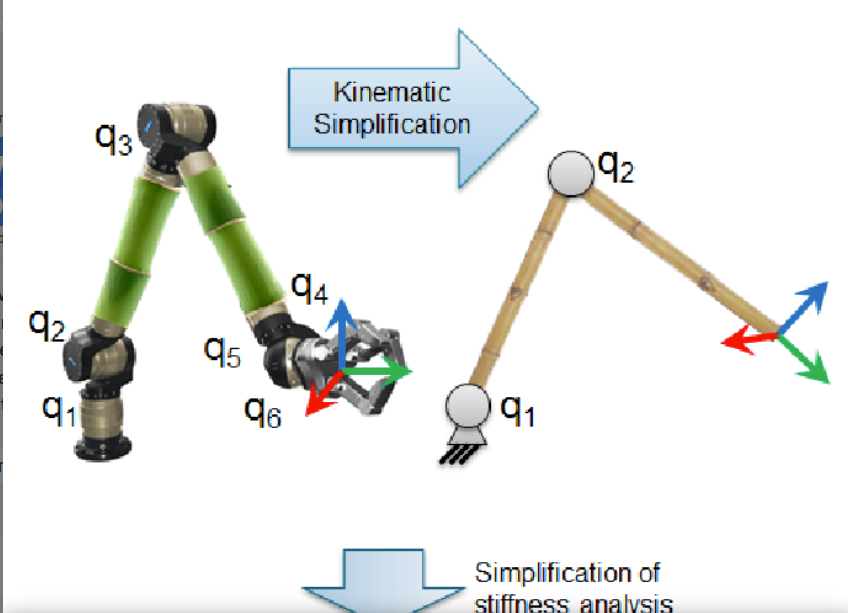

* [Working with Uncertainties: An Adaptive Fabrication Workflow for Bamboo Structures](https://link.springer.com/chapter/10.1007/978-981-33-4400-6_25)

* [EcoBotics: Advantages and challenges of building a bamboo robot arm](https://www.semanticscholar.org/paper/EcoBotics%3A-Advantages-and-challenges-of-building-a-Csiszar-Sommer/843cb8acbc0f3e6c233b35cc0119f805b9567a26)

