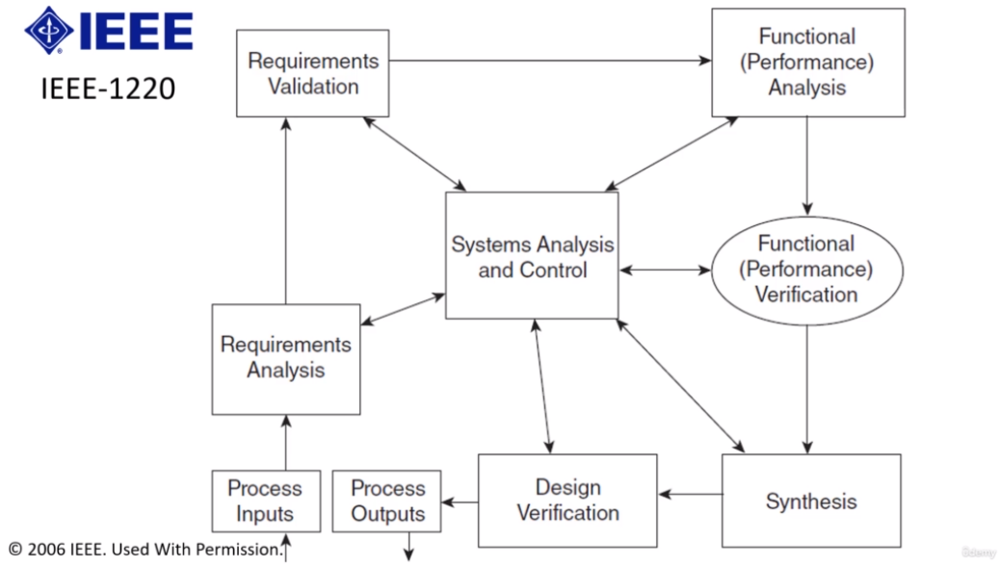

# Product Development & Systems Engineering

## Section 1. Introductory / Groundwork Topics

### 1. Course Introduction

#### Introduction to Systems Engineering

* Everything, including complex products and systems, has a life cycle.
* Systems engineering is an approach to bringing complex products into existence from the top down, starting with defining characteristics at high levels and then breaking them down into smaller and smaller segments until implementation.
* Successful systems are developed using a win-win strategy where the customer and supplier are both better off and happier after the transaction.

#### Overview of the Course
* Many systems engineering courses are either too detailed or too short, too specific, or not offered online.
* This course was designed to fill the gap in the learning market by focusing on the big picture of product development and systems engineering.
* This course is primarily aimed at teams that want to bring complex products into existence, grad school students, research labs, and startup companies seeking to develop and field their inventions.
* This course is beneficial for large firms specializing in developing or improving already existing complex systems, including jetliner manufacturers, and government organizations that define and oversee system development.
* The course aligns with the Inkosi Systems Engineering Handbook and ISO IEC II Tripoli Standard 15 to 88, and helps reduce the risk of overspending budget or exceeding schedule.

#### Topics Covered in the Course
* It teaches how to plan and organize products by architecting the structure of the system from the top down, identifying system requirements, interactions, internal functions, and components, estimating the scope of development efforts, and identifying required infrastructure.
* The course teaches how to successfully define, develop, implement, integrate, test, produce, deploy, and sustain a product while increasing reliability, improving quality, and reducing overall risk.
* The course uses examples of aircraft, cars, and automated teller machines, with the latter being the most used example.
* The course focuses on systems engineering and uses the ATM as the primary example system.
* The first set of lessons covers the definition of systems, systems engineering, benefits, systems context and boundaries, and systems engineering activities.
* The second set of lessons covers each of the life cycle technical processes, including writing requirements, creating functions and functional flows, writing use cases, planning for tests, and constructing the physical characteristics of the system.
* The third set of lessons covers the technical management processes, such as risk management, configuration management, project planning, project management, and quality management.
* The fourth set of lessons covers the agreement processes, including the roles of the developer and government in the acquisition and supply processes.
* The fifth set of lessons covers the enterprise processes or project enabling processes, including lifecycle management, infrastructure management, portfolio and human resource management, and portfolio and knowledge management.
* The sixth set of lessons covers tailoring the processes, modeling and simulation, object-oriented systems engineering, software development prototyping, integrated product development, lean systems engineering, agile systems engineering, and enterprise systems.
* The seventh set of lessons covers subject matter areas such as affordability and value engineering, electromagnetic compatibility, environmental engineering, reliability system safety, human system integration, system security, product support, and resilience.

### 2. System Defined

#### Definition of A System
* The course focuses on the concept of the system, which is defined as a combination of interacting elements organized to achieve one or more stated purposes.
* The definition of a system is a combination of interacting elements organized to achieve one or more stated purposes, with stated purposes being the agreed-upon primary goal of the system.
* Other sources provide similar definitions, indicating that a system is a human-made entity created to execute a mission for a user with a specific operational environment.

#### System Elements and Their Services
* Interacting elements refer to a group of parts within the system that work together, such as hardware, software, processes, people, information, techniques, and facilities.
* System elements provide internal and external services, such as those for the user, and are critical to product development.
* The concept of services will come up frequently throughout the course.
* A desktop computer is an example of a system, with its various integrated elements working together to achieve defined objectives.
* The course will use the ISO definition of a system throughout.

### 3. System Hierarchies

#### Introduction to System Hierarchy

* Creating a system hierarchy helps to decompose a system into smaller, manageable pieces.
* A system hierarchy is an organizational representation of a system structure using partitioning relationships.

#### Components of the Hierarchy

The hierarchy is composed of the system at the top, followed by subsystems, components, subcomponents, and parts.
* The subsystem layer is a collection of system elements that fulfill the primary goals of the overall system.
* Components work together to perform the operations of a subsystem, while subcomponents operate together to allow each component to perform its primary functions.
* Parts are individual items that make up the subcomponents.

#### Expressing the Hierarchy

* A system's hierarchy is usually expressed using words rather than graphics.
* Composite associations are shown as a little black diamond, with "is comprised of" used when reading from top to bottom, and "is a part of" when reading from bottom to top.
* The relationships are typically expressed using words to describe system elements or using graphics like the small block definition diagram.
* The diagram shows the composition relationships and multiplicity of system elements.

#### Context and Use

* The hierarchy depends on the context of use, and it may be expressed differently by different organizations or manufacturers.
* System hierarchies are dependent on context and specific to various domains.
* It is important to decompose the hierarchy down to a level where the individual element in question can be developed and integrated with other elements.
* Multiplicity can be used to show that a subcomponent is composed of more than one part of the same configuration.

#### Conclusion

* Systems engineers use system hierarchy to break down a system into smaller, more manageable parts.
* System hierarchy is an organizational representation of a system structure using partitioning relationships.
* Hierarchies are a product of developing a system, not created first and then followed up by the design of the system.

### 4. The System Context

#### External and Internal Views

* A product or system can be viewed from an external or internal perspective.
* The external view examines the system without looking at its internal workings and considers the various elements it interacts with during its life.
* The external elements include the environment, users, processes, and other systems that the system might encounter during its operation, storage, or maintenance.
* The external view helps determine the boundaries of the system and what the system is expected to interact with.
* The internal view examines the elements within the boundaries of the system and helps to differentiate the product from the system environment.
* Project managers and systems engineers draw boundaries around their projects and systems to focus on what's within their scope and what the system is expected to interact with.
* It is important for a systems engineer to identify and document what is within and outside the boundaries of a system and communicate this with all stakeholders.
* This prevents wasted time and resources on elements outside the context of the system.
* Enabling elements, such as manuals, simulators, tools, and facilities, may or may not be within the boundaries of a system.
* Users are generally considered outside the system boundaries because human behavior is difficult to predict and control.
* Systems should be designed to be controlled by users rather than controlling users.
* Systems engineers should consider the user within the context of their system boundaries.

#### Context Diagram

The context diagram is a tool used by systems engineers to capture and communicate the boundaries of systems and their primary interactions with external entities.
* The context diagram can be developed for the main mission of a system or any other scenario to identify the functions and components necessary to accomplish the mission.
* The context diagram shows external entities and their interactions with the system.
* To build a context diagram, identify the context and list all primary players within that context.
* Determine if entities are within the system boundaries or external and use the rules of thumb to develop the context diagram.
* Label the primary exchanges and determine which entity owns the interface.
* The purpose of the context diagram is to communicate system boundaries and primary interfaces with external entities.
* Creating all possible context diagrams is not practical; instead, create them as needed to help answer inquiries during the development of primary domains.

#### Hierarchy

* The hierarchy of a system is composed of subsystems, components, and subcomponents.
* Avoid using system and subsystem stereotypes in system modeling language and unified modeling language to prevent confusion among different engineers.

### 5. System Domains

#### System Hierarchies and Domains:

* System hierarchies are categorized based on engineering specialties or knowledge domains that specialize in specific aspects of a system.
* Some common categories or domains in systems engineering are requirements, operational or missions, behaviors, physical, user, and test domains.
#### Requirements, Mission, and Functional Domains:

* The requirements domain contains all the mandatory behaviors, features, and interfaces that a system needs to accomplish its missions and functions.
* The operational or mission domain identifies the missions the system is expected to perform and how it might go about performing them.
* The behavioral or activity domain describes the behavioral aspects, functions, or activities that a system has to perform to accomplish its missions and requirements.
* A requirement is a statement that identifies a system or a product or process characteristic or constraint that is unambiguous, clear, unique, consistent, standalone, verifiable, and necessary for stakeholder acceptability.
* A mission is the objective or task together with the purpose, which clearly indicates the action to be taken, and always has a clear objective or outcome.
* A function, behavior, activity, and action are synonymous terms in systems engineering that mean the same thing.
* A function converts inputs and outputs, and every function must have at least one input and one output.
* The requirement set is made up of a hierarchical set of requirements derived from users or stakeholders that are captured in documents like marketing analysis documents or contract documents.
* Mission descriptions and scenarios capture how the end user will use, maintain, retire, and dispose of the system, and they provide a foundation to populate the requirements and functional domains for the primary operational phase of a system's life.
* Use cases are the lowest level descriptions of a single segment of a single mission and form the foundation for the functional domain.
* Functional domain captures the sequence of activities, inputs, and outputs required to perform those activities.
#### Physical Domain and Design Teams:

* The physical domain is the compartment where all the physical pieces of hardware and software reside within a system.
* The construction of the physical domain is driven most heavily by the functions from the functional domain.
* Traceability between the physical domain and other domains must be maintained to justify the existence of each piece of the system and prevent gold-plating.
* The physical architecture forms the foundation for the formation of the design teams to implement, integrate, and test hardware and software.
* The product breakdown structure helps assign the various functions to design teams that specialize in a particular knowledge area.
#### Benefits of Systems Engineering:

* Systems engineers need to have a basic understanding of all these knowledge domains and coordinate the development of the system at acceptable levels of risk.
* The systems engineering process is the process used by systems engineers to develop each of these primary domains.
* Systems engineering helps manage and organize complex problems and solutions by compartmentalizing and categorizing things into respective domains.

### 6. Users & Stakeholders

#### Importance of understanding users and stakeholders:
* Knowing users and stakeholders is essential to develop a successful product.
* Users and stakeholders help to gather requirements and ensure that the product meets their needs.
* Failure to understand user needs and requirements can result in negative feedback and loss of sales.
* Understanding users and stakeholders is crucial in developing a successful product or system.
* Users and stakeholders are engaged early in the product development process to elicit requirements and provide feedback on the design and features.
* User and stakeholder input is critical to the success of the product being developed.
#### Definition and types of users and stakeholders:
* Users and stakeholders are not the same, and users are defined as individuals or groups that interact with or benefit from the system during its utilization.
* Direct and indirect operators, maintainers, testers, and production artisans are examples of users.
* Adversaries of the system, like hackers, are also users that should be considered.
* A user is an individual or group that interacts with or benefits from a system, including direct and indirect operators, maintainers, testers, production artisans, adversaries, and end users.
* A stakeholder is an individual or organization that has an interest in a system, including system owners, administrators, sponsors, investors, regulators, and non-end users who benefit from the system.

### 7. Boundaries & Interfaces

#### System context diagram and external elements:

* The system context diagram shows what is external to the system, and interfaces between the system and its environment.
* External elements share information with the system and vice versa, and the system boundaries are defined by interfaces.
#### Interfaces and types of interfaces:

* Interfacing is a critical element of how a system is defined, and there are three types of interfaces: connector, isolator, and converter.
* A connector allows for the transfer of forces, energy, data, signals, or materials.
* An isolator controls or suppresses one of these five elements, while a converter alters or transforms the form of the interface.
* Many systems convert from analog to digital or mechanical to hydraulic.
* There are many types of interfaces, including connectors, isolators, and converters.
* Interfaces can be standardized, and the systems engineer is responsible for identifying, defining, and managing them.

#### Interface management:

* Many issues with system development can be traced back to bad requirements or problems with system components communicating with each other.
* Interface management is challenging, especially if interfaces are not owned or controlled by the system.
* Standardized interfaces can evolve and change, and systems engineers must consider future implementations and make decisions about which ones to use.

### 8. Systems Engineering Overview

#### Introduction to systems engineering:

* Systems engineering is an interdisciplinary approach to enable the realization of successful systems.
* It involves drawing from the strengths of multiple disciplines to combine their efforts into a cohesive whole.
* Systems engineering is not a guarantee for the success of a system development effort, as various outside factors may influence it.
#### Systems engineering process:

* The process begins with identifying the need for a product and capturing the behaviors that the product needs to possess to meet the needs.
* The focus then shifts toward defining requirements for the system.
* The systems engineering process follows a generic V-shaped diagram with inputs, requirements development, functional and mission development, physical definition, and system integration and testing.
* The physical definition assigns each function to a piece of hardware or software that can fulfill that function.
* The systems engineer is responsible for coordinating and controlling interfaces between the different components to maintain system integrity throughout the lifecycle of the system.
* Systems engineering process is applied iteratively through time as the system matures from an idea to an actual, tangible, ready to use product.
* Solutions from one iteration become the problem or the need for the next iteration of the systems engineering activities.
* Verification is performed to ensure the physical definition can perform all functions and meet all requirements.
#### Systems engineering outputs and hierarchy:

* Outputs early in the life cycle include high-level specifications, analysis of alternative findings, high-level mission descriptions, scenarios, use cases, functional diagrams, physical block diagrams, and traceability matrices.
* Lower-order physical elements exist within the system and can be expressed in the form of a hierarchy.
* Each layer in the system's hierarchy will recursively apply the systems engineering activities on their own levels.
* Each lower order element of the system will kick off its very own set of systems engineering activities.
* The recursive application of systems engineering activities ultimately results in a top-down system concept with a robust set of system elements.
#### Systems engineering benefits:

* The systems engineering process allows the product developer to discover and learn new things about the system, and improve it.
* Systems engineering is not used for elements that are not complex or require specialty engineering tools and techniques.
* The systems engineering process significantly increases the chances of project and product success.
#### Technical management activities:

* The eight technical management activities are project planning, project assessment and control, decision management, risk management, configuration management, information management, measurement, and quality assurance.

### 9. Alternative Systems Engineering Methods

### 10. Systems Thinking

### 11. The Origins & Evolution of Systems Engineering

### 12. The Systems Engineer

