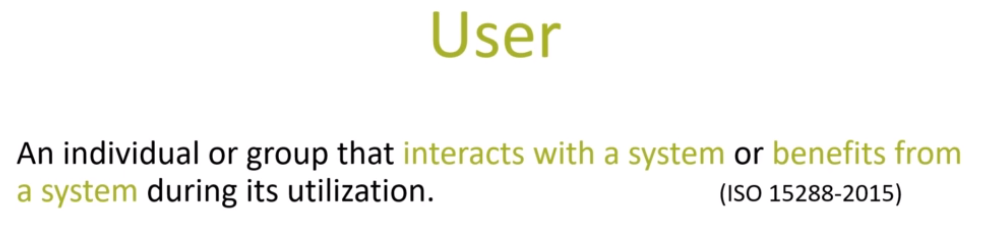
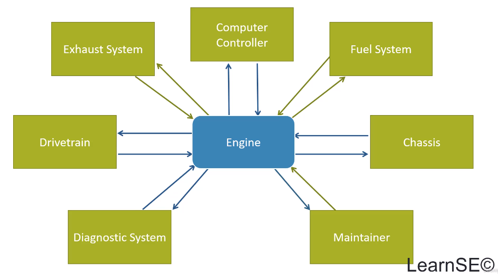

# Product Development & Systems Engineering

## Section 1. Introductory / Groundwork Topics

### 1. Course Introduction

* Everything, including complex products and systems, has a life cycle.
* Systems engineering is an approach to bringing complex products into existence from the top down, starting with defining characteristics at high levels and then breaking them down into smaller and smaller segments until implementation.
* Successful systems are developed using a win-win strategy where the customer and supplier are both better off and happier after the transaction.
* Many systems engineering courses are either too detailed or too short, too specific, or not offered online.
* This course was designed to fill the gap in the learning market by focusing on the big picture of product development and systems engineering.
* This course is primarily aimed at teams that want to bring complex products into existence, grad school students, research labs, and startup companies seeking to develop and field their inventions.
* This course is beneficial for large firms specializing in developing or improving already existing complex systems, including jetliner manufacturers, and government organizations that define and oversee system development.
* The course aligns with the Inkosi Systems Engineering Handbook and ISO IEC II Tripoli Standard 15 to 88, and helps reduce the risk of overspending budget or exceeding schedule.
* It teaches how to plan and organize products by architecting the structure of the system from the top down, identifying system requirements, interactions, internal functions, and components, estimating the scope of development efforts, and identifying required infrastructure.
* The course teaches how to successfully define, develop, implement, integrate, test, produce, deploy, and sustain a product while increasing reliability, improving quality, and reducing overall risk.
* The course uses examples of aircraft, cars, and automated teller machines, with the latter being the most used example.
* The course focuses on systems engineering and uses the ATM as the primary example system.
* The first set of lessons covers the definition of systems, systems engineering, benefits, systems context and boundaries, and systems engineering activities.
* The second set of lessons covers each of the life cycle technical processes, including writing requirements, creating functions and functional flows, writing use cases, planning for tests, and constructing the physical characteristics of the system.
* The third set of lessons covers the technical management processes, such as risk management, configuration management, project planning, project management, and quality management.
* The fourth set of lessons covers the agreement processes, including the roles of the developer and government in the acquisition and supply processes.
* The fifth set of lessons covers the enterprise processes or project enabling processes, including lifecycle management, infrastructure management, portfolio and human resource management, and portfolio and knowledge management.
* The sixth set of lessons covers tailoring the processes, modeling and simulation, object-oriented systems engineering, software development prototyping, integrated product development, lean systems engineering, agile systems engineering, and enterprise systems.
* The seventh set of lessons covers subject matter areas such as affordability and value engineering, electromagnetic compatibility, environmental engineering, reliability system safety, human system integration, system security, product support, and resilience.
* The instructor, Christopher Olsen, has extensive experience in product development and systems engineering, including working on various programs for the US Army, civil aviation, and the US Navy.
* The instructor is also certified in DOWA, PMP, and OC, SMP.
* The course has over 100 lessons, each averaging about 15 minutes, and is designed to help learners develop a product.

### 2. System Defined

* The course focuses on the concept of the system, which is defined as a combination of interacting elements organized to achieve one or more stated purposes.
* Interacting elements refer to a group of parts within the system that work together, such as hardware, software, processes, people, information, techniques, and facilities.
* System elements provide internal and external services, such as those for the user, and are critical to product development.
* The concept of services will come up frequently throughout the course.
* The definition of a system is a combination of interacting elements organized to achieve one or more stated purposes, with stated purposes being the agreed-upon primary goal of the system.
* Other sources provide similar definitions, indicating that a system is a human-made entity created to execute a mission for a user with a specific operational environment.
* A desktop computer is an example of a system, with its various integrated elements working together to achieve defined objectives.
* The course will use the ISO definition of a system throughout.

### 3. System Hierarchies

#### Introduction to System Hierarchy

* Creating a system hierarchy helps to decompose a system into smaller, manageable pieces.
* A system hierarchy is an organizational representation of a system structure using partitioning relationships.

#### Components of the Hierarchy

The hierarchy is composed of the system at the top, followed by subsystems, components, subcomponents, and parts.
* The subsystem layer is a collection of system elements that fulfill the primary goals of the overall system.
* Components work together to perform the operations of a subsystem, while subcomponents operate together to allow each component to perform its primary functions.
* Parts are individual items that make up the subcomponents.

#### Expressing the Hierarchy

* A system's hierarchy is usually expressed using words rather than graphics.
* Composite associations are shown as a little black diamond, with "is comprised of" used when reading from top to bottom, and "is a part of" when reading from bottom to top.
* The relationships are typically expressed using words to describe system elements or using graphics like the small block definition diagram.
* The diagram shows the composition relationships and multiplicity of system elements.

#### Context and Use

* The hierarchy depends on the context of use, and it may be expressed differently by different organizations or manufacturers.
* System hierarchies are dependent on context and specific to various domains.
* It is important to decompose the hierarchy down to a level where the individual element in question can be developed and integrated with other elements.
* Multiplicity can be used to show that a subcomponent is composed of more than one part of the same configuration.

#### Conclusion

* Systems engineers use system hierarchy to break down a system into smaller, more manageable parts.
* System hierarchy is an organizational representation of a system structure using partitioning relationships.
* Hierarchies are a product of developing a system, not created first and then followed up by the design of the system.

### 4. The System Context

### 5. System Domains

### 6. Users & Stakeholders

### 7. Boundaries & Interfaces

### 8. Systems Engineering Overview

