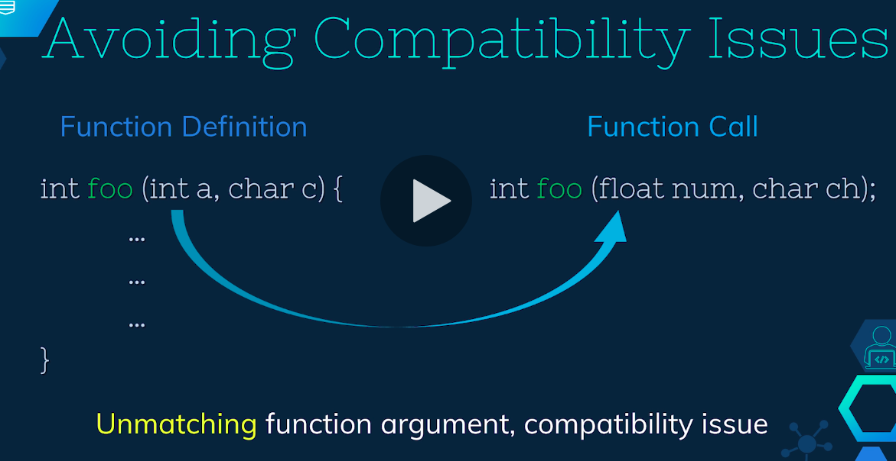
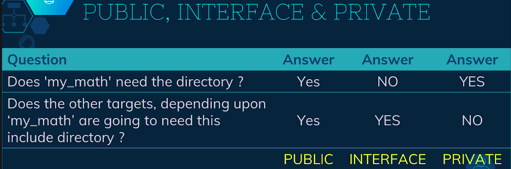
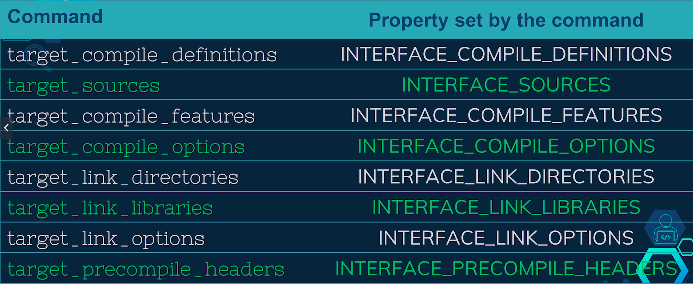
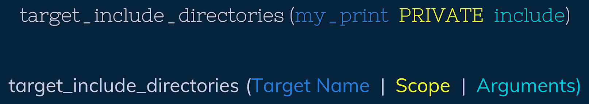
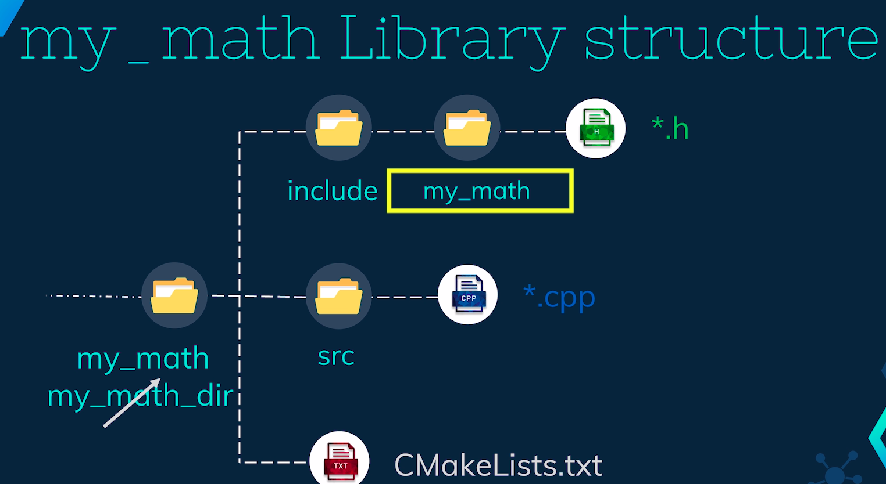
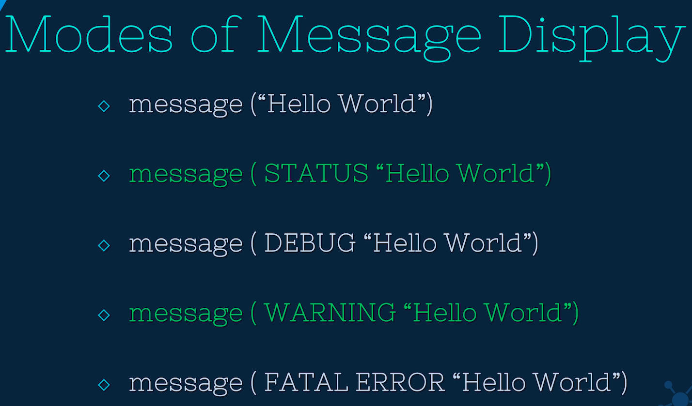

## Requirements
g++
sudo apt install g++

## Module 1

* You'll get the following error as the function definitions are not present in C++.
```
g++ main.cpp -o calculator                                                           (base) 
main.cpp: In function ‘int main()’:
main.cpp:13:18: error: ‘addition’ was not declared in this scope
   13 |     result_add = addition(first_no, second_no);
      |                  ^~~~~~~~
main.cpp:14:18: error: ‘division’ was not declared in this scope
   14 |     result_div = division(first_no, second_no);
      |                  ^~~~~~~~
main.cpp:16:5: error: ‘print_result’ was not declared in this scope
   16 |     print_result("Addition", result_add);
```
So add the following definitions to main.cpp.
```
float addition(float, float);
float division(float, float);
void print_result(std::string, float);
```

You'll get another error as the g++ command can't find the specified functions.
```
g++ main.cpp -o calculator                                                       (base) 
/usr/bin/ld: /tmp/ccjWHdjz.o: in function `main':
main.cpp:(.text+0x78): undefined reference to `addition(float, float)'
/usr/bin/ld: main.cpp:(.text+0x93): undefined reference to `division(float, float)'
/usr/bin/ld: main.cpp:(.text+0xd0): undefined reference to `print_result(std::__cxx11::basic_string<char, std::char_traits<char>, std::allocator<char> >, float)'
/usr/bin/ld: main.cpp:(.text+0x11e): undefined reference to `print_result(std::__cxx11::basic_string<char, std::char_traits<char>, std::allocator<char> >, float)'
collect2: error: ld returned 1 exit status
```

* Compile it with following command
```
g++ main.cpp addition.cpp division.cpp print_result.cpp -o calculator
```

* Better practice is to make header files which contain function definitions and include them in main.cpp.


### Need of Build Systems
When we are compiling a project containing multiple C++ files, initially all the files are
compile independent of each other.
In our example the 4 C++ 
In our example the 4 C++ files were compiled to produce four different compiled binaries. When compiling

'main.cpp',

all you need to tell the compiler that 3 functions used in 'main.cpp' do exist somewhere.

We have done that by including header files, which contains the function declaration. At this point,

the compiler does not care about these functions.

definition. During the compilation process, the compiler places a placeholder, where the functions are called.

these placeholders tell that the function call will be resolved during the linking process. During linking

the linker finds the compile binaries of 'addition.cpp' 'division.cpp' and 'print_result.cpp' and

links those alltogether to produce one single executable. One thing to note here is that, as long as

you have the header files containing the function declaration and the compiler binaries of C++ files

you will be able to build the project.

You do not need the C++ files containing the function definition.

The example explained in this lecture had just 4 files but, in the real world project, sometimes the

number of files in a project might go above 1000, In such cases,

it's a very challenging job to keep the track of all the files and its dependencies.

Also the compilation process in such projects takes a lot of time; sometimes more than tens of hours. Therefore

if the dependencies are not very well managed, every-time we modify even a single file, we need to compile

and link all the files from the beginning which is a very time consuming process. In such case,

if we have access to a tree based representation of all the dependencies and the list of files that

we have changed since our last successful compilation, then we can choose only to compile the files that

we have changed recently and thereafter we can link all those together.

This would save us a significant amount of time, since very few places are used in one go.

This is where the build system comes in.

You might have heard of 'Make', 'Ninja' 'Ant' 'Gradle' or any other build system. These build systems are software

for automating the source code compilation and linking process. Opting for one particular build system

over the other

is sometimes a matter of personal choice where sometimes it is restricted by the development environment

in the coming lecture.

We are going to build our project using a popular build system 'Make' and have a glimpse of something called

build system generator.

### Need for a Meta Build System
Usually for building a project, the developer writes a special code in something called build files which

is different from the project's source code and then the build system uses that build file to compile

and link the source codes. In case of 'Make', the developer writes a 'Makefile' and runs that code using Make

build system. 

Now, let us attempt to make the 'make' command. As we can see that the make tool is not installed in my system.

So, we need to install 'make' from the repository.
```
sudo apt install make
```

The make command is going to look for a makefile and then build the project

based on the rules written inside makefile. The output of this step is an executable. Notice here that,

it is compiling all the files and then linking them all together.

Now let us choose one of the files and run the make command again

Notice here that the make command has only compiled one file, the one that we have changed just now

and everything else is linked thereafter thereby saving our time.

The idea here is not to teach you about the makefiles or build system in general but about the meta build

system.

CMake. The CMake tool is capable of writing the makefiles for us.

Make: Uses build system files to generate executable.
CMake: Used to generate build system files.


Now, the question arises, Why do we even need to learn this new tool CMake for this simple application?

The problem is that, the building of C++ projects is not a standard across the platforms

This means, even if you have the source code and makefile of a C++ project from your Linux machine, you

cannot directly build that code inside Windows operating system.

Similarly, if you have a visual studio solution from your Windows machine you cannot directly build a

project in a Linux environment.

CMake solves this problem by creating the platform based system files. Before moving forward,

let us delete the compiled binaries that the make command has created. In the coming module,

we are going to have a look at CMake tool basics, and then we are going to generate a makefile for our

project using CMake.

Thank you.

Usually for building a project, the developer writes a special code in something called build files which

is different from the project's source code and then the build system uses that build file to compile

and link the source codes. In case of 'Make', the developer writes a 'Makefile' and runs that code using Make

build system. For our example,

we will create a 'makefile' in 'module1' directory. Note that, the name of the makefile is case-sensitive.

Now we will write the rules in makefile. You should not be concerned about the contents of the makefile

as of now. If you want to, you can download and understand the make file from the download section.

Now, let us attempt to make the 'make' command. As we can see that the make tool is not installed in my system.

So, we need to install 'make' from the repository.

Once installed,

we will run the make command. The make command is going to look for a makefile and then build the project

based on the rules written inside makefile. The output of this step is an executable. Notice here that,

it is compiling all the files and then linking them all together.

Now let us choose one of the files and run the make command again

Notice here that the make command has only compiled one file, the one that we have changed just now

and everything else is linked thereafter thereby saving our time.

The idea here is not to teach you about the makefiles or build system in general but about the meta build

system.

CMake. The CMake tool is capable of writing the makefiles for us.

Now, the question arises, Why do we even need to learn this new tool CMake for this simple application?

The problem is that, the building of C++ projects is not a standard across the platforms

This means, even if you have the source code and makefile of a C++ project from your Linux machine, you

cannot directly build that code inside Windows operating system.

Similarly, if you have a visual studio solution from your Windows machine you cannot directly build a

project in a Linux environment.

CMake solves this problem by creating the platform based system files.


## Module 2

### CMake Installation

There are three ways to install CMake
1. From repository
```
sudo apt install cmake
```
Check if CMake is installed properly with
```
cmake --version
```

2. Downlad the compile binaries from CMAke official website. (Uninstall cmake before
   proceeding).
We will download the �.sh� file, which is a shell script.
Now, we will go to the download folder, open the terminal from the download folder and give execution
permission to the script using �chmod +x� command then run this script.
Here, we can see that a folder is created. If you choose to download the tar file and run the tar xvf command,
it will also result in the same folder.
Now once we have the folder, we can go inside the bin directly. Here we have the CMake executable. To use
this executable, we need to add the path of this executable to the system path.
we can paste this command into �.bashrc� file inside the home directory.
Here I have added the path and we can see that cmake --version is giving us the expected output.
Before proceeding to the third technique of installing CMake, we will remove the previously downloaded
files and the bashrc entry.

3. Download the source codes from the CMake website.
Now extract it using tar command.
Once extracted, We can navigate inside there directly and run these three commands.
After learning the bootstrap file, if you are getting an error,
you should run this command also.
This process takes some time.
Now we will run the make command.
And lastly, we will run �sudo make install�.
After a successful installation,
we can check the CMake version. As you can see that the CMake has been installed properly.
Once we have the installation, we can move to the next lecture. 

Note that, in this course, I have used
CMake version 3.16 which I installed from the source. For you to follow along, any version
greater than 3 is fine.


### Build file generation
We are going to see the basic setup required for using the CMake tool.
When we are running the CMakecommand for the first time, it needs 2 information. 
* The location of CMakeLists.txt file and 
* the directory location to store the build system files.

The CMake tool finds the CMakeLists.txt file, processes the information written 
inside it to generate the build system files
in the specified location. A common practice is to have the CMakeLists.txt file in the top level

project directory. The build files are kept inside a separate sub directory of the project. Note that the

folder name for storing the build system files could be anything, but the name of the CMakeLists.txt file

is fixed. If you rename the CMakeLists to anything else, the CMake will give an error. Firstly, we will copy

the folder from the last module and rename it to module2.

Now we will remove any executable or compiled binary or makefile from the previous session.

Now let us create a folder for storing the build system files called �my_build_dir�.

Also, let us create an empty CMakeLists.txt in the top-level directory of the project.

Top level project directory is module2 here. Now we are ready to run our first CMake command. We will

navigate get into my_build_dir and then run the CMake command using .. argument.

Here .. argument tells CMake that CMakeLists.txt is inside the parent folder. Also, by

Default, CMake generates the build system files inside the directory from where the CMake command was

Executed. In this case, the base system files are going to be placed inside my_build_dir. Now let us

Run the CMake command. As we can see that, the command is executed successfully and the build files are generated

inside my_build_dir. If you do not have G++ or GCC compiler installed in your system, this

command is going to fail. In such a case, install this compilers to get rid of the error. Now, let us have

a look at the build system files that CMake has generated. Out all these files, makefile and CMakeCache.txt

are very important ones. This make file is used by the make tool to build the project

and the CMake Cache.txt is used by the CMake in the subsequent rounds of the CMake command. Running cmake

command will not generate any executable

as of now, because we don't have a source code to make that executable. Note that, we always run the make command

from the folder which contains the makefile. In the next lecture, we are going to populate our CMakeLists.txt

file to generate an executable.

### Generating the First Executable using CMake
In this lecture we will generate an executable using cmake and make commands.

Firstly let us delete the files from the last session to start afresh.


Now we will edit the CMakeLists.txt

file

CMakeLists.txt file consist of the commands required to build the project.

These commands are executed one after the another.

like a script. The first command

we will learn is add_executable. This command is used when we want an executable file at the end of the build

process. For successful execution of this command,

we need to provide the names of the final executable and the source files required to build that executable.

We will name our executable calculator and the source files required for this executable are addition.cpp

division.cpp

print_result.cpp and main.cpp

Note that the naming sequence of all these source files do not matter but the name of the executable

should be the first argument.

Here we have our CMakeLists.txt file ready.

And now we can execute the CMake command from the my_build_directory.

We can see that the command executed successfully with just one warning
```
CMake is pretending there is a "project(Project)" command on the first
  line.
This warning is for project developers.  Use -Wno-dev to suppress it.
```

In my_build_dir,

CMake has generated a makefile for us.

Now we can run the make command to generate the calculator executable.

Here you can see that our executable is generated. Let us execute this executable and verify the output.

Now let us resolve the warning that we got. Every CMake project requires a name for the project.

To resolve this warning, we need to specify the project name and an optional version number of this project.

We will do that using the project command.

Apart from this it is a common practice to specify the minimum CMake version in the CMakeLists.txt file.

If the CMakeLists.txt file is using any feature from a newer version of CMake then you might get some mysterious

errors,

if you have an older version of CMake installed in your system. By specifying that minimum version,

We are telling CMake that all the features used in the script is supported by that particular version

you can use the command cmake_minimum_required to specify this. At this point,

if you copy these files to another system with an older CMake version, cmake command will fail.

As a developer,

it is my duty to test the script with an order CMake version and mention

those numbers here, so that the maximum number of people can use this project developed by me.

Now, we can run the cmake command and verify that the warnings are gone.

Coming back to our CMakeLists.txt file, we have specified that these files are used for making our executable.

Now at this point,

if we change just one file say divide.cpp,

and again execute the make command,

we can see that only divide.cpp is compiled and then everything as is linked all together. Although

we have been successful in generating the first executable.

There is no sense of hierarchy here. Which means anyone reading these lines of code would not understand

where the main.cpp is depending upon addition.cpp or addition.cpp is depending upon

main.cpp

This might create a problem when managing the large projects. In the coming lecture we will make the

project modular with some sense of hierarchy.

### Generating the First Library
From our project tree structure, we can simply point out that main.cpp file depends on other 3

C++ files. In this example,

we will make our project a little bit modular by making two libraries; one for mathematical operation

and one for printing purpose.

Once we have the libraries, we can link those 2 to main executable.

This step also brings a sense of hierarchy in our project. Another advantage of making a library is that,

we can use these libraries in any other project just like we added an executable using add_executable()

command.

We are going to add a library using add_library() command.

We are going to name our libraries based on their functionalities.

Let us make a my_math library, which would be responsible for addition and division.

Here, we will specify that addition.cpp and division.cpp are the source files for this particular

library.

Also let us make another library for printing purpose.

We are going to name this library my_print and the source files for this library is

print_result.cpp.

Now, let us remove these extra source files from add_executable() commans because those are already used

for making libraries.

Lastly, we need to link these 2 libraries that we made against the executable.

target_link_libraries() is the command for linking a library to an executable. Here, in place of arguments,

we first specify the name of executable, followed by the name of libraries.

In this project,

the name of the executable is calculator and the libraries are my_math and my_print.

Now, we are ready to run the cmake and make commands.

As we can see that the libraries and executables are built successfully.

Now we can run the executable and verify the output.

In this lecture,

we worked with 2 libraries and 1 executable. The libraries and the executables are jointly called

targets in CMake. In the next lecture,

we are going to have a look at different properties associated with their targets.

### Target's Properties and Dependencies
When we are running add_library or add_executable command, we are defining our target with the specified name. Here, in this CMakeLists.txt file, we have 3 targets named my_math, my_print and calculator. 

Every target in CMake has some properties and dependencies associated with it.

Here are some of the properties that you might come across very often.
Target Properties:
* INTERFACE_LINK_DIRECTORIES
* INCLUDE_DIRECTORIES
* VERSION
* SOURCES

You can visit the CMake website to know all the properties of a target. These properties are automatically set when we run the commands like target_link_libraries() or target_include_directories(). The properties can also be modified or retrieved using these commands. The targets can also have dependencies on one another. This means, if target B is a dependency of target A, then target A can only be built after target B is built successfully. Here, it is also possible that the target B is having its own dependency. Coming back to our CMakeLists.txt file, here in this command, we have a specified a target, followed by its dependencies for linking. In our project, the my_math and my_print are the dependencies of the calculator target. A target is also capable of propagating its properties in the dependency chain. For example, you might see the command target_link_libraries written with PUBLIC or INTERFACE keywords like this. 

```
target_link_libraries(calculator INTERFACE my_math my_print)
```

These keywords mean that a property called INTERFACE_LINK_LIBRARIES is set and this property is available to all the targets that depends upon myapp.

There is a third keyword PRIVATE.

```
target_link_libraries(calculator PRIVATE my_math my_print)
```

This is used when we do not want to set and propagate a property to other targets.

We will see the practical use of these keywords in the next module.

### FAQ on Targets
In this lecture, we are going to answer some questions related to target. The first question is, can we add more than one executable in one CMakeLists.txt file? And, the answer is yes. Here we can copy this line and paste it. Let us change the name of the executable to duplicate_calculator, and link the required libraries. To avoid any confusion, we will clean any build files from the last session and then we will execute cmake and make commands. As you can see that the cmake and make commands executed successfully; and as a result, we have two different executables. We can execute both executable and verify the correct output. The next question is, can we have two targets of the same name? And, the answer is No. If we do so, the CMake will give an error and this error is to prevent any confusion in the subsequent stage. This is the reason why I used a different name while making another executable. The third question is, do we have this target file saved in our computer? And, the answer is Yes. The executables, and libraries are saved inside my_build_dir. Note here that, the name my_math, my_print and calculator are only the logical names. The actual file names could be different. For example, in the Windows operating system the executives have .exe in the end. Similarly, a library name can have a suffix .lib, .dll, .a, or .so and a prefix lib, depending on the operating system that you are using. This concludes the second module of this course. Before we move forward, let us clean the build directory. Thank you.

## Module 3

### Sub-directories
In a large project with more than tens of libraries, it does not make sense to keep all the files inside the same folder. 

It is intuitive and a common practice to name this directory �Build�, since this directory contains the system files. Sometimes, people also use 2 separate folders called �debug� and �release� instead of �build� to have 2 separate set of build system files with varying compiler optimization levels. 

For now, we will delete our previous folder and create a new build folder. 

First thing you need to know that, the CMakeLists.txt file is the entry point of the CMake command. We can also say that the CMakeLists.txt file is the root of the build tree. The CMakeLists.txt file can only see the files which are inside its directory; which means, if I move addition.cpp inside the �temp� folder, the cmake command education will fail. One way of resolving this error is to provide the relative path of this addition.cpp file. In this case, CMake will find the addition.cpp file inside the temp folder; and then it will successfully generate the build system files. 

But we are not here for such workarounds. We are here to learn the CMake way of using subdirectories. Let us restore our addition.cpp in the original folder and delete the previous build system files Now, we know that we want 2 libraries called my_math and my_print in our project. We will create 2 folders for these 2 libraries in the top-level directory of this project. Currently, the top layer directory of this project is Module 3. For now, I am naming these subdirectories my_math_dir and my_print_dir. And then we will move the respective files inside these subdirectories. Note that, I'm not moving the addition.h, division.h and print_result.h inside the subdirectories as of now. The next thing that we want to do is to add these newly created subdirectories to the build tree. We can do that by adding add_subdirectory command. By using this command, we are telling CMake to go inside these subdirectories and then find another CMakeLists.txt file in the subdirectories and thereafter run those one by one. If we run the cmake command at this time, it is going to fail because there are no CMakeLists.txt file inside these subdirectories. Let us go inside the my_math_dir and create a CMakeLists.txt file. This file from now on is responsible for managing the my_math library. We can move the add_library command from root level CMakeLists.txt to the subdirectory level CMakeLists.txt file. We will do the similar changes for my_print library. At the end of this step, the project directory structure looks like this. And the 3 CMakeLists.txt files look like this. Now, we can run the cmake and make commands. As we can see that, all the 3 targets of our project are built successfully. Coming back to the root level CMakeLists.txt file, in this line, the CMakeLists.txt file from my_math_dir will be executed and it will add My_math library. In this line, the CMakeLists.txt file from my_print_dir will be executed and the my_print library will be added. In this line, our executable will be added and finally the libraries will be linked against the executable.

### Managing Header Files
In the last lecture we modified the project's directory structure by making separate sub-directories

for each target, but the header files are still in the root level directory. A good practice is to keep

all the files belonging to one particular library in one place.

This makes the maintaining and sharing of libraries easier, so we will move these header files inside

their respective sub-directories. Let us do that by moving addition.h and division.h inside my_math_dir

And print_result.h in my_print_dir.

Now, these header files and the source files are also kept in separate directories. Usually the header

files are kept inside the �include� folder and C++ files are kept inside �src� folder. Let us create

these two folders inside my_math_dir and then move these files accordingly.We will follow the similar

directory structure for my_print library.

Another good practice is to include the header files inside the respective C++ files using #included<>

directive.

Let us understand why. When we are calling a function inside our main function we need to make sure that

the functions� arguments type and return type are the same during function call and function definition.

If those are not the same, then the compatibility issues might arise. 



A header file stores this interfacing information in a very

compact way. By including these header files in their respective C++ files, we can avoid the inconsistent

declaration of a function and hence there aren't be any compatibility issues in the future.

To avoid any issue in the future,

let us follow the common practice of including the header files inside the function definition file.

Now you might wonder that the addition.cpp and addition.h are in different folders.

How are we going to include addition.h in addition.cpp? In the next lecture,

We are going to see how to include the header files from the other folders.

### Cmake way of Including the Header Files
Whenever we are including a header file inside any other file using #include<> directive, then the

Pre-processor finds that particular file and then replaces the #include<> line with the content of that

particular file.

If the source file and the header file are inside the same folder, the pre-processor will easily find

that particular file. But if the header file is in some another folder, then we need to tell the processor

explicitly where to find that header file.

This can be easily done by providing the relative path when you're using the #include directive.

For example, in addition.cpp,

we can include addition.h by going one level up and then one level down inside the include folder.

The other way of solving this problem is by telling CMake to take care of it. We can use the command

target_include_directories() for this purpose; and this command takes three arguments.

Firstly, the name of the target is provided,

the second argument is the scope of propagation of the properties,

and the third argument is the name of the directories that contains the header files. We will come

back to the scope of the argument in a moment.

Let us use this command in our project. We will edit the CMakeLists.txt file inside my_math_dir.

Note that, I can only use target_include_directories() after we have added the target. The name of the targe

here is my_math, for now, let us keep the scope as PUBLIC.

And finally, the name of the directory is include.

Using this command we can include multiple directories at the same time, but in our case we have just

one single directory that contains the header files at this point.

We can directly include addition.h and division.h in addition.cpp and division.cpp respectively,

without specifying any relative path. Lastly, we will make sure that the CMake is able to find C++ files

inside �src� folder.

In a similar fashion,

now we will also modify the CMakeLists.txt file from my_print_dir directory.

Here, the target is my_print,

the scope is PUBLIC and the directory is include

Again.

Note that, we have not used the command target_include_directories() inside the root level CMakeLists.txt

File, still main.cpp can include the files without providing any relative part.

This is possible because of the PUBLIC keyword that we used earlier.

Now,

let us run the cmake and make commands. And finally, run the executable to get the

desired results.

In the next lecture,

we are going to look at the PUBLIC, PRIVATE and INTERFACE propagation scopes.


### Target Properties and Propagation Scopes

As you know that the targets have properties associated with it. When we specify a PUBLIC or INTERFACE

keyword in a command, a property for their target is automatically set. For example, by using any of the

two lines, a property called INTERFACE_INCLUDE_DIRECTORIES is set for the my_math target. Here,

INTERFACE_INCLUDE_DIRECTORIES is set or the my_print target.

Now, if you remember, we specified the dependencies of calculator by using target_link_libraries command

in the root level CMakeLists.txt file. At this point, CMake will read the properties of both the dependencies.

Once read,

the include directories of both the libraries are visible to the calculator target, so we don't need

to specify the relative part of the header files in the main.cpp file.

Now you might wonder, what is the difference between PUBLIC, INTERFACE and PRIVATE keywords. The PRIVATE

keyword does not set the INTERFACE_INCLUDE_DIRECTORIES or any other property. In such case,

main.cpp will not be able to find the include directory.

Now, we are going to answer 2 questions to find out when to use PUBLIC, PRIVATE or INTERFACE keywords

Referring to our calculator project, the first question is, �Is my_math going 
to need this directory?�. And the answer is YES, because addition.cpp is including 
addition.h. The next question is, �Are the targets dependent upon the my_math 
target, going to need this include Directory?�. In our case, the calculator 
depends upon my_math target and calculator also needs addition.h. So, the answer 
of the second question is also YES. If both the answers are YES, then we use the 
PUBLIC keyword. If the first answer is No, and the second answer is Yes, then we 
use the INTERFACE keyword. And lastly, if the first answer is Yes and the second 
is No, then we use the PRIVATE keyword. 



As you can see, we have rightly used the PUBLIC keyword in our code. In the next lecture,

we will experiment with the PUBLIC, INTERFACE and PRIVATE keywords.

Thank you.

### Propagation of Target Properties
In the last lecture, we concluded that we should use the PUBLIC keyword in our calculator project while

using the target_include_directories() command.

Now let us change the PUBLIC keyword and see the errors that we will get.

If we change PUBLIC keyword to interface,

Then we can see that addition.cpp cannot find addition.h and,

if we change this keyword to PRIATE, then main.cpp cannot include addition.h.

target_include_directories() is not the only command which requires PUBLIC, PRIVATE or INTERFACE scope.

Here are some of the commands that you might come across very frequently, which requires the scopes. 


This list

also shows the properties that these commands set, when they are executed. These commands in general,

need a target name, the scope specifier and the target requirements.



 And, using the scope specifier allows

us to propagate the requirements to another higher-level targets.

If our target has both PUBLIC requirements and PRIVATE requirements, then these two can be clubbed together

in one command, or repeated calls can be made with different scopes.

Coming back to our calculator project,

if we open our main.cpp, we can see that addition.h is included, which belongs to my_math target,

but if someone else wants to understand this code, it would be very hard for that person to trace the

source of addition.h, especially when we have too many libraries in the project.

If somehow, we can also manage to write the name on the library in #include<> directive, it would be very

easy for someone to trace that. Let us see how we can do that.

We can go inside my_math_dir directory and then inside include territory here.

We will make a folder name my_math. Note that, this name is same as the name of the library. And now,

we will move the header files inside this folder. As we have modified the directory structure, our code

will not work because addition.cpp and main.cpp will not be able to find the addition.h.

To fix this,

we have two options.

We can either modify the target_include_directories() command

but it beats the purpose why we are doing this.

Instead we will modify the addition.cpp, division.cpp and main.cpp to use the relative

paths.

This way,

anyone reading these codes can find out that addition.h belongs to my_math library.

In a similar fashion,

we will also modify my_print library

Now,

We can run the cmake and make commands and then verify the executable output.

Sometimes,

you will also see that a library's top level folder name is same as the folder inside include directory.

For example, my_math_dir would be my_math and my_print_dir would be my_print. So far,

I have been using two different names for these two folders, because I did not want to confuse you between

these 2 directories of the same name. We will rename these directories accordingly.

Also, we will change the top level CMakeLists.txt file of the project according to the new names. Note that,

add_subdirectory() command reference to the upper level my_math directory while main.cpp or addition.cpp

refers to the lower level my_math directory. 


## Module 4

### Normal Variables
Hello, and welcome to the fourth module of this course.

So far, we have been executing the cmake command to generate the build system files. In this module,

we are going to use CMake in the script mode.

Also, we are going to learn about variables, list and the strings in this module. To begin with,

let us create another project called module4 with an empty CMakeLists.txt file.

Now, we are ready to execute this CMakeLists.txt file using -P option. This option enables CMake to

execute in the scripting mode.

You can also see that using cmake --help command.

With -P option, no build files are generated.

Also, note that the name of the script could be anything that you want.

For now, we will keep it as it is.

We will edit the CMakeLists.txt file to print a text using message() command. 
```
message (<mode-of-display> "the message")
```

Message() command expects an

optional �mode of display� and a �string message�. STATUS, DEBUG, WARNING and FATAL_ERROR are

some of the modes of message display. 



You can check out the official website for more information.

In our first example,

in the scripting mode, we will print a message

Hello world.

Here, we are not going to specify any mode of display.

Also, we will specify the cmake_minimum_version().

By running the cmake command with -P option,

we can see that the message is printed. Note here that we need to specify the file name in the command.

Therefore, you are free to choose any file name in the script mode. Note that, we will not use the project()

command here, because this command is not scriptable and cmake will give us an error if we use the

project() command.

Now, just like any other programming language CMake also has variables.

Here, you can create any normal variable using set() command. One important thing to note here is that, all the variables

in CMake are of string type. Once these variables are created, they can be dereferenced using variable

Names, enclosed between the curly braces and prepended with their dollar sign, like this.

If you tried to dereference any variable which is not yet set, it will give you an empty string.

Let us see that using an example.

Firstly, I will set a �Name� variable to value �Bob� and �Height� variable to �190�.

Now, if we want to print a message, we can write

message Hello my name is dollar name

my height is dollar height centimeter and my age is dollar age years.

Let us run this script with -P option.

As you can see that, it is printing the correct name and height, but it prints nothing in place of age, because

the age variable returned an empty string.

Now, let us modify the CMakeLists.txt file such that the name variable contains 2 words

Bob Smith with quotes and execute the script.

We can see the expected results.

Now, again run the script by removing the quotes.

As you can see that the 2 outputs that we have got are different.

Let us understand why we got the different outputs. When we wrote set name Bob Smith using quotes,

We created a string with a value.

BOB SMITH, but when we wrote set name Bob Smith without quotes, we created a list of two items Bob and Smith

A list in CMake is just a list of semicolon separated items.

So, in this case the value of naming variable is Bob;Smith.

One thing to note here is that, a string is also a list with just one single item. Lists in CMake can

be operated using list() command and the strings can be operated using string() command. More about these

commands in the upcoming lectures of this module. Coming back to our example, when we are printing the

name variable,

we are getting a list output. Let us see some more examples of lists and strings in the next lecture.

Thank you.
