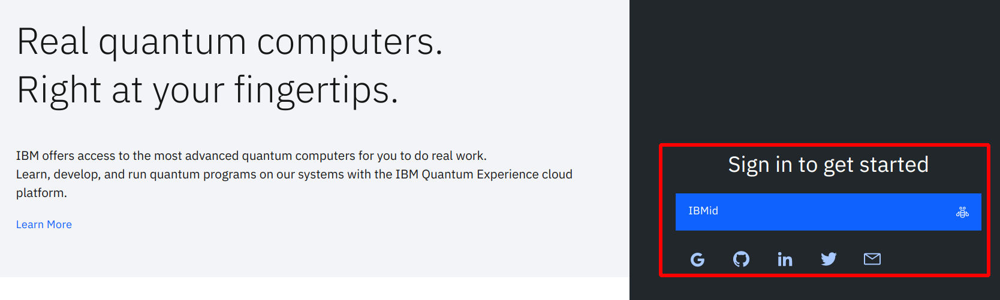
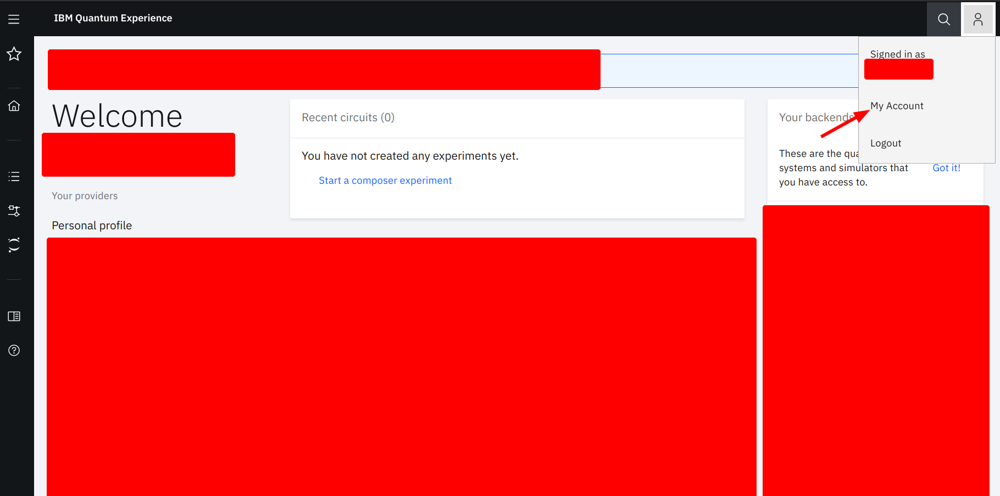
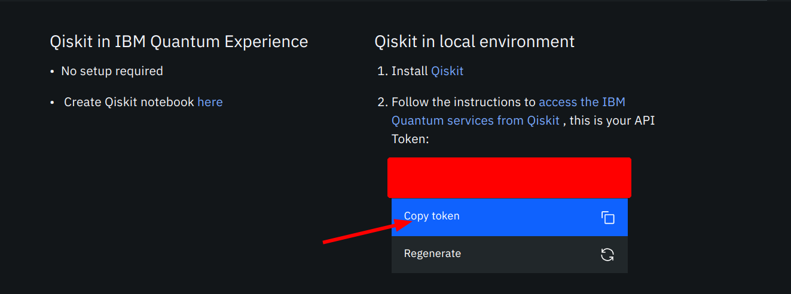

# Learning Qiskit
This repo contains my notes for learning Qiskit. I follow the videos from
[Qiskit's Youtube playlist](https://www.youtube.com/playlist?list=PLOFEBzvs-Vvp2xg9-POLJhQwtVktlYGbY).


## Installation
* Create a minimal environment with Anaconda
```
$ conda create -n name_of_my_env python=3.7
$ source activate name_of_my_env
```

* Install qiskit with pip
```
pip install qiskit
```

* Additional packages:
```
$ pip install matplotlib
$ pip install jupyter
$ pip install ipywidgets
$ pip install seaborn
$ pip install pygments
```

## Get IBM access token
* Create account at this [link](https://quantum-computing.ibm.com/)

* Login to your account:


* Go to *My Account* to access the token:


* Copy your *token*:

