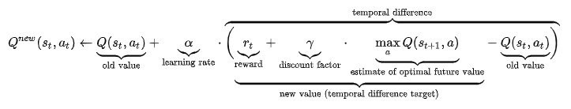
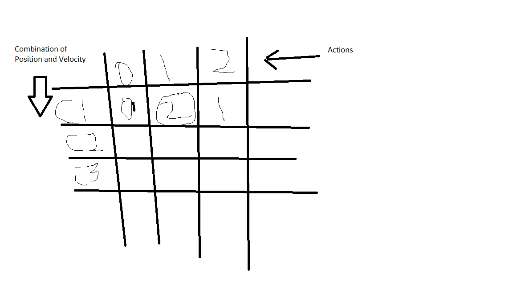

# Reinforcement Learning

## Q-learning
Model-free learning. Applicable to any environment. As long as it is simple enough.
Can't do anything really complicated.

In the first tutorial, after rendering the environment we see a car trying to climb
a mountain. Our task is to make it reach the goal at the top of the mountain.

For this we're gonna use the following formula:


The way it works is, we're gonna first create a Q-table, which is a large table
having any combination of states of position and velocity, we're gonna lookup the 
3 q values, and we'll pick the one with the highest q value.

Initially we'll make a table with random q values. And then our agent will update
those q values.

So we'll make a table like below:

And we'll look for the q value for the combination of position and velocity that 
we get as observation. And then we'll pick the q value with the highest value.

And then using the above formula, we'll kinda backpropagate that reward to make for
higher q values for the actions when chained together lead to the reward.

### q-learning-1 notes
# These two values you might change depending on the environment
```
q_table = np.random.uniform(low=-2, high=0, size=(DISCRETE_OS_SIZE + [env.action_space.n]))
```
This will make a 20x20x3 table, so every combination of possible environment
observations x 3 actions that we could take. And inside of those cells, right
now we have random q values.

Everytime we step through the environment we get a new state which is like
an observation we sense from the environment

So we saw that the reward is gonna be -1 until it reaches the goal flag
then it'll be zero.

### q-learning-2 notes
And every time we import an environment, we want to reset it

Discount is kind of like a weight. It's a measure of how important do we find
future actions
It's a measure of how important our future actions over current actions
Our future reward vs our current reward

Action depends on the max q value for the current discrete state

Pay attention that we're updating the discrete state after we took the step
of that discrete state

### q-learning-3 notes
Full tutorial:
https://pythonprogramming.net/q-learning-analysis-reinforcement-learning-python-tutorial/

A dictionary tracking episode number, average, min and max
```
aggr_ep_rewards = {'ep': [], 'avg': [], 'min': [], 'max': []}
```
ep: is like the x-axis of the graph
avg: is the windowed average, our window is like 500. It should go up as our model
improves
min: is the worst model that we have
max: is the best model that we have. We might have cases where we want our worst
model to be somewhat decent compared to the average
We'll use these metrics to optimize depending on our task

# max and not argmax because here we want the q-value rather than the arg-max

the way it back-propagates is dependent on the DISCOUNT and max_future_q
values.

Pay attention that we're updating the discrete state after we took the step
of that discrete state

### q-learning-4 notes - Create your own environment
All the blobs need to be able to move, need a starting location, need to be
initialized randomly.

The observation space is gonna be the relative position of the food, and the
relative position of the enemy to the player.

There is a possibility that the player, enemy and food positions
might overlap.

Only player is gonna use action.
Action will interact with move method.
We wanna pass a discrete value to action.

Observation space is gonna be two coordinates. The first one is gonna be
delta to the food, so relative difference between player and food. And the
second one is with the enemy. So it's gonna be like (x1, y1) (x2, y2)

## Deep Q-Learning
Started with the paper: Human-level control through deep reinforcement learning.

Input is an image, and then there are some convolutional layers and fully connected
layers, etc.. Output layer is gonna map to various actions that you could take.
It's gonna do so with a linear output. So it's a regression model.

A Deep Q network can be used for way more complex environments. With simple Q-learning
if it observes something outside the discrete space, then it's gonna take a random action.
But a deep q network could recognize it, and take action.

Also, in Q-learning, if you increase the discrete size of the q-table, then the memory
required to maintain that q-table increases drastically.

But the downsides are that the neural networks are a lot more finicky and they take
a lot longer to train.

As the neural networks don't care about the future values, we'll need to calculate
those values using fit and then add them to the remaining part of the q-learning
formula.